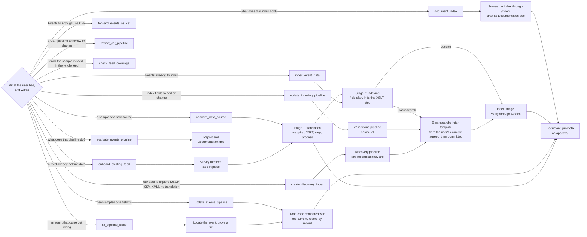
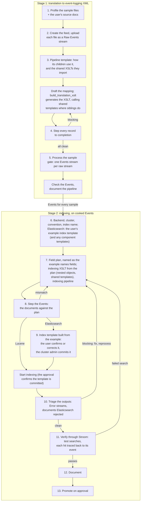
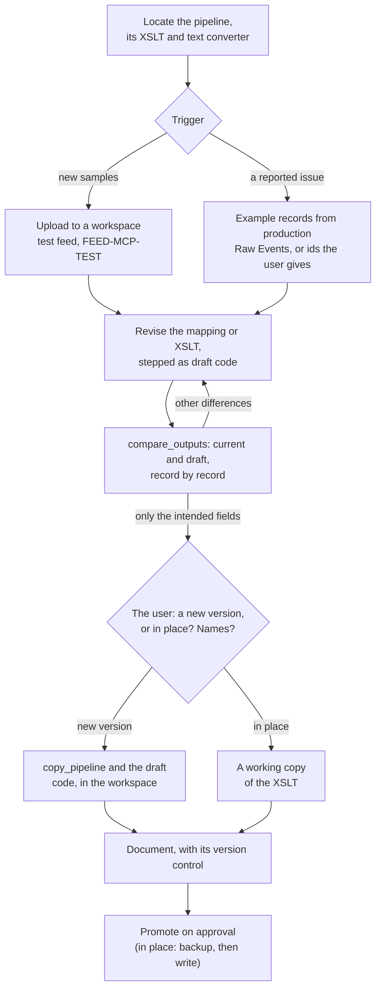
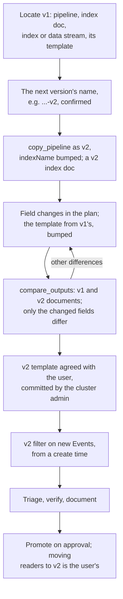
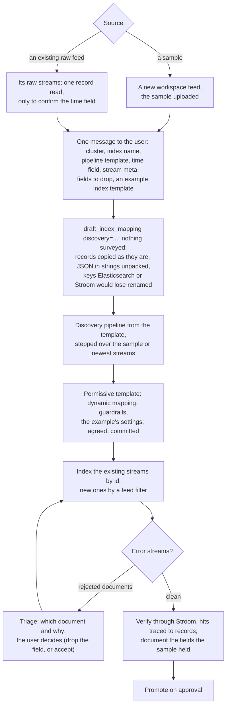
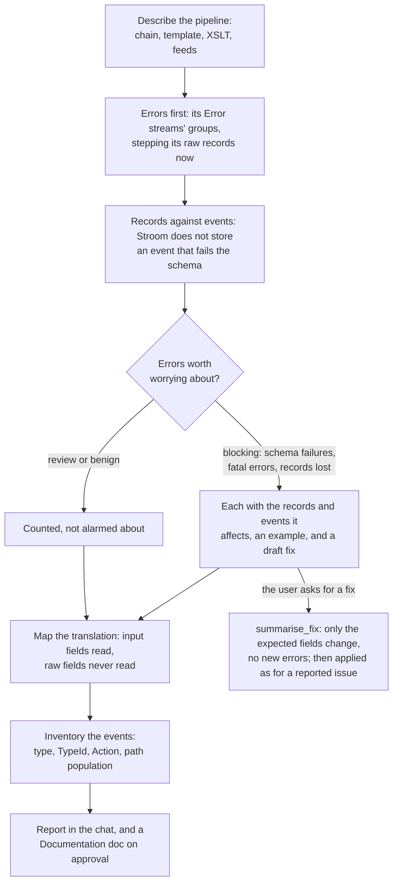
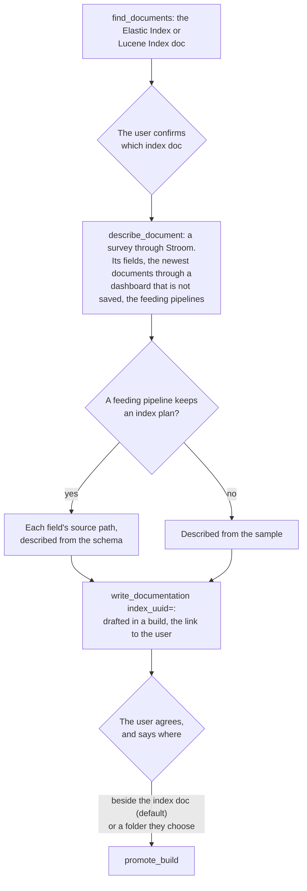
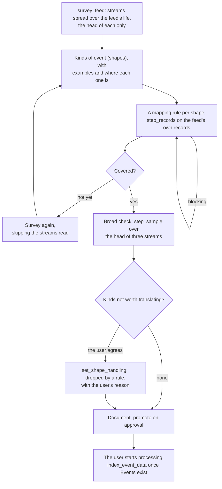
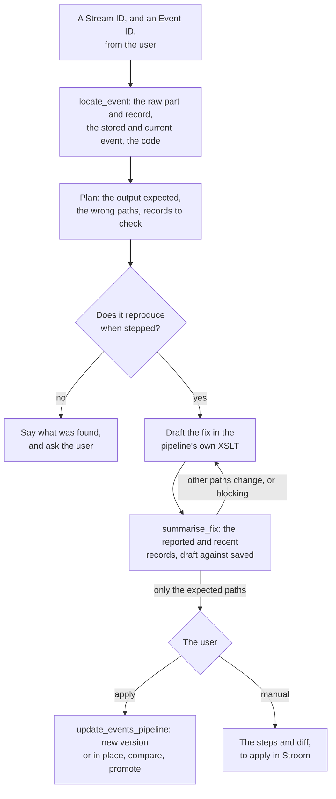
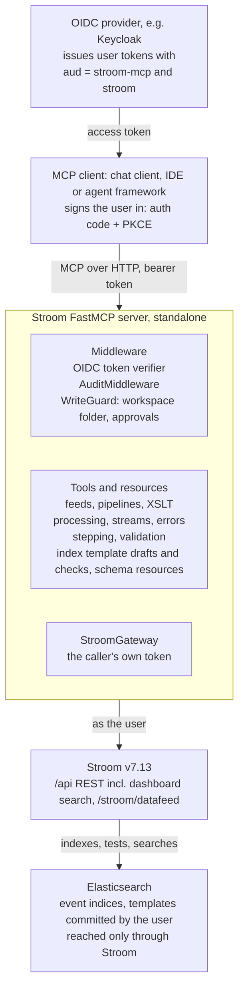

# Stroom FastMCP Server — Design

As of 2026-10-04. Kept in step with the shared design doc
(https://claude.ai/code/artifact/d0f92563-de5d-4c87-9d9b-8ba1c06f8c9a); diagrams are redrawn here in Mermaid.

## Overview

The Stroom MCP server lets an agent, whatever runs it, take a sample of raw data, or a feed that already holds data, and turn it into working Stroom content: a feed, a translation pipeline that emits [GCHQ event-logging](https://github.com/gchq/event-logging-schema) XML, and an indexing pipeline that sends those events to Elasticsearch. It is standalone: it talks only to Stroom, reaches Elasticsearch through Stroom, and needs no other MCP server. It borrows its structure from the Elasticsearch FastMCP server project but does not call it. It includes no agent or model: any MCP client that can sign the user in drives it (see Clients), and the rules that must hold are enforced by the server, not by a client.

**Goals**

- Accept a pasted or uploaded sample in XML, JSON, CSV or Syslog and land it in a Stroom feed.
- Build a translation pipeline (text converter + XSLT) iteratively on a suitable template pipeline, validated against the event-logging schema by stepping every sample record.
- Process the sample into Events, then build a lightweight indexing pipeline, on Stroom's Lucene index or Elasticsearch, and draft its index mapping that follows the environment's chosen field convention.
- Triage Error streams from pipelines that act on cooked Events, and fix what the agent's own content caused.
- Maintain existing content: update a translation with new samples or a field fix, and create a new versioned indexing pipeline beside the one in production; index raw structured data directly into a discovery index for exploration; and evaluate and document existing events pipelines against the event-logging schema.

**Non-goals (v1)**

- General-purpose search of indexed data; indexing is verified through Stroom searches, not direct queries.
- Managing Stroom users, permissions, nodes or volumes.
- Deleting existing content, or editing content the agent did not create, without an explicit flag.

**Target platform**: Stroom v7.13 REST API (`/api/...`), the event-logging schema version the environment uses (v3.5.2 in the reference environment; configurable), Elasticsearch 8/9.

## Workflows

Each workflow is a prompt (`stroom://` prompts; a client may offer them as slash commands). They share their building
blocks: the translation stage, the indexing stage, the index template hand-over, verification, documentation and
promotion. Everything is built in a workspace build and promoted only on the user's approval.



| Prompt | Starts from | Described in |
| --- | --- | --- |
| `onboard_data_source` | Sample files of a new source | End-to-end workflow |
| `onboard_existing_feed` | A Raw Events feed that already holds data | Build a pipeline for a feed that already holds data |
| `index_event_data` | An Events feed | End-to-end workflow, stage 2 |
| `create_discovery_index` | Raw JSON, a sample or an existing feed | Create a discovery index |
| `update_events_pipeline` | An events pipeline, new samples or a field fix | Update an events pipeline |
| `update_indexing_pipeline` | An indexing pipeline, field changes | Update an indexing pipeline |
| `forward_events_as_cef` | An Events feed, a Kafka topic | Send its Events to ArcSight as CEF |
| `review_cef_pipeline` | A CEF pipeline, a change | Review a CEF pipeline, or change it |
| `check_feed_coverage` | An events pipeline that processed its feed | Find kinds the sample missed and cover them |
| `fix_pipeline_issue` | A Stream ID, optionally an Event ID | Fix a reported pipeline issue |
| `evaluate_events_pipeline` | An events pipeline | Evaluate and document an events pipeline |
| `document_index` | An Elastic Index or Lucene Index doc | Document an existing index |

## End-to-end workflow

In stage 1, stepping every sample record to completion is the correctness check: once every record steps clean, processing the sample only produces the Events stream stage 2 needs. The agent confirms every raw sample stream produced exactly one Events stream, since the indexing pipeline has nothing to step without one, but does not iterate on the stage 1 Error streams. From stage 2 on, pipelines act on cooked Events and write to Elasticsearch, so their Error streams are triaged and can send the agent back to fix and reprocess.



1. **Profile the sample.** Detect format (XML, JSON, CSV with or without header, RFC 3164/5424 Syslog), encoding, record delimiter and timestamp format. If the user supplies vendor documentation or annotated samples, the agent records them as a field dictionary and event catalogue (`record_source_notes`; see Source documentation) to guide steps 3 and 4. Without documentation there are no notes: the draft reads the sample's own values.
2. **Create the feed and upload.** Create a `Feed` doc (stream type `Raw Events`, encoding) once the user confirms the proposed feed name and encoding, then POST the sample to `/stroom/datafeed` with a `Feed` header. The new stream's meta id is found with `/api/meta/v1/find`.
3. **Choose a template, draft the translation pipeline.** The XSLT is generated from a field mapping (`build_translation_xslt`) rather than written by hand, wherever a mapping can express it. That is where Unknown is checked and agreed: a build's own XSLT written by hand whose records come out as `EventDetail/Unknown` doesn't step clean. Search for translation-stage template pipelines (`find_pipeline_templates`), see how existing children specialise them, and learn what shared elements such as user decoration expect. Environments often keep common steps in shared XSLTs that their translations import by name (`xsl:import href="Common-Event-V1"`), e.g. a named template writing `EventSource/Device` from `stroom:meta('MyHostName')`, or `Event/Meta` with the stream's GUID. `describe_template` reads the children's XSLTs, looks each imported document up by name as Stroom resolves it, and reports every named template they call: where (the element it writes), what it writes and reads, and the parameters passed. The mapping's `shared` entries make the generated XSLT import the same document and call the template in that element's place; mapping anything below an element a shared template writes is refused, as it would be written twice and fail schema validation. Create a child of the chosen template, supplying only the source-specific `TextConverter` (Data Splitter or XML Fragment) and `XSLT`. Stroom's standard Event Data (Text) or Event Data (XML) pipelines are the fallback. The user confirms the chosen template before the child is created. Field mappings and event types follow the field dictionary and event catalogue when there are source notes.
4. **Step every sample record to completion.** `/api/stepping/v1/step` accepts a `code` map that overrides element code for the session, so the agent tries XSLT revisions without saving them. It steps every record of the sample, not a subset; each step returns per-element input, output and error indicators, and any blocking error sends it back to step 3. Stepping errors are triaged with the same rules as Error streams, so benign decoration warnings do not hold it up. The agent resolves the errors its own content causes (mapping, XSLT, text converter) itself, stepping again until they are gone, before involving the user; only errors it cannot resolve (an inherited element, reference data, the source data) go to the user, who may accept them as benign (step 12). Errors already accepted for the pipeline are reported as benign, with the user's reason.
5. **Save and process the sample.** When every record steps clean, save the docs and create a processor filter on the sample stream ids. This run only produces the `Events` stream that stage 2 needs; before stage 2 the agent checks that every raw sample stream has exactly one child Events stream, with records, and that the counts match the stepped records. More than one means the raw stream was processed twice (overlapping filters or a stray reprocess), which would give the indexing stage duplicate events, so the agent reports it and asks which to keep. A raw stream with no Events means processing failed despite clean stepping (a failed task, a fatal error, a filter that missed the stream), so the agent reads that stream's task status and Error stream, fixes the cause and reprocesses it (`reprocess_streams`), or asks the user. Beyond this gate, stage 1 Error streams are not iterated on.
6. **Draft the field plan.** Apply the field convention the user or configuration selected (never an assumed one), check names and types against that convention's reference index docs (their fields read through Stroom). For Elasticsearch, the user's example index template comes first: each field takes the example's name for the same data (its `User.Id` for the user, `TypeId` for the event type), matched by the event-logging path's own element names, then by known convention names; fields the example lacks are named in its style (PascalCase, camelCase or ECS-style, dotted or run together), and sample paths it maps are added. The indexing XSLT writes dotted names as nested objects (`"user": {"id", "name", "emailAddress"}`), calling any shared indexing templates in place of the fields they write.
7. **Choose a template, build the indexing pipeline.** Search for indexing-stage templates the same way; a local one may already set the Elastic cluster, batch size and shared enrichment. Inherit from it (fallback: Indexing (Elasticsearch)). The indexing filter's `cluster` property must point at an existing Elastic Cluster doc: the agent takes the one that existing Elastic Index docs and indexing pipelines for similar data already use (`find_elastic_clusters`) and checks it with `elasticCluster/v1/testCluster`. It never creates a cluster doc, since that holds credentials; if none fits, it asks. The cluster, the indexing template, the field convention and the destination index or data stream name (with its version) are proposed together at the start of stage 2, and the user confirms or corrects them before anything is drafted or created. The child's XSLT emits the `xpath-functions` JSON-XML `array`/`map` form with `StreamId`, `EventId` and `@timestamp`.
8. **Step Events through it.** Step the cooked Events and compare each stepped document's fields and value shapes with the draft template. Fix the XSLT or the template on a mismatch.
9. **Agree the template, then hand over the filter.**
   - The agent suggests the index template once the indexing pipeline steps clean (`propose_index_template`). It is rendered from the field plan for the pipeline's own destination index, as a Kibana Dev Tools request, and already checked against the documents the pipeline writes. Without the user's example nothing is built for the cluster: the agent is told to ask for it (pasted into the chat), and a template from the plan alone needs `without_example`, which the user confirms. In a VS Code session a plan-only template handed to the user was committed to the cluster unagreed, and indexing was still refused.
   - If the user sends back a changed template, `check_index_template` steps the candidate indexing pipeline and checks every document field against it. It checks that `index_patterns` cover the pipeline's index and that values fit the mapped types, including date formats and IPs. It also checks the `dynamic` setting for unmapped fields, fields mapped as values that the pipeline writes as objects (or the reverse), `@timestamp` for data streams, and fields the template renamed or added.
   - When it fits, the user sees it before agreeing to it: the reply is `needs_review`, with the template as a Dev Tools request for the agent to show in the chat as a code block, and called again with `reviewed=true` the confirmation form is a short summary (name, pattern and priority, settings, the fields and their types). Shown whole in a form, it had been one unformatted line, and an invalid template was agreed.
   - An alias in the user's example (their `User.Id` an alias of `User.Name`) becomes a field when the pipeline writes it, typed as its target: documents can't write to an alias. Both checks block an alias of a field the template lacks, which Elasticsearch refuses, and a written field mapped as an alias.
   - When the template does not fit, the agent lists the pipeline changes it needs (e.g. rename `user.name` to `user.id` in the indexing XSLT) and asks whether to make them or change the template instead.
   - The server has no Elasticsearch access of its own: the cluster admin commits the template, and events reach Elasticsearch only through the Stroom indexing pipeline.
   - The agent asks the user for an example: the Elasticsearch index template a sibling source's index uses (or an existing index's mapping) and the component templates it is composed of. `propose_index_template` builds the index template for the new index from them, following their conventions: the new index's pattern; the example's settings and `composed_of`; fields the examples map left as they map them; new fields mapped in the examples' style for their type (`ignore_above`, `.keyword` sub-fields, date formats); field names unlike theirs reported, for the agent to rename in the field plan and build again. When it fits the documents the pipeline writes, the user confirms it as shown, or corrects it (`check_index_template` with their version, confirmed there when it fits). The agreed template is kept in the indexing pipeline's description, with the index, cluster and a digest of the indexing XSLT it was agreed for. The user then has the cluster admin commit it; `create_processor_filter` refuses an Elasticsearch pipeline without an agreed template for its current index and code, and its approval asks the user to confirm the agreed template is committed to the cluster, as documents arriving before it would create the index without it.
   ```mermaid
   sequenceDiagram
       actor User
       participant Agent
       participant Server as Stroom MCP server
       participant Stroom
       actor Admin as Cluster admin
       participant ES as Elasticsearch
       Agent->>User: An example index template (and any component templates)?
       User-->>Agent: GET _index_template/... as Dev Tools shows it
       Agent->>Server: draft_index_mapping with the example
       Server-->>Agent: field plan, named as the example names fields
       Agent->>Server: save_xslt, create_indexing_pipeline, step_sample
       Server->>Stroom: create, step
       Agent->>Server: propose_index_template (plan, example)
       Server->>Stroom: step the pipeline: the documents it writes
       Server-->>Agent: needs_review: the Dev Tools request
       Agent->>User: the template, shown in the chat
       Agent->>Server: propose_index_template, reviewed
       Server-->>User: Use this index template, as shown in the chat? (a short summary)
       opt the user corrects it
           User-->>Agent: the changed template
           Agent->>Server: check_index_template
           Server-->>User: Use this one? (when it fits the documents)
       end
       Server->>Stroom: the agreed template, kept with the pipeline
       Agent->>User: the Dev Tools request, for the cluster admin
       User->>Admin: apply it
       Admin->>ES: PUT _component_template, _index_template
       User-->>Agent: it is committed
       Agent->>Server: create_processor_filter
       Server-->>User: Approve: the agreed template is committed, start indexing?
       Server->>Stroom: processor filter, enabled
       Stroom->>ES: documents, through the indexing filter
   ```

10. **Triage indexing outputs.** Stepping does not write to Elasticsearch, so mapping conflicts and bulk rejections only appear now. While the pipeline is in the workspace, `create_processor_filter` and `reprocess_streams` set its batch size to 10, so a rejected document comes back whole in the Error stream rather than cut short in a large bulk response; `wait_for_processing` removes the setting once indexing completes without errors (the template's default applies again), and promotion makes sure of it. Reprocessing a stream into Elasticsearch does not remove the documents it already put there (Stroom's purge on reprocess does not apply to a second filter, and the server has no Elasticsearch access), so the approval gives the cluster admin the `_delete_by_query` request to run first. Stroom reports a bulk request with failures as one message holding Elasticsearch's whole response; triage splits it into one entry per rejected document (which one in the batch, and why: a value where an object was mapped, a type it cannot parse, a field name Elasticsearch refuses, the field limit), each with what to do. The agent reads the indexing Error streams, classifies them as blocking, review or benign (see Error triage), fixes the XSLT or template and reprocesses on blocking errors, then runs Stroom's connection check (`elasticIndex/v1/testIndex`).
11. **Verify the Stroom way.** Create an Elastic Index doc for the target index or data stream on the same Elastic Cluster doc the indexing filter writes through, copying settings such as the time field and search scroll size from existing Elastic Index docs on that cluster (its fields load from the mapping) and a verification dashboard in the workspace, laid out for the people who will search it. The agent suggests the table's columns (the time field and the plan's key fields: user, host, address, event type, outcome) and the user confirms them before the dashboard is made. The query has one term, the time field, from the sample's earliest event rounded back to a 30-day boundary through the end of today (`day()+1d`, so events stamped later today are included), and runs when the dashboard opens. The table shows the user's columns, newest first; `StreamId` and `EventId` are hidden columns, for the text pane and tracing hits. A text pane, linked to the table, shows the selected row's record, with stepping enabled and no extraction pipeline. The dashboard belongs to the build that made the index: verifying another build's or production's index searches through an unsaved dashboard. Then run test searches through Stroom's dashboard search API: all documents for the sample stream ids, whose count must match the Events records; an exact-match search on each key field using a value from a stepped document; a time-range search around the sample timestamps; and the searches people will make (a value in another case, which must find nothing on keyword fields, IN, wildcards, numeric and IP ranges, full text). Each must return the expected records, which checks the mapping and the way people will actually search it. Given the indexing pipeline, each check's first hit is traced back to its record: the pipeline is stepped at the hit's StreamId and EventId, and the document there must be the hit and hold the value searched for. A failed search sends the agent back to step 7. Some conditions answer wrongly on Elasticsearch through Stroom 7.13, without an error (STARTS_WITH and CONTAINS find nothing; IS_NULL and IS_NOT_NULL match everything; IN needs commas): `verify_index` refuses them and names what to use (EQUALS with `*` wildcards, EQUALS `*` for any value).

    ```mermaid
    flowchart LR
        U["The user confirms the columns"] --> A["verify_index"]
        A --> B["Dashboard on the index doc: opens on the time field<br/>from the sample through today; columns newest first;<br/>text pane with stepping"]
        B --> C["All documents of the streams:<br/>the count must match"]
        B --> D["Searches: exact, case, IN, wildcard,<br/>regex, ranges, IP/CIDR, full text"]
        C & D --> T["Each check's first hit: step the indexing<br/>pipeline at its StreamId and EventId"]
        T --> Q{"The same document,<br/>holding the value?"}
        Q -- "yes" --> OK["pass"]
        Q -- "no" --> NO["fail: which record, and why"]
    ```

12. **Document.** Write Stroom Documentation docs for the events and indexing pipelines (`write_documentation`) from what stages 1 and 2 measured: the field mapping, event types from the processed sample, the index template and version, and the verification results. The Errors section is generated: every kind of error processing the sample produced, with counts and examples. Errors the agent's own content causes are fixed before this point; an error it cannot resolve (an inherited element, reference data, the source data) that the user says is benign is recorded there with their reason (`accept_errors`, confirmed by the user, optionally covering a kind with `*`), and triage then reports it as benign for that pipeline, so later reviews do not raise it again. The same summary is returned in the chat.
13. **Promote on approval.** Everything so far lives in the workspace. `build_status` shows what the build still lacks (a clean step of each pipeline's current code, documentation). `promote_build` proposes destination folders from where sibling sources live; the user confirms them and approves, with any of those warnings in view, and the docs are moved into place. Each promoted pipeline gets a processor filter for new data on its feed, created disabled, with a link to the pipeline for the user to review and enable it.

## Further use cases

Six further jobs. The evaluation is read-only. The two updates start from existing production content rather than a new source: both work on draft code or copies until a person approves, and both compare new output with current output record by record, so the only differences are the intended ones.

**Update an events pipeline**

Triggered by new samples the current XSLT does not handle, or a reported issue such as a missed or wrongly translated field.



1. **Locate the baseline.** Find the pipeline by name or feed (`find_documents`, `describe_document`) and read its XSLT and text converter.
2. **Gather test records.** New samples go to a workspace test feed with the production feed's settings (`<FEED>-MCP-TEST`), never to the production feed, where live processor filters would pick them up. For a reported issue, the agent finds example records in the production feed's recent Raw Events (`find_streams`, `read_stream`), or uses stream and record ids the user gives.
3. **Revise with draft code.** Stepping accepts draft XSLT through the `code` map, so the existing pipeline is stepped over the test records and a regression set of recent production records without saving anything.
4. **Compare outputs.** `compare_outputs` steps the same records through the current and draft code and diffs each event. There must be no blocking errors, and differences must be limited to the fields the change targets; anything else goes to the user.
5. **Confirm how to save, then save.** The agent asks whether to create a new version or change the current pipeline in place, and proposes names from the baseline's versioning convention, e.g. `Keycloak-V1.2-Events` becomes pipeline and XSLT `Keycloak-V1.3-Events`. The user confirms the choice and the pipeline and translation names, or edits them. A new version is made in the workspace with `copy_pipeline` (pipeline, XSLT and text converter) plus the draft code; an in-place change is saved to a working copy of the XSLT in the workspace, and its documentation is the production pipeline's: `write_documentation` on the working copy updates a working copy of the Documentation doc beside the production pipeline (or creates one under its name, promoted beside it), which promotion writes back after a backup. Nothing in production changes until the user approves promotion: a new version is then moved into place and gets its processor filter, with the current version left running until the user retires it; an in-place change is written into the production XSLT after a backup. Reprocessing historical data with the production pipeline is the user's to do (see Design decisions); the agent lists the streams the change would affect. Test records in the build are reprocessed as part of development. The Documentation doc is created for a new version, noting what changed, or updated with a change-log entry for an in-place change.

**Update an indexing pipeline (as a new version)**

Triggered by a request to index more fields or change how fields are mapped. In-use production indices stay untouched: the agent builds a new versioned pipeline beside the current one.



1. **Locate the baseline.** Find the indexing pipeline, its Elastic Index doc, the index or data stream it writes to, and its index template.
2. **Work out the next version.** With the convention `stroom-windows-events-v1`, the candidate is `stroom-windows-events-v2`. The pattern is configurable (`index_versioning.pattern: '{base}-v{n}'`); if the current name does not match it, the agent asks. The v2 name and the cluster are confirmed like any stage 2 destination.
3. **Copy and bump.** `copy_pipeline` copies the pipeline and the XSLT it owns into the workspace under the new version and sets the `ElasticIndexingFilter` `indexName` to the v2 name; `create_index_doc` adds a v2 Elastic Index doc. Any inherited parent template is kept.
4. **Revise the XSLT and template.** The template draft starts from the v1 template, renamed and with `index_patterns` bumped to v2, then applies the requested field changes under the selected field convention.
5. **Step and compare.** `compare_outputs` steps the same Events records through v1 and v2 and diffs the documents. Only the added or changed fields may differ, and each must match the v2 template.
6. **Hand over.** The agent proposes the v2 template (`propose_index_template`) and checks any changes the user sends back (`check_index_template`). Once the user has agreed it and the admin has committed it, the v2 indexing filter starts, on new Events from a create time, after the user's approval; backfilling older streams is the user's. Then triage its outputs and verify through a v2 Elastic Index doc and dashboard, as in steps 10 and 11. The v2 pipeline gets its own Documentation doc, noting what changed from v1. Moving readers from v1 to v2 and retiring v1 are the user's (see Design decisions).

**Create a discovery index**

A discovery index lets people explore raw data (JSON, delimited text such as CSV, or XML) before or instead of writing a translation. A simple indexing pipeline reads the Raw Events stream, parses it and indexes each record as it is, with no event-logging step.



1. **Choose the source.** An existing Raw Events feed, or a sample uploaded to a new workspace feed as in steps 1 and 2.
2. **Choose a template.** Look for a discovery-stage template pipeline as in step 7 (`pipeline_templates.discovery`); in the reference environment that is `Raw to Elasticsearch`; the fallback is a minimal chain: `JSONParser`, `XSLTFilter`, `ElasticIndexingFilter`.
3. **Draft the XSLT, surveying nothing.** Elasticsearch maps the source's fields dynamically as documents arrive, so the raw data is not profiled or read through first: the user confirms the timestamp field (and its format if it is not ISO 8601 or epoch milliseconds), any stream meta to add and any fields to drop, and `draft_index_mapping` with `discovery` turns that into a discovery field plan. Its XSLT copies each `JSONParser` record from the `http://www.w3.org/2013/XSL/json` namespace into the `xpath-functions` one the indexing filter reads, with the source's own field names, adding `StreamId` (`stroom:stream-id()`), `EventId` (`stroom:record-no()`: the template splits one record at a time, so it finds exactly that record again) and `@timestamp`, and the stream meta (`stroom:meta()`). A string holding a JSON object, such as a `message`, is also parsed with `json-to-xml()` into a sibling `<field>_json` object; the string is kept, so a field that is only sometimes JSON keeps one type, and text that is not valid JSON is left as it is. Keys that would be lost are kept under another name: Elasticsearch refuses its metadata fields (`_id`) and Stroom's indexing filter silently drops any key starting with `_`, so those become `<key>_original` without the `_`, as do top-level keys repeating `StreamId`, `EventId` or `@timestamp`; empty keys and keys with an empty dotted part are repaired. A record Elasticsearch still rejects (a field that is an object in one record and a value in another) is reported in an Error stream, which triage splits out of Elasticsearch's bulk response: which document, why, and what to do. Delimited text and XML are indexed the same way (`discovery.input`): a Data Splitter's record gives one field per column, named by the header; an XML record element (`discovery.record`, matched by name whatever its namespace) becomes nested objects, with repeated elements as arrays and attributes as fields. All their values are text, so the template turns on Elasticsearch's numeric detection (`"200"` becomes a number; an odd value is ignored as malformed). An XML discovery pipeline has the shape of an indexing pipeline (XMLParser, XSLT, indexing filter), so `create_indexing_pipeline` tells them apart by the discovery plan kept with the XSLT. Anything beyond this, such as a full event-logging translation, belongs in `onboard_data_source`. The XSLT is saved from the plan and stepped over the raw streams: the documents show what the source holds.
4. **Draft a permissive template.** Field names stay as in the source, so no field convention applies. The template uses dynamic mapping with guardrails from the plan: strings as `keyword` (with `ignore_above`, 1024 by default), no date guessing, a total-fields limit (2000), `ignore_malformed`, and explicit types only for `StreamId`, `EventId` and `@timestamp`. As for any index, the user is asked first for an example index template (a sibling discovery index's) and its component templates; the template takes the example's settings and component templates, not its fields or mapping rules, and is not offered to agree until the example is given.
5. **Confirm, step and apply.** Cluster, destination name (e.g. `stroom-discovery-<source>-v1`), template pipeline, timestamp field and the meta and fields to drop are confirmed in one prompt. The agent steps every sample record and proposes the template; the user confirms it (or corrects it, `check_index_template`), and once they say the admin has committed it, the processor filter on the raw streams starts, after the user's approval.
6. **Verify the Stroom way.** Triage and verify as in steps 10 and 11. The discovered field list, read through the Elastic Index doc, can seed the sample profile when the source is later onboarded with a full translation. The discovery pipeline is documented like any other.

**Evaluate and document an events pipeline**

A read-only health check: is anything wrong with the pipeline that is worth worrying about, schema compliance above
all? It also explains what the translation does. Nothing is changed; when the user asks, suggested fixes are proven
and applied as for a reported issue. (A user who already knows what is broken starts from `fix_pipeline_issue`.)



1. **Describe the pipeline.** Element chain, inherited template, text converter, XSLT, reference data and decoration lookups, and the feeds its processor filters cover (`describe_document`, `processing_status`).
2. **Errors and schema compliance, first.** The pipeline's Error streams for recent raw streams (`summarise_streams (kind=errors)`), triaged as blocking, review or benign; `check_events` on sampled Events records; and `step_sample` over up to `max_sample_records` raw records, which shows the errors the current code gives now. Records stepped are compared with events stored: Stroom does not store an event that fails the schema, so the stored events can all be valid while records are being lost.
3. **Say whether anything is worth worrying about.** Blocking groups (schema failures, fatal errors, records not translated) each with the records and events affected and an example; review groups; benign ones only as a count. E.g. "6 records, 5 events: one record's event fails on `EventSource/Device/IPAddress` ('n/a') and is not stored".
4. **Map the translation.** `describe_document` reads the XSLT and lists which input fields feed which event-logging paths; comparing that with the raw data shows input fields that are never used.
5. **Inventory the events.** `summarise_streams (kind=events)` counts events by `EventDetail` type, `TypeId` and `Action`, with examples, and reports how often each path is populated.
6. **Suggest fixes.** Prioritised, blocking errors first, each with what it fixes, the share of records or events affected and a draft change to the pipeline's own XSLT or text converter. When the user asks for one, `summarise_fix` proves it (only the expected fields change, and it adds no errors) and it is applied as in Fix a reported pipeline issue.

The report is returned in the chat and saved as the pipeline's Documentation doc: written in the workspace and, on approval, moved beside the pipeline or written into its existing doc after a backup, with a change-log entry. It uses the shared documentation sections, with suggestions under Open items:

| Section | Content |
| --- | --- |
| Purpose and data | Feeds, source system, record format, volumes |
| Processing | Element chain, inherited template, reference lookups and decoration |
| Field mapping | Input field to event-logging path, unused input fields |
| Event types | `EventDetail` types, `TypeId`s and `Action`s, with counts and examples |
| Errors and schema conformance | Whether anything is worth worrying about: blocking and review error groups with records affected, records against events stored, validation and quality pass rates, schema version gap |
| Suggestions | Prioritised changes with rationale and draft XSLT |

**Document an existing index**

An index can predate the server, or be fed by something other than Stroom. The agent documents it as the indexing
pipeline pathway would: every field, what it holds and its values. Nothing but the documentation is written.



1. **Locate and confirm.** `find_documents` with `types=['ElasticIndex', 'Index']`; the user confirms which index doc, from its name and folder. `write_documentation` asks again, naming the doc, before anything is written.
2. **Survey through Stroom.** `describe_document` on the index doc: the fields Stroom has for it (`dataSource/v1/findFields`, which for Elasticsearch come from the index mapping; for Lucene `index/v2/findFields`, which also says whether each field is stored); the newest documents, up to 100, read through dashboard searches on a dashboard that is never saved, sorted on the time field (how often each field is populated, its values, the time range covered); and the pipelines that feed it, each with the index plan kept with its XSLT when there is one. A wide index is read in groups of up to 100 columns, each with StreamId, EventId and the time field, joined on the ids; past 600 fields the rest are listed as not surveyed, and the doc says how many were read. Feeding pipelines are found by content (a Lucene IndexingFilter names the index doc, an Elasticsearch one the index name) and each confirmed from its effective properties, so a mention elsewhere does not count; an index name built from values (`ecs-windows{_suffix}v1`) or an index doc naming a pattern or alias matches. A pipeline that cannot be found this way is not claimed absent: the doc says none was found, and how they were looked for. A Lucene field that is not stored is searchable but has no values to show; the table says so. When the survey cannot run (the cluster unreachable, say), `describe_document` still returns the doc, with the reason. Stroom returns a hit only when its `StreamId` is a stream in this Stroom that the user may read, so documents written from outside Stroom without one (or with another system's) never come back, with no error: such an index is documented from its mapping, every field marked not read, and the doc says why. The server never queries Elasticsearch directly.
3. **Ask, then draft.** The agent asks the user what the index is for, what produces its data and who searches it, and waits for the answer: the survey shows what the index holds, not why it exists. `write_documentation index_uuid=...` asks the user to confirm the index doc (named with its folder) before the index is read, then writes a Documentation doc named after the index doc in a workspace build. A doc already beside the index doc is changed through a working copy, so promotion writes it back after a backup, keeping its change log, rather than adding a second doc of the same name. The agent writes Purpose and data from what it has seen of the source (the feeds and their descriptions, the feeding and events pipelines and their docs, the kinds of events in the sample, dashboards on the index), saying what it does not know; under it the tool adds a generated "Data surveyed" summary from grouped dashboard searches over the whole index: how many documents and the time they span, how many streams, and for the streams with the most documents the feed, stream type and producing pipeline (from each stream's meta), with the feed's description. The Field mapping section is generated from the survey like an indexing pipeline's: every field with a description, its type, its event-logging source path when a feeding pipeline's plan records it, how often the surveyed documents held it, and sample values. Descriptions say what each field is, from the plan, else the event-logging schema for the source path; they do not repeat what In sample and Sample values show, only add that a field holds several values in one document. A field nothing describes gets the kind of values the sample shows (IP addresses, numbers), else says no plan or schema covers it. The reply has the doc's link, which the agent gives the user.
4. **Promote on consent.** `promote_build` moves the doc beside the index doc (the default for a Documentation doc named after an index doc), or to a folder the user chooses.

**Build a pipeline for a feed that already holds data**

The user names an existing Raw Events feed instead of giving a sample. Not every kind of event shows up in every stream, so the agent samples stream after stream until more streams add nothing new. It only reads and steps: no feed is created, nothing is uploaded or processed, so there are no filters or streams to clean up.



1. **Survey.** `survey_feed` picks streams spread over the feed's lifetime (by create time, read newest, oldest, then the middle, then the quarters, so any prefix spans the whole range) and reads only the head of each: up to 250,000 characters of up to 3 parts, and 1,000 records, so a multi-GB stream costs the same as a small one. A cut-off last record is dropped, and JSON arrays and XML are parsed incrementally, so only complete records count. It groups the records into shapes, one per kind of event. For JSON, XML and key=value records a shape is the set of fields plus the values of fields that usually name the event (`action`, `event`, `type` and similar). For delimited data it is the values of those naming columns, or of low-variety columns when none is named that way. For syslog and other text it is the message with numbers, addresses and quoted strings masked, merged with messages that differ only in a few words, such as user names. A message-like field (body, message...) is unwrapped: JSON inside it, after any text prefix or byte order mark, is signed by its fields and naming values (logger names count), and naming `key=value` pairs keep their values (`type="LOGIN"`), so a wrapper such as syslog shipped as JSON does not hide the kinds of event. The survey stops when a few streams in a row add no new shape, and returns each shape's count, share and examples, with where each example is (stream, part, record), and says plainly whether the feed is covered yet.
2. **Translate every shape, stepping in place.** The mapping gets one rule per shape (`build_translation_xslt`), and `step_records` steps the translation on the survey's locations, the feed's own records, until clean. Records no rule matches are logged, not dropped, so a missed shape shows up. Kinds not worth translating (housekeeping, debug) are shown to the user with their share; only if the user agrees are they left untranslated: `set_shape_handling` records the choice and the user's reason in the survey doc (a confirmation), the mapping gets an explicit drop rule for them, and their locations are stepped expecting no Event.
3. **Read more streams.** The agent surveys again, skipping the streams already read and passing the signatures it already knows, so only new shapes come back. The mapping gains rules and every location found so far is stepped again. This repeats until a survey says the feed is covered, or every stream has been read; until then the agent says plainly that it is not covered yet.
4. **Broad check.** Two examples per shape cannot show every variant (a missing optional field, an odd value), so `step_sample` steps the first 200 records of three surveyed streams spread over time (`records_per_stream`). Anything blocking or for review goes back to the mapping. Then the agent reports which kinds of event the pipeline covers and their share of the data.
The survey is kept in the build as a Documentation doc, `<FEED> - Survey`: the kinds of event with counts, shares, streams and handling (translated, or left untranslated and why), example records with where each one is, the surveys run, and a machine-readable state block. A later survey with the same build carries on from it (skipping the streams read, knowing the shapes found), so an interrupted or later session need not start again, and it is promoted beside the pipeline as a record of what the feed holds. Example records are the feed's own data; who can read them is down to the permissions on the folder the doc lives in.

5. **Document, promote, hand over.** The translation is documented and promoted on approval. Processing the source feed with it is the user's to start; once its Events exist, `index_event_data` builds the indexing, since an indexing pipeline can only be stepped and filled from real Events streams.

**Fix a reported pipeline issue**

A user reports that something came out wrong, often one event type that is not translated properly, and gives a Stream ID and optionally an Event ID (as a dashboard shows them). The agent finds where it came from, confirms the problem, proves a fix and offers it. Nothing changes unless the user asks for the fix to be applied.



1. **Locate.** `locate_event` accepts an Events, Error or Raw Events stream id. An output stream leads to its parent raw stream and the pipeline that produced it; a raw stream leads to its Events child. With an Event ID, the agent steps the raw stream record by record, counting the events each record produces, until it reaches that event. It returns the raw part and record, the record's input, the stored event, the event stepping gives now, and the XSLTs and text converters the pipeline runs (marking any inherited from a template). This works on multi-part streams: Stroom numbers records within each raw part, while the Events stream's events run on across parts, and a record can produce no events or several.
2. **Plan the validation.** In a few lines the agent says what output the record should give (from the user's words, the schema and any source notes), which field paths are wrong now, and which other records it will check: recent raw streams on the same feed and the same event type (`find_streams`, `summarise_streams (kind=events)`).
3. **Confirm the issue.** `step_pipeline` on the located part and record, `check_events`. If the problem does not reproduce, the agent says what it found and asks the user rather than guessing a fix.
4. **Draft and prove the fix.** The fix goes in the pipeline's own XSLT or text converter, tried with draft code. `summarise_fix` steps every record of the reported stream and a few recent ones with the draft and with the saved code, and diffs the output. The fix is ready when it changes the reported output, only the expected field paths change, and stepping with it brings no blocking error the saved code does not have. Errors the saved code has too are reported apart, as not the fix's doing (a pipeline can have more than one problem); errors the draft clears are reported as resolved. It also returns the code diff and manual steps, and warns when the code belongs to a template shared by other pipelines.
5. **Offer it.** The agent shows the diff, the fields that change and on how many records, and asks whether to apply it. **Apply** follows `update_events_pipeline`: the user chooses a new version or an in-place change and confirms the names, then the agent copies, updates, compares against the original, documents and promotes on approval. **Manual** returns the steps to apply it in Stroom with the diff. In both cases reprocessing production data is the user's.

## Architecture

The server copies the ES MCP server's shape: FastMCP over streamable HTTP, OIDC auth, audit middleware, a lifespan-managed Stroom gateway, and tools that return compact, budgeted JSON with hints the model can act on. The one new idea is a **write guard**, because this server creates and changes content.



**Identity.** The server acts as the user who asked. Stroom 7.x trusts the same OpenID Connect provider (Keycloak, Entra ID, Okta, ...), and the clients' tokens carry both audiences (`aud` includes the MCP server's audience and `stroom`, e.g. through a Keycloak audience mapper; with a provider that issues one audience per token, Stroom accepts the server's audience instead), so the server forwards the caller's token unchanged on every Stroom call, including `/stroom/datafeed` uploads. Stroom applies that user's own document permissions and audits changes under their name. There is no shared API key and no token exchange. A token without Stroom's audience in `aud` is refused with a message saying so, and a token that expires during a call (a form left open while the client holds the call, as VS Code does, or a long `wait_for_processing`) tells the agent to call again, which the client makes with a fresh token: nothing for the user to do. When the user answered a form in that call, nothing more is done in Stroom, and their answer (with any value they changed) comes back as an id for the repeated call, so they are not asked twice. A Stroom API key is used only with `dev_no_auth`, which is refused unless the server listens on localhost. For uploads to work, Stroom's receiver must accept OIDC tokens (`receive` token authentication enabled).

**Clients.** Any MCP client can drive the server; what one needs is under Clients below. VS Code's chat (agent mode) is the first set up and tested: its model runs the workflows from the prompts (slash commands), guides attach as resources, and VS Code handles the sign-in with a pre-registered public client (PKCE, redirect URIs `http://127.0.0.1:33418` and `https://vscode.dev/redirect`). Setup: `docs/VSCODE.md`.

**Asking the user.** Confirmations and approvals are forms the user answers, so the model never holds the answer. A name the server confirms (a feed, pipeline or index doc, an Elasticsearch index) is proposed by calling the tool, not asked for in the chat first: its form carries the proposal in an editable field, so the user accepts or corrects it in one place, and the tool goes ahead with what they settled on. On MCP 2026-07-28 connections, which have no server-initiated requests, the tool returns an input-required result with the form, and the client repeats the call with the answer (SEP-2322); the sealed request state names the exact request and user, and the gates already passed in the call. On earlier connections the server sends the elicitation during the call. A client that cannot answer forms gets a one-time id bound to the request and user instead.

**Elasticsearch.** The server never connects to Elasticsearch and holds no Elasticsearch credentials. Everything goes through Stroom, as the user: index doc fields (`dataSource/v1/findFields`), connection tests (`elasticIndex/v1/testIndex`, `elasticCluster/v1/testCluster`) and searches that verify indexed documents. Index templates are drafted and checked by the server and committed by the user. Documents reach Elasticsearch through Stroom's own `ElasticIndexingFilter` and Elastic Cluster doc; the server never bulk-writes events.

**Stroom API details.** Explorer calls (`fetchExplorerNodes`, `find`) must send `filter.requiredPermissions: ["VIEW"]`, as the Stroom UI does, and `find` needs a name filter (`*` or `type:Pipeline`); without them Stroom returns nothing below System. Docs are matched by UUID, because names held in inherited references go stale when a doc is renamed.

**Indexing backends.** Stage 2 is the same flow on Stroom's built-in Lucene index and on Elasticsearch: a field plan, an index doc, an indexing pipeline from a template, stepping, processing, then a verification dashboard and test searches. Only the pieces below differ, so tools take the backend from the build rather than assuming one. The backend is chosen per build from where sibling sources index and which indexing template is picked, and confirmed with the other stage 2 details. The local development stack uses Lucene; the live instance uses Elasticsearch.

| Aspect | Lucene (Stroom Index) | Elasticsearch |
| --- | --- | --- |
| Index doc | `Index`, in a volume group; `index/v2` | `ElasticIndex`, on an Elastic Cluster doc; `elasticIndex/v1` |
| Field definitions | On the index doc, via `index/v2/addField` | An index template in Elasticsearch; the doc reads fields from the mapping |
| Indexing template | `Indexing` (`IndexingFilter`, property `index`) | e.g. `Events to Elasticsearch` (`ElasticIndexingFilter`, `cluster`, `indexName`) |
| XSLT output | `records:2`: `<data name="..." value="..."/>` | `xpath-functions` JSON XML `map` |
| Keyword field | `TEXT` with the `KEYWORD` analyzer (`KEYWORD` itself indexes nothing) | `keyword` |
| IDs and time | `ID` for `StreamId`/`EventId`, `DATE` for the time field | `long`, `date` |
| Verification | Dashboard on the index doc, `dashboard/v1/search` | Same |

**Project layout**

```
stroom-fastmcp-server/
  main.py                 # FastMCP app: auth, TLS, /healthz, lifespan, tool registration
  main_tools.py           # the tool modules
  config.py               # Settings, STROOM_MCP_* env vars
  access_policy.yaml      # where template pipelines are looked for, per stage
  error_rules.yaml        # error triage rules: message regex, element, severity -> class
  conventions/            # field convention profiles (*.yaml)
  knowledge/guides/       # the stroom://guide/{name} resources
  security/
    auth.py               # OIDC token verification (key discovery, private CA, clear rejection reasons)
    audit.py              # audit middleware and events
    guard.py              # write guard: workspace folders, mcp-* tags, managed docs only
    policy.py             # access policy (template sources)
  utils/
    stroom.py             # StroomGateway: forwards the caller's token, error mapping
    consent.py            # confirmations and approvals: forms, elicitation or ids
    schemas.py  eventschema.py   # event-logging XSD from Stroom; element order, required parts, choices
    xsltgen.py            # translation XSLT from a field mapping
    survey.py  surveydoc.py      # kinds of event in a feed; the survey doc
    profile.py  fieldplan.py  templatecheck.py  triage.py  tls.py
  tools/                  # one module per tool group (see the tool catalogue)
  charts/stroom-mcp/      # Helm chart
  dev/                    # local Stroom and Keycloak stacks, e2e suites, evaluation set, live checks
  tests/                  # unit tests: respx-mocked Stroom, schema fixtures
```

**Config (`STROOM_MCP_*`)**: every setting, with its default and chart value, is in `docs/DEPLOYMENT.md`.

**Deployment.** One container image (uv multi-stage, non-root uid 10001, read-only root file system, no capabilities) and a Helm chart, `charts/stroom-mcp`, modelled on the Elasticsearch MCP server's. The server terminates TLS itself and refuses to start without a certificate, unless a proxy in front terminates TLS (`tls_terminated_upstream`, which the chart sets with `tls.enabled: false`) or it listens on localhost for development; with sign-in on, `public_base_url` must be https. The certificate comes from a Secret or cert-manager. Private CAs for Stroom and the identity provider are trusted in addition to the system CAs. Forms carry sealed state between rounds; several replicas must share the sealing keys (`request_state_keys`), and the chart refuses more than one replica without them. `/healthz` is unauthenticated and independent of Stroom and the identity provider, for probes. The access policy, error rules and field conventions can be replaced from chart values. CI runs the tests, lints and renders the chart (and checks it refuses to render without its required settings), and smoke-tests the image over TLS before publishing the image and chart to GHCR.

**Dependencies**: `fastmcp`, `httpx`, `pydantic`, `pydantic-settings`, `lxml` (XSD validation, XSLT well-formedness, incremental parsing), `saxonche` (a mapping's XPaths evaluated on the sample; CEF plans run), `elementpath` (an XSLT's XPath parsed when a mapping is read back from it: parsing only, Stroom evaluates), `pyyaml`; dev: `pytest`, `pytest-asyncio`, `respx`.

**Field conventions.** Index field names and structure are environment-specific: some environments use ECS, others a custom scheme. The server has no built-in naming scheme. A convention profile is a YAML file in `conventions/` (`STROOM_MCP_CONVENTIONS_DIR`), loaded like the ES server's source packs, and exposed as `stroom://conventions/{name}`.

```yaml
name: ecs
description: Elastic Common Schema 8.x, as used by ecs-* indices
reference_index_docs: [ECS-Base]   # existing Index or Elastic Index docs whose fields are authoritative
structure: nested                    # nested objects or flattened dotted keys
required_fields: {'@timestamp': date, StreamId: long, EventId: long}
field_map:                           # optional: event-logging path -> index field
  EventSource/Device/IPAddress: host.ip
  EventSource/User/Id: user.name
type_overrides: {'*.ip': ip}
```

Selection order: the profile the user names in the conversation, else `STROOM_MCP_DEFAULT_CONVENTION`, else none. With none, `get_field_conventions` asks the user in a form, the choices as a picker (following an index, a second form asks which); a client without forms gets `needs_guidance`, and the agent asks the user to pick a profile, point at reference index docs, or describe the convention. A described convention goes into the field plan as explicit fields (`draft_index_mapping`'s `extra_fields`); one worth keeping is added as a profile by whoever runs the server (the chart's `conventions`). The agent never falls back to ECS or any other scheme on its own.

**The Elastic Common Schema.** Asked for by the user: the `ecs` profile had named only a few fields, and the server knew nothing else of ECS. The schema Elastic publishes (`ecs_flat.yml`, Apache-2.0) is bundled as `conventions/ecs_fields.json` (each field's type, level, short description and allowed values; `dev/update_ecs.py <version>` refreshes it from a pinned release, 9.5.0 now). Its uses:

- The profile's `field_map` names only ECS fields of the right type (a unit test checks each against the schema, and each path against the event-logging schema). Beyond the network and host fields: the user's domain, full name and email, the client's and server's host names (`source.domain`, `destination.domain`), the system's environment and organisation, the process's command line and id, the device's id, city and time zone (`host.id`, `host.geo.*`), the client's and server's MAC addresses and cities, the user's roles, the network's application protocol, HTTP method, process and rule, a file's path, name, size and times (`file.*`, whichever action it is under), a web request's URL, referrer, user agent, method, version, response code and MIME type (`url.original`, `http.*`, `user_agent.original`: a Resource under any action; ECS has no field for a page's title, which is drafted as a custom field), a process's thread id, and, for whichever action element the event has, its Action as `event.action`, its Outcome's Description (else its Reason) as `event.reason`, its Rule as `rule.name`, and its Success as `event.outcome` (`success`/`failure`, through the planned field's `transform: outcome`; left out when there is no Outcome). Those any-action fields are ECS's way, so a draft that follows the user's example index template names each action's own instead.
- A plan that follows ECS (`FieldPlan.convention: ecs`) is checked field by field: a name in one of ECS's field sets that ECS doesn't define (with the nearest ECS names), or a known field given another type. A name outside ECS's field sets is a field of the user's own, which ECS allows. `draft_index_mapping` reports it (`ecs_check`), as `save_xslt` does for a plan saved later; it doesn't draft such names itself (`ecs_not_planned`, e.g. `process.type` for Process/Type).
- A Data element whose name is an ECS field's, written in another case or with other separators (`source_ip`, `SourceIp`, `Source-IP`), is drafted under that name and ECS's type (`ecs_data_elements`). Abbreviations (`src_ip`) are not guessed; the draft is for the user to review.
- The index template built from an ECS plan is composed of Elasticsearch's built-in `ecs@mappings` component template (8.13 and later), Elastic's recommended base, and relies on it for the standard ECS fields, mapping only the rest (asked for by the user: the template had mapped every field explicitly, and with `dynamic: false`, which stops the component mapping anything, as its mappings are dynamic templates). So dynamic mapping is on, and the template maps Stroom's own fields (StreamId, EventId), the user's own fields, an ECS field the plan types otherwise than ECS, and the few ECS fields the component maps otherwise than ECS says. Those were measured, not assumed: `dev/ecs_component.py` indexes every ECS field into a real Elasticsearch, as the indexing XSLT writes its type, under a template composing `ecs@mappings`, and records what the component maps otherwise (`conventions/ecs_component.json`: 48 of 2,521 on Elasticsearch 9.5.3, flattened and constant_keyword fields, and a few counts as integer where ECS has long). The self-check (`propose_index_template`, `check_index_template`) checks each document's ECS fields against what the component maps them as; with dynamic mapping turned off, it says the component then maps nothing. A user's example composing `ecs@mappings` (with dynamic mapping on) leaves the ECS fields to it the same way; one that doesn't is followed as it is, with a note.
- `get_field_conventions name=ecs` gives the schema's version and field sets, and `ecs_fields='<set or prefix>'` the fields under one, with their types and what they hold.

**Pipeline templates.** Before drafting either pipeline, the agent looks for an existing pipeline to inherit from. A local template often carries shared elements a new source should reuse, not copy: user decoration XSLTs, reference data lookups, schema filter settings, indexing properties. Discovery uses three signals, in order:

1. Configured template sources per stage in `access_policy.yaml` (folders, explorer tags, name patterns).
2. Inheritance: pipelines that working pipelines inherit from (`parentPipeline`), ranked by number of children and how similar their feeds are to the new source.
3. Stroom's standard pipelines (Event Data (Text), Event Data (XML), Indexing (Elasticsearch)), as a last resort.

```yaml
pipeline_templates:
  translation:
    folders: [System/Template Pipelines]
    names: ['Event Data (*)']
  indexing:
    folders: [System/Template Pipelines/Elasticsearch]
    names: ['Events to Elasticsearch']
  discovery:
    folders: [System/Template Pipelines/Elasticsearch]
    names: ['Raw to Elasticsearch']
```

For each candidate the agent reviews the element chain, the elements a child is expected to supply (usually the text converter and source XSLT), and the input contract of shared downstream elements, e.g. a decoration XSLT that reads `EventSource/User/Id`. It shows the user the chosen template and why; when candidates are close or none fit, it asks instead of picking. The child overrides only what it must, so later fixes to the template reach every source. A new pipeline keeps the template's structure and defaults, e.g. its decoration step. A new version or an in-place change keeps the original pipeline's structure and settings instead: elements it removed or re-linked, its reference loaders and its property values. Stepping the child runs the whole inherited chain, so a translation that breaks a shared element shows up as an error on that element.

**Pipeline documentation.** Every pipeline the agent creates, changes or evaluates gets a Stroom Documentation doc (`documentation/v1`), written in Markdown from the guide in `knowledge/guides/documentation.md`. The Field mapping section is never typed: the mapping (or index plan) an XSLT was generated from is kept with the XSLT (by `build_translation_xslt` when it saves it, or `save_xslt index_plan=`, in its description), and `write_documentation` regenerates the section from it by stepping the sample streams with each Event marked by its rule, so the tables show both halves (where each value comes from, and what the sample's events got) with exact per-rule counts. A digest marks the section; `build_status` reports documentation that predates the current mapping or XSLT, and an XSLT edited by hand since its mapping. The same content is returned in the chat. The doc takes the pipeline's name and sits in the same folder. On an update the agent revises the affected sections and appends to the change log instead of rewriting the doc.

| Section | Events pipeline | Indexing or discovery pipeline |
| --- | --- | --- |
| Purpose and data | Feeds, source system, record format, volumes | Source feed, destination index or data stream, Elastic Cluster |
| Processing | Element chain, inherited template, reference lookups and decoration | Element chain, inherited template, enrichments |
| Field mapping | Generated from the kept mapping: XPath, description, From, sample values; one row per rule with counts and each EventDetail element as path <- from = value | Generated from the kept plan: index field, type, event-logging path, how often populated |
| Output | Event types (`EventDetail`, `TypeId`, `Action`) with counts | Index template name and version; verification searches and results |
| Conformance | Schema validation and quality pass rates; recent error groups | Error stream triage summary |
| Open items | Suggestions and known limitations | Suggestions and known limitations |
| Version control | One row a promoted build: version, date, who (and the agent, client and model), what changed and why, the XSLT version and mapping digest | Same |

**Source documentation.** When onboarding or updating, the user can give the agent vendor documentation or annotated samples, e.g. a field reference, a list of event ids and their meanings, or a sample with notes such as "field 7 is the logon user". The user converts it to Markdown or plain text first: Stroom's Documentation docs hold Markdown, and the tables in it (event codes, fields) are what matters. `record_source_notes` keeps it in Stroom in two layers, promoted beside the feed:

- the **documents themselves**, verbatim, as Documentation docs `<source> reference - <title>`: the vendor's own words, for provenance and for later workflows (an update or a fix finds what an event code means with `find_documents content=<code>`). The user gives it to the agent through their own client (a file attached in VS Code, say), and the agent passes it on (`documents=[{title, text}]`); a long manual goes in parts, one call each. A doc already in Stroom (one the user made in the Stroom UI) is registered by uuid instead. Later, the agent reads only the passages it needs (`describe_document find=<code>`: the matching lines with some around them; a long doc read whole comes back cut short with its outline);
- the **notes** condensed from them, `<source> source notes`, which the tools read back: a **field dictionary** (field, meaning, codes and what each means, the event-logging path it belongs in) and an **event catalogue** (each event, the field and value that show it in a record, its `EventDetail` action element, `TypeId`, Action and outcome). The notes are condensed from documentation only, never guessed from the sample. A catalogue is refused when it can't be drafted from: an action element the schema doesn't have (`Allow`; a connection allowed is `Network/Permit`), Network without its action (`event_detail` can be a path, `Network/Deny`), or two events with the same field and value, which no record can tell apart.

The notes are used, not just kept. `draft_translation_mapping build=...` drafts from them: each field the dictionary places goes there (its codes become Outcome/Success values when their meanings say success or failure), and each catalogued event becomes a rule with its action element, TypeId, description, Action and outcome; catalogued events the sample lacks still get a rule (reported as not in the sample), and sample values the catalogue lacks keep the sample's own rule when it names an action element, else fall to the rule for the rest, named in the notes. A catalogued rule gets what the schema wants and the catalogue doesn't say (Authenticate's Action, Update's After) from the sample's rule for the same records. Where an event can't be followed (Unknown, notes made before the checks), the sample's rules are kept. The draft never agrees to Unknown: `build_translation_xslt` puts it to the user. `build_translation_xslt build=...` checks the mapping against the catalogue and reports each catalogued event whose records meet a rule writing another action element or TypeId. The pipeline's documentation lists each source field with the documentation's meaning and codes. Where the sample and the documentation disagree, the sample decides the format and the documentation decides the meaning, and the conflict is shown to the user.

**Data larger than a model's context.** Only `upload_sample` passes sample text through the model. Sample files on the user's disk go from their disk, whatever their size (sample text is only for what the user pastes into the chat: VS Code's `read_file` cuts a line at 2,000 characters, and an agent judging when that mattered uploaded two records of each file): `upload_sample` with `files` returns a short-lived ticket for that one feed and a `curl` command per file, which the agent runs in the user's terminal (they approve it). The file goes to the server's `/upload`, which sends it to Stroom's datafeed as the user and returns its stream id; nothing passes through the model. The ticket is a 12-character code in the command's URL (`/upload/<code>`): the server keeps the feed, the user and their access token for it, for minutes, never past the token (`UPLOAD_TICKET_MINUTES`, `MAX_UPLOAD_MB`). With several replicas and no sticky routing, `UPLOAD_TICKETS=sealed` carries all of it in the ticket instead, sealed (AES-GCM) with a key derived from the request-state keys so any replica opens it; but at 2,500 characters an agent retyping it dropped a quote, and the command hung. Once a feed has been given commands, text samples for it are refused. Without a terminal, the file reaches Stroom as the source would send it (the Stroom UI, or `curl` to the datafeed; `create_feed`'s reply gives both), and the agent works from its stream id. Sample text is each file's whole text as read, never trimmed or completed: an agent completed a record cut at 2,000 characters with values it made up, and a sample holding a reader's cut is refused: profiling, drafting and the mapping check read a bounded part of the stream (`max_sample_chars`), stepping a bounded number of records, and Stroom processes the whole stream. No tool reply grows with the file (`dev/e2e_large_sample.py` holds every reply under 64,000 characters for a 15 MB, 200,000-record file).

## MCP tool catalogue

56 tools in 18 groups. Tools are task-shaped rather than one-per-endpoint: each hides DocRef plumbing, pipeline JSON, expression trees and paging, and returns only what the model needs next. Write tools are marked **W**; those needing user approval are marked **A**.

**Explorer and reference content** (`tools/explorer.py`)

| Tool | Purpose | Stroom API |
| --- | --- | --- |
| `find_documents` | Find docs by name pattern and type (Feed, Pipeline, XSLT, TextConverter, XmlSchema, ElasticIndex) | `explorer/v2/find` |
| `describe_document` | Fetch a doc's content by type and UUID or path; XSLT and TextConverter code returned verbatim. For the event-logging XMLSchema, `element=` says what an element takes (its children in order, required, repeatable, one of a choice and whether one is required, a leaf's type and allowed values, each described; `EventDetail` gives the action elements), the uuid optional; the XSD itself isn't returned. For an XSLT, the mapping kept with it is summarised (rules, counts, style, the calls that change or regenerate it) and its pending changes listed; `mapping=true` returns the mapping whole | `xslt/v1`, `textConverter/v1`, `feed/v1`, `pipeline/v1`, ... |
| `find_pipeline_templates` | Candidate parent pipelines for a stage (translation, indexing, discovery, reference, records or forwarding) by what they are, not their names: configured sources, inheritance, Stroom's standard folder, and any parentless pipeline that leaves its XSLT or text converter for a child; each with element chain, shared elements, elements a child must supply, and child count. A pipeline Stroom can't build (an element type it lacks) is left out and listed as unreadable | `explorer/v2/find`, `pipeline/v1/fetchPipelineJson`, `fetchPipelineLayers` |
| `describe_template` | Existing pipelines that inherit from a template, with the elements each overrides and the feeds they process | `explorer/v2/findInContent`, `pipeline/v1/fetchPipelineJson` |
| `describe_template` | What a child's output must contain for the template's shared elements to work, from the XPaths their XSLTs read. Also the shared XSLTs (`xsl:import`/`xsl:include`) its children's XSLTs use, each read by name as Stroom resolves the import: every named template called, where (the element or JSON key it writes), what it writes in full and reads (`stroom:meta`), its parameters and those passed; every `xsl:function` with its prefix's namespace, parameters and return type, and how often and how the children call it (noting a child's own copy, which wins over the import) | `pipeline/v1/fetchPipelineJson`, `xslt/v1` |
| `find_documents (content=...)` | Existing XSLTs for a vendor or format, as few-shot examples | `explorer/v2/findInContent` |

**Feeds and sample data** (`tools/feeds.py`)

| Tool | Purpose | Stroom API |
| --- | --- | --- |
| `start_onboarding` **W** | Start onboarding a source: profiles every sample file (format, fields, timestamp patterns, what differs between files), names the environment's own templates whose parser reads the format, creates the build, and returns the plan with the first step. Sample text tells the format; the files go to Stroom whole with `upload_sample files=`. Files on the user's disk are given as `files=` (paths): the build is created and the next calls named (create_feed, upload_sample with the paths, then start_onboarding with the stream ids, which profiles them), so their text never passes through the model. Pasted text is for samples that aren't files, about 10 records each; more than 20,000 characters a file is noted for next time (`sample_note`) | `explorer/v2/create`, template and pipeline reads |
| `profile_sample` | Local: detect format (XML document or fragments, JSON array or lines, delimited with or without a header, syslog, CEF, key=value), delimiter, header, timestamp patterns inferred from the values, field inventory, and string fields that hold embedded JSON; says which parser, converter and parser settings to use. For XML fragments the wrapper is the environment's own when it has one (an existing XML_FRAGMENT converter outside the workspace, named; an event-logging:3 one for fragments that are event-logging Events already), else the standard records:2 one, with the namespace the mapping reads the fragments in. Given several files, profiles them together and reports the fields and timestamp shapes only some files have. Text that starts as JSON and doesn't parse is refused with where and why (a retyped file, say), not profiled as something else. Not called before start_onboarding, which profiles itself: each call has the model write the text again. Long texts get the same `sample_note` | none |
| `record_source_notes` **W** | Keep the user's vendor documentation in Stroom (verbatim, in parts when long, or registered by uuid when already there) and the field dictionary and event catalogue condensed from it, read back by drafting, the mapping check and documentation; promoted beside the feed Only for documentation the user gave, never notes guessed from the sample. Refuses a catalogue naming an action element the schema lacks (`Allow`: a connection allowed is `Network/Permit`), or Network without its action, or two events with the same field and value. | `explorer/v2/create`, `documentation/v1/{uuid}` |
| `create_feed` **W** | Create a feed in the workspace with stream type, encoding and description Says when Stroom still holds streams from a deleted feed of the same name (they are never the build's samples). | `explorer/v2/create`, `feed/v1/{uuid}` |
| `upload_sample` **W** | POST sample text to a feed (Raw Events, or Raw Reference with an effective time, by default 2000-01-01 so it covers samples already uploaded); returns the new stream id. One call per sample file With `files` instead of text: a ticket and a `curl` command per file, for the user's terminal, sending each from their disk through `/upload` (files too large to pass through the model, or cut short by its reader). | `/stroom/datafeed`, `meta/v1/find` |

**Pipelines** (`tools/pipelines.py`)

| Tool | Purpose | Stroom API |
| --- | --- | --- |
| `create_pipeline` **W** | Create a child of the chosen template; sets only the elements the child supplies (text converter, XSLT) and any properties the template leaves open. `replace_parser` swaps the template's parser in the child (e.g. an `XMLFragmentParser` for XML fragments when no template has one), re-linked where the old one was (fed from Source, added if the template stores none, as Stroom's editor draws it); `references` attach reference feeds and their loader for `stroom:lookup()` (the loader found by structure: the one the feed already uses, else the only one). Sets `jsonParser.addRootObject` false when the translation XSLT's mapping reads a JSON array, so each item is a record. Plain property values are written as the types Stroom declares (`pipeline/v1/propertyTypes`): "false" for a boolean is false; a value not of its type, or a property the element lacks, is refused. `set_properties` (here, in `copy_pipeline` and `update_pipeline`) are objects, shown in the descriptions as JSON; `translationFilter.xslt=<uuid>` and other dotted forms are read as the property they name. | `explorer/v2/create`, `pipeline/v1/savePipelineJson` |
| `update_pipeline (references=...)` **W** | Attach reference data (feed and loader pipeline) to a pipeline this server created | `pipeline/v1` |
| `copy_pipeline` **W** | Copy an existing pipeline and the docs it owns into the workspace under new names, e.g. a version bump; keeps the original's structure, reference loaders and settings, rewires the copies and can set properties such as `indexName` | `explorer/v2/copy`, `pipeline/v1/savePipelineJson` |
| `describe_document` | Flattened element chain with effective properties, including inherited ones and removed elements | `pipeline/v1/fetchPipelineJson`, `fetchPipelineLayers` |
| `update_pipeline` **W** | Set one element property, e.g. `schemaFilter.schemaGroup`, `elasticIndexingFilter.indexName`, as the type Stroom declares for it | `pipeline/v1/savePipelineJson` |

**Builds** (`tools/builds.py`)

| Tool | Purpose | Stroom API |
| --- | --- | --- |
| `start_build` **W** | Create or find the build's workspace folder; returns the standing instructions that apply to the feeds or folders given | `explorer/v2/create`, `documentation/v1` |
| `build_status` | The build's documents, working copies marked, and what its pipelines still lack before promotion: a clean step of their current code, documentation | `explorer/v2/fetchExplorerNodes`, doc reads |
| `write_documentation` **W** | Create or update a pipeline's Documentation doc from the documentation template, in the workspace; updates revise sections and append a change-log entry A new doc's change line is "Created"; an update needs its own. An events pipeline's Events streams stand for the raw streams they were made from. A promoted pipeline's documentation is changed through a working copy in the build (promote_build writes it back after a backup), not as a second doc of its name. The generated Field mapping section says which sample records its counts are of (so many from each stream). | `explorer/v2/create`, `documentation/v1/{uuid}` |
| `promote_build` **W A** | Move a build's docs from the workspace to confirmed destination folders (creating any that don't exist, listed in the approval), or write working copies into the production docs they replace after a backup, then remove the build's folder if it is left empty; the approval carries what `build_status` says is missing. Pre-creates, disabled, a filter for new data on each promoted pipeline's feed (from its sample filters, or the surveyed feed) with the pipeline link A verification dashboard goes where the index it searches goes, unless told otherwise. A document given `keep` as its destination stays in the workspace (a test feed made while fixing). | `explorer/v2/move`, doc `PUT`s, `processorFilter/v1` |

**Translation content** (`tools/translation.py`)

| Tool | Purpose | Stroom API |
| --- | --- | --- |
| `save_text_converter` **W** | Create a Data Splitter or XML Fragment converter with code; refuses a Data Splitter that is not a `dataSplitter` document, e.g. an attempt to parse JSON (the JSONParser does that, with no converter), and an XML Fragment wrapper without the `fragment` entity | `textConverter/v1` |
| `save_text_converter` **W** | Replace the code of a converter the server created (production docs change through a working copy); refused if the doc changed since the `version` given | `textConverter/v1/{uuid}` |
| `save_xslt` **W** | Create an XSLT doc with code | `xslt/v1` |
| `save_dictionary` **W** | A Dictionary doc of key=value lines or a list, read at run time by the generated XSLT (`dictionary`, `in_dictionary`) | `dictionary/v1` |
| `save_xslt` with `uuid` **W** | Replace the code of an XSLT the server created (production docs change through a working copy); refused if the doc changed since the `version` given | `xslt/v1/{uuid}` |

**Generation** (`tools/generation.py`, reads the schema from Stroom, writes nothing)

| Tool | Purpose | Stroom API |
| --- | --- | --- |
| `build_translation_xslt`. A mapping's `shared` entries import a shared XSLT and call its named template in the element's place (with the parameters siblings pass); mapping anything below that element as well is a problem, as it would be written twice. Its `functions` entries import a shared XSLT and bind its prefix, so xpaths call its `xsl:function`s; a prefix called but not bound is a problem. Variables are declared just in time, immediately before the first element that reads each (`style.variables`: `top` keeps them at the start), and computed Data values are interpolated, `Value="{...}"` (`style.data_values`: `attribute` for xsl:attribute). Extractions that differ only by the key they find in one text field become one function a shape, called with the key (`mcp:quoted_value($body, 'dstintfrole')`). A Data entry read from the input is one line, `mcp:data('name', value)`, writing it only when the value is present (`style.data_entries`: `guarded` for an xsl:if around each), and a run of Data entries several rules write the same way is a template of its own, applied in each rule's place (`style.data_run_min`). A part several rules write the same way is written once, the action element above it (Deny or Permit) allowed to differ. Each event kind is its own template, by default a template rule with its own mode applied to the record (`style.layout`: `modes`, `named` or `inline`, set by an AGENTS style guide or the user). A conversion several elements use (a time format, `strip_domain`, `domain`, `digits`) is declared once as the XSLT's own function (`mcp:parse_time`), from `style.function_min_uses` (2). Fast on every attempt: schema problems come back before the sample is read; the sample streams' text is kept a while between calls; the pipeline is stepped for the Field mapping preview only with `field_mapping=true`. Each extraction regex is run (by Saxon, XPath's rules) on the sample's text: one that matches none is a problem saying where it stops matching and which character the text has there. An invalid mapping's errors name where each is (`events[2].fields[0].path`) and the value given; a missing key comes with what it is, a path holding another key's text (the call's JSON run together) is named as such, "exactly one of" says which were given, and a refusal for the mapping's shape carries a whole example mapping | Write the event-logging translation from a field mapping: input kind, fields every event shares, and one rule per kind of event (conditions, then input field or constant to event-logging path, with time patterns, value maps, defaults and `Data` entries). Mistakes the schema catches come back as problems per mapping entry, with suggestions: unknown paths, disallowed constants, alternatives used together, missing required elements, unquoted pattern letters. Otherwise it returns XSLT in schema order that leaves out elements with empty inputs and logs unmatched records. Drop rules (conditions only) leave kinds the user chose not to translate out without the warning. Sources are a field, the first of several (`any_of`), a constant, an XPath, a reference-data `lookup` or a `dictionary`, with a `transform` (case, trim, domain stripping) and `extract` (regex groups of a text field become fields). `for_each` makes every item of a record an event (record-level inputs marked `scope: record`), `repeat` writes one element per value of an array, and `drop_when` leaves records out by condition, with a reason. Given the sample (and the splitter spec), the mapping is checked against its records first: fields no record has, with the nearest names, and time formats the values do not fit. The standing instructions for the feeds given come back with the result Keeping a rule Unknown is refused where its records show a connection or a logon (with the rules to use instead), and is otherwise put to the user with the sample records it catches, which must have been read (a delimited sample without a spec is read with the one inferred from it). A value given an element the schema lacks is offered as Data of the nearest element that takes it. A rule's `data` (fields carried as Data of its action element) is read as one Data entry each. `allow_unknown` counts only on a rule that writes Unknown; on any other it is a warning to remove it. `allow_unknown` is refused when the sample's values give a rule for every record the rule catches. A fix sends `changes=` instead of the mapping: rules replaced, added or removed by name, common entries by path and Data name, any other key whole, merged into the mapping last sent for that XSLT (its uuid, or the build and name; this replica's memory), else the one kept with the saved XSLT; `changes_applied` lists what each did. `uuid=` alone (no mapping, no changes) regenerates the saved XSLT from its kept mapping as the generator writes it now | `xmlSchema/v1` |
| `draft_translation_mapping` | A valid mapping drafted from the sample: input kind, the obvious event-logging homes for fields by name, a rule per kind of event, other fields as Data, and notes on what to decide. A field inventory sent to `build_translation_xslt` as the mapping gets this draft back Each kind's own records are read for its action: connections allowed or denied become Network/Permit or Deny, made or ended Network/Connect or Close, logons and logoffs Authenticate, configuration changes Update, so they validate as drafted; fields named for the source or destination side go as Data under Source or Destination. Where the build's catalogue can't be followed (an element the schema lacks, Unknown, two events a record can't tell apart), the sample's own rules are kept; a catalogued rule gets what the schema wants that the catalogue doesn't say (Authenticate's Action) from the sample's rule for the same records; Unknown is never agreed by the draft. Health and state records (CPU, a threshold, a tunnel or link up or down) are drafted as Alert with Type and Severity, a service started or stopped as Process. The draft comes back compact, to fit a client's reply inline: a rule's leftover fields as its `data` list, warnings the same but for their rule as one, schema problems to their first sentence. | none |
| `build_data_splitter` | Write a Data Splitter from a spec (delimited with or without a header, regex with named groups, key=value, syslog with a parsed body) and run the spec on the sample locally: records, unmatched lines, field names. For XML fragments it gives the wrapper converter instead (as `profile_sample` picks it) and saves it with `save_as`, with the `xml_namespace` the mapping needs | `explorer/v2/find`, `textConverter/v1` (fragments only) |
| `build_reference_xslt` | Write a reference-data pipeline's XSLT from a mapping of maps (name, key, value parts), in `reference-data:2` | `xmlSchema/v1` |
| `find_reference_data` | The reference maps the environment loads (from the XSLTs that write `reference-data:2`): key and value shape, loading pipeline and feeds, loader, and the pipelines that use them | `explorer/v2/findInContent`, `xslt/v1`, `processorFilter/v1/find` |

A model that is weak at XSLT only has to produce the mapping. The generator carries what the model would otherwise get wrong: the input namespace, element order, `stroom:format-date`, guards against empty elements, and `xsl:choose` per event kind. Hand-written XSLT remains for what a mapping cannot express, such as unpacking embedded JSON or reference lookups.

**Validation** (`tools/validation.py`: checks run locally; the XSD is read from Stroom once and cached)

| Tool | Purpose |
| --- | --- |
| `check_xslt` | Well-formed, XSLT 2.0/3.0 namespace, only real `stroom:` functions (an unknown one is refused with the nearest name), match/select expressions that would select nothing for want of the input namespace, event-logging elements the schema has no place for (checked against the XSD in Stroom), imports that resolve. Runs on every XSLT saved and on draft code before it is stepped |
| `check_events` | Validate event XML (given, or read by the server from Events streams with `stream_ids`, up to `max_sample_records`; a pass on streams records an `mcp-validated-*` tag with the code's hash on the pipeline that wrote them, the plan's `validated` step) against the event-logging XSD held in the Stroom instance (the configured version, or the one the events declare); errors with line, path and a short fix hint |
| `check_events` | Beyond the XSD: `EventTime/TimeCreated` parses, `EventSource/System/Name` set, no empty elements, `EventDetail` type matches the action |
| `describe_document` | Read an XSLT and list, per output event-logging path, the input fields or expressions that feed it; flags constant values and paths never set |

**Processing** (`tools/processing.py`)

| Tool | Purpose | Stroom API |
| --- | --- | --- |
| `create_processor_filter` **W A** | Filter for a pipeline on sample stream ids, or on feed + stream type from a create time. Refuses streams the pipeline already processed (use `reprocess_streams`). A feed-wide filter starts no earlier than its feed (earlier streams of that name belong to a deleted namesake), and a translation pipeline's is refused when it selects none of the feed's streams still to process, or when the pipeline has the same filter already. An indexing pipeline reading Events must name its source events pipeline, and the filter adds `Pipeline IS_DOC_REF <source>`. For an Elasticsearch indexing pipeline, needs the index template the user agreed for its destination index and current XSLT, and the approval also confirms it is committed to the cluster | `processorFilter/v1`, `fetchPipelineLayers` |
| `set_processor_filter_enabled` **W A** | Enable or disable a filter the agent created | `processorFilter/v1/{id}/enabled` |
| `reprocess_streams` **W A** | Process up to 10 streams again through a workspace pipeline after a change, one task at a time; Stroom supersedes the earlier output. For Elasticsearch, the same agreed template, and the approval also confirms it is committed | `processorFilter/v1` |
| `processing_status` | A pipeline's filters with tracker state and task counts by status, each filter's own tasks asked for by id (a page of every task in the system misses them on a busy instance) | `processorFilter/v1/find`, `processorTask/v1/find` |
| `wait_for_processing` | Returns at once when the pipeline has no processor filter (nothing to wait for), or when no enabled filter selects a stream still without output (naming which filter misses it and why: feed or type, time bound, disabled). Otherwise polls `processing_status` with backoff until all tasks are complete or failed, or a timeout; then reports, per input stream, the child output stream (Events, or Reference for a reference-data pipeline) and errors, flagging inputs with none or more than one; can count only one filter's outputs. The gate fails while a pipeline in a build has code that has not stepped clean (a filter keeps processing after its XSLT is replaced); a promoted pipeline keeps no record of its steps, and isn't held | as above |

**Standing instructions** (`tools/instructions.py`, read-only)

| Tool | Purpose | Stroom API |
| --- | --- | --- |
| `get_instructions` | Standing instructions from `AGENTS` Documentation docs: those that apply to the given folders, feeds or documents (a doc applies to its folder and below; one directly under a root folder applies everywhere), most general first, with their text; other `AGENTS` docs listed by folder | `explorer/v2/find`, `documentation/v1` |

**Sampling** (`tools/sampling.py`, read-only apart from the build's survey doc)

| Tool | Purpose | Stroom API |
| --- | --- | --- |
| `survey_feed` | Sample an existing feed's streams spread over its lifetime (or exactly the sample streams an onboarding uploaded, given `stream_ids`), reading only the head of each (characters, parts and records capped), and group records into shapes (kinds of event) until more streams add nothing new; returns each shape's count, share and examples with their locations (stream, part, record) for `step_records`, and says plainly whether the feed is covered yet. A message-like field (body, message...) is unwrapped: JSON inside it (after any prefix or byte order mark) is signed by its fields and naming values, and naming `key=value` pairs keep their values, so a wrapper such as syslog shipped as JSON does not hide the kinds of event. Continues with `skip_stream_ids` and `known_signatures`, or, given a `build`, from the build's `<FEED> - Survey` doc, which it keeps up to date. Kinds the user chose to leave untranslated are marked, and their locations carry `expect: none` | `meta/v1/find`, `data/v1/fetch` |
| `set_shape_handling` **W** | Record in the survey doc, after the user confirms, that some kinds of event are left untranslated on purpose (with the user's reason), or undo that; returns their example locations to step. The doc shows each kind's handling | `documentation/v1` |

**Diagnosis** (`tools/diagnosis.py`, read-only)

| Tool | Purpose | Stroom API |
| --- | --- | --- |
| `locate_event` | From a reported Events, Error or Raw Events stream id and optional Event ID: the raw stream, part and record, the pipeline and its code docs, the record's input, the stored event and the event stepping gives now | `meta/v1/find`, `data/v1/fetch`, `stepping/v1/step` |
| `summarise_fix` | Prove a drafted XSLT or text converter fix on real records: output diff against the saved code (only expected paths may change), stepping verdict, code diff, readiness, and manual steps for applying it by hand | `stepping/v1/step`, doc reads |

**Streams and errors** (`tools/streams.py`)

| Tool | Purpose | Stroom API |
| --- | --- | --- |
| `find_streams` | Streams by feed, type, pipeline, parent id or create time | `meta/v1/find` |
| `describe_stream` | Child streams (Events, Error, Context, Meta) of a raw stream | `meta/v1/find` (`Parent Id`), `data/v1/{id}/parts/0/child-types` |
| `describe_stream` | Meta attributes a stream carries (e.g. `MyHost`, `ReceivedTime`, `RemoteAddress`), with values, for `stroom:meta()` decoration | `data/v1/{id}/metaAttributes`, `data/v1/{id}/info` |
| `summarise_streams` | Summarise streams: errors (the markers of Error streams, or the Error children of raw or Events streams, grouped by severity, element and message, each group triaged as blocking, review or benign), or events (what Events streams hold, by EventDetail type, TypeId and Action, and how often each path is populated) | `data/v1/fetch` (MARKER, TEXT) |
| `read_stream` | Records from a stream in a range, within `max_stream_chars`: whole records only (one that would be cut is left for the next page, `next_first_record`), unless a single record is larger than the limit | `data/v1/fetch` (TEXT) |
| `summarise_streams (kind=events)` | Profile Events streams: counts by `EventDetail` type, `TypeId` and `Action` with examples, and how often each event-logging path is populated | `data/v1/fetch` |
| `summarise_streams (kind=errors)` | Error markers grouped by message, element and severity with counts and first locations, each group classified blocking, review or benign with the rule that matched | `data/v1/fetch` (MARKER) |

**Stepping** (`tools/stepping.py`)

| Tool | Purpose | Stroom API |
| --- | --- | --- |
| `step_pipeline` | Step one record (first, last, or a record index) with optional draft code per element; returns the chosen elements' input and output and every element's errors, triaged. A pipeline with a property Stroom can't use as written (a string where it takes true or false) is refused, naming it: Stroom never finishes stepping it | `stepping/v1/step` |
| `step_sample` | Step every record of the sample streams to completion (capped by `max_sample_records`, default 500, and optionally `records_per_stream` for the head of each stream); one compact verdict per record, errors triaged. A clean run of a build pipeline is recorded as an `mcp-stepped-*` tag on it, for promotion's checks On a build's own pipeline whose XSLT was saved without a mapping, records written as `EventDetail/Unknown` are a blocking group: nobody agreed to Unknown for them (`build_translation_xslt` is where that's checked and agreed). By default the first 50 records of each stream (processing reads every record). A step outlasting Stroom's wait is followed up with the cookies its first response set, so an ingress with cookie affinity keeps it on its node. A pipeline with a property Stroom can't use as written is refused first, naming it. Reference data with no reference in any record, like Events with no Event, is blocking. Refused while a reference feed the pipeline looks up has no stream of the referenced type: Stroom keeps a lookup's empty answer for 10 minutes. | `stepping/v1/step` |
| `step_records` | Step chosen records of existing streams in place (e.g. `survey_feed`'s locations: stream, part, record) with optional draft code; one verdict like `step_sample`, plus which shapes did not step clean. A location with `expect: none` (a kind left untranslated) is clean when it writes no Event and flagged when it writes one. Nothing is copied or processed The same Unknown check as `step_sample`. | `stepping/v1/step` |
| `compare_outputs` | Step the same records through two pipelines, or one pipeline with current and draft code, and diff each record's output (event XML or index document); reports fields added, removed and changed | `stepping/v1/step` |

Stepping holds no session between calls: each step is a fresh request from the last record's location, and a session id only polls a step that is still running (Stroom drops it when the step completes). So there is nothing to release afterwards.

**Indexing** (`tools/indexing.py`; Lucene or Elasticsearch per build)

| Tool | Purpose | Backend |
| --- | --- | --- |
| `get_field_conventions` | List convention profiles, or return the selected one with field-to-type maps from its reference index docs (Lucene or Elastic); asks the user which when none is selected, in a form (`status: chosen`, with the next call), or returns `needs_guidance` where the client has no forms. For Elasticsearch, one labelled choice each, in order: From an index template, Follow an existing index in Stroom, then a convention per profile. Without a backend, the one every indexing template has is used, and the templates are returned. The answer given in the form is remembered for the session (per user): `draft_index_mapping` with that convention, or `like_index` that index, drafts without asking again or confirming it again; and when `draft_index_mapping` asks the question itself, it drafts as the user answers. Seen in VS Code: the user picked ECS, then was asked the same question again by the draft, and a third time in the chat after its "not drafted" reply. An answer the agent relays (no forms) is not theirs to the server, so drafting from a convention alone is still confirmed. | `dataSource/v1/findFields` |
| `draft_index_mapping` | Local: turn stepped documents and the field convention into a field plan (name, logical type), rendered for the build's backend as an Elasticsearch index template or a Lucene field list; can start from a baseline with the version bumped; flags conflicts. For Elasticsearch, given the user's example index template and component templates, names fields as the example does (its `User.Id`, `TypeId`), names the rest in its style (PascalCase, camelCase or ECS-style, dotted or not) and adds sample paths it maps. With `discovery`, a discovery index's plan from what the user confirmed, reading nothing: the record-copying XSLT and a permissive, dynamically mapped template. Dotted names are written as nested objects (`user.id` -> `"user": {"id"}`); an object whose fields lie below one element and whose shape recurs (an action's `Outcome`, a `Resource`, a `Source` or `Destination` holding one) is written by one template, applied to that element wherever it occurs, as the translation XSLT writes each thing once; when the example sets `subobjects: false`, documents are still nested but the index template maps each dotted name as a field of its own, so a value may sit beside its dotted names (`time`, `time.min`, written as flat keys); `shared` templates are called instead of writing their fields, which are planned from the shared XSLT's own text `like_index` reads that index's fields (the Elastic Index doc's own list, with Elasticsearch's types; `findFields` otherwise) before the user confirms, and says what only the pasted template would give (settings, component templates). Network fields are planned whichever action the event records (`EventDetail/Network/*/Source/Device/IPAddress`), a name once; unmapped paths are listed once with `*` for the action; an example's name matching only the last element of several planned fields isn't used. The reply leaves out the XSLT, which `save_xslt index_plan=` generates. The action element's fields (Alert, Authenticate, Process, Update) are planned by default; an example that nests any names nests fields sharing an element (`Alert.Type`, `Source.IPAddress`). A pasted example is kept in the build (`<index> example index template`). | none |
| `propose_index_template` **W** | Elasticsearch: the index template for the candidate indexing pipeline's own index, built from the user's example index template (or index mapping) and its component templates, following their conventions; as JSON and a Dev Tools request, self-checked against the pipeline's documents. When it fits, the user confirms it and it is kept with the pipeline as the agreed template First returned as `needs_review`, the Dev Tools request for the agent to show in the chat; with `reviewed=true` the user confirms a short summary. An alias in the example becomes a field when the pipeline writes it. The review reply says to call again with `reviewed=true` in the same turn, with every argument. Without an example (or given one that isn't a template), it follows the one kept in the build when the plan was drafted. | `fetchPipelineLayers`, `stepping/v1/step`, `pipeline/v1` (description) |
| `check_index_template` **W** | Elasticsearch: check a user's index template (or correction), with its component templates composed as Elasticsearch does, against the documents the candidate indexing pipeline writes; returns compatible or not, blocking issues, and each pipeline change needed. A compatible template is confirmed by the user and kept as the agreed one Blocks an alias of a field the template lacks, and a written field mapped as an alias. Shown first, then confirmed, as `propose_index_template` is. | `stepping/v1/step`, `pipeline/v1` (description); `composed_of` components not given are noted as unchecked |
| `create_index_doc` with `plan` **W** | Lucene: set a Lucene index doc's fields from the field plan (a keyword becomes `TEXT` with the `KEYWORD` analyzer) | `index/v2/addField`, `updateField`, `findFields` |
| `find_elastic_clusters` | Elasticsearch: cluster docs with their connection URLs (never credentials), the index docs and pipelines that use each, and their settings; optional connection test | `explorer/v2/find`, `elasticCluster/v1`, `elasticIndex/v1`, `elasticCluster/v1/testCluster` |
| `create_index_doc` **W** | The build's index doc: an Elastic Index doc on an existing Elastic Cluster, or a Lucene Index doc in a volume group, with settings copied from sibling index docs Elasticsearch: the index name defaults to the plan's, and the cluster to the one the existing Elastic Index docs all use (shown in the confirmation). An Elastic Index doc given as the cluster is named, with its own cluster. | `explorer/v2/create`, `elasticIndex/v1` or `index/v2`, `dataSource/v1/findFields` |
| `create_indexing_pipeline` **W** | Child of the chosen indexing template (e.g. `Events to Elasticsearch`, or `Indexing` for Lucene) with its XSLT and index property Elasticsearch: given the Elastic Index doc, its index name and cluster. | as `create_pipeline` |
| `create_index_doc` | Elasticsearch: Stroom's own connection and index test | `elasticIndex/v1/testIndex` |
| `verify_index` **W** | Workspace dashboard, after the user confirms its columns: a query on the index doc's time field from the sample's earliest event (rounded back to 30 days) through today, run on open; a table of the user's fields, newest first (`StreamId`, `EventId` hidden); a text pane on the selected record with stepping, no extraction pipeline; same on either backend Returns the dashboard's link; the dashboard is laid out as Stroom's UI lays one out (sized panes, its config's own settings). | `explorer/v2/create`, `dashboard/v1/{uuid}` |
| `verify_index` | Run test searches through the dashboard (stream id count, counted with a count() search however many documents, not the rows of one page; exact match per key field, time range, and any further searches: case, IN, wildcards, regex, numeric, date and IP/CIDR ranges, full text); with the indexing pipeline, each check's first hit traced back to its record by stepping it at the hit's StreamId and EventId. Searches Stroom answers wrongly on Elasticsearch (STARTS_WITH, CONTAINS, IS_NULL, IS_NOT_NULL) are refused with what to use instead and poll to completion; per search, pass or fail with expected and returned rows A wildcard on an ip field is refused, naming its CIDR range. On Lucene, searches Stroom answers with nothing (STARTS_WITH, ENDS_WITH, CONTAINS on a keyword field, a range on a text field) are refused, naming the wildcard to use. | `dashboard/v1/search` |

**CEF output** (`tools/cef.py`, `utils/cef.py`; ArcSight Common Event Format, usually through Kafka)

| Tool | Purpose | Stroom API |
| --- | --- | --- |
| `draft_cef_mapping` **W** | Flattened CEF from Events: one CEF line per Event (`CEF:0\|vendor\|product\|version\|class id\|name\|severity\|` then key=value pairs), not CEF fields as XML elements. First asks the user whether keys outside ArcSight's CEF dictionary may be sent (ArcSight usually indexes none), unless the standing instructions say. Drafts from the sample Events: the header (vendor from System/Organisation, product System/Name, version System/Version, class id TypeId and name Description, each falling back to the action), fields every event shares, and per kind of event (its action element) the rest; ArcSight's standard keys first, a value's type checked against its key (an IPv4 address for src), then its custom slots (cs1-cs6, cn1-cn3, cfp1-cfp4, deviceCustomDate1-2, flexString1-2, flexDate1) with a label each, then keys outside the dictionary only where allowed; what nothing takes is listed as not sent. Mappings in the standing instructions (`<Event path> -> <CEF key>`, with a label) and the user's overrides take precedence, as do a topic, a vendor and a pipeline template the instructions name. Returns the plan, its problems, the lines it writes for the sample (reviewed), the documentation's tables, the forwarding templates and existing CEF pipelines (with the templates they inherit from; a template the instructions name wins), and the environment's KafkaConfig docs. With build and name (or uuid) it saves the XSLT with its plan, so the plan never passes through the model again: a kafka-records:1 record per Event, its value the CEF line (Kafka: one Event a record, as kafka-records v1.1 takes one record a document), or lines of text. With pipeline_uuid it reviews an existing CEF pipeline instead: stepped over the Events streams, its lines parsed and checked (header fields, severity, keys outside the dictionary, a custom slot with no label, values longer or of another type than their key takes, duplicate keys), each key matched to the Event value it carries, and what each event sends nowhere; its kept plan, or the mapping its lines imply, comes back to change | `pipeline/v1/fetchPipelineLayers`, `stepping/v1/step`, `explorer/v2/findInContent` |

`find_pipeline_templates stage=forwarding` finds pipelines that send Events to Kafka (a StandardKafkaProducer); a text writer alone does not make one (Batch Search writes text from XML too). With none, `create_pipeline standalone='kafka'` builds a pipeline of its own after the user confirms its chain: Source, XMLParser, SplitFilter (one Event a record), XSLTFilter, SchemaFilter (kafka-records:1), StandardKafkaProducer with the KafkaConfig the user picks. Stepping sends nothing. `write_documentation` generates a CEF pipeline's Field mapping section from its kept plan, with each key's ArcSight field name, its label, and the value the sample gave; for one written by hand, from the mapping its lines imply, with the problems in them.

**Coverage and follow-on pipelines** (`tools/coverage.py`)

| Tool | Purpose | Stroom API |
| --- | --- | --- |
| `review_coverage` | Whole-feed coverage of an events pipeline once its feed is processed: kinds of event its sample missed. The generated translation logs, into the Error stream of the raw stream a record came from, each record no rule matched ("No event mapping matched record N (action=view | ...)", WARN) and each a rule keeps as Unknown ("Kept as Unknown by rule 'other': record N (...)", INFO, benign in triage), with the values its rules test (record numbers count from 0). So the kinds are grouped from the Error streams alone, however large the feed, a few raw records read only for examples. A feed of hundreds of thousands of streams is read in bounded batches by Id (`max_streams` a call, `continue_from` carries on; clean streams skipped where Stroom counts them); what is kept is bounded: counts per kind, examples, the batch's affected streams and their Id and time range. An XSLT saved before Unknown records were logged has its newest Events sampled instead, and is told to save again. It tells the user (`tell_user`); the affected raw streams alone need processing again, always with the user's approval: a few named (`reprocess_streams` in a build; in production, the user's), many by criteria on the feed (its Raw Events in the affected time window, every stream in it). Then the pipelines that follow it: those whose processor filters name it (Pipeline IS_DOC_REF) or its Events feed with type Events (the feed by name, by doc reference or in a Dictionary, as production filters name it), each checked against the Events the pipeline writes for some affected records (or `events_stream_ids`): a CEF plan's additions for new kinds and values (existing keys kept, clashes moved to free slots) as overrides; an index plan's Event paths no field takes; for Elasticsearch, the template change through check_index_template and the `_delete_by_query` the cluster's admin runs before the streams are indexed again (on the old Events streams' StreamIds when few, by the reprocessing window when many); a CEF pipeline's resending of whole streams; their documentation. Reads only | `meta/v1/find`, `data/v1/fetch` (markers), `processorFilter/v1/find`, `stepping/v1/step` |

`build_translation_xslt` saving a change (uuid) says to review the follow-on pipelines with `review_coverage` once the
pipeline has written Events with it.

**Rebuilding a mapping** (`tools/rebuild.py`, `utils/xsltread.py`, `utils/xpathtree.py`)

| Tool | Purpose | Stroom API |
| --- | --- | --- |
| `rebuild_mapping` | The mapping kept with a translation XSLT, read back from the XSLT (asked for by the user): when it was lost (the XSLT's Documentation tab cleared; `build_status` names the loss) or no longer matches the XSLT (changed by hand in Stroom; `build_status` shows the lines that differ). The XSLT is read the way the generator writes it: per rule, its condition and each element, Data entry or attribute with its constant or expression, variables replaced by what they select, shared templates and Data runs followed (and a named template of the XSLT's own, added by hand, followed in place with its parameters bound: what the call passes, by select or as text, else the template's defaults). With the kept mapping, every element that reads as the mapping generates keeps its entry exactly (field, extraction, map, time format), in the mapping's order, and what differs becomes new or removed entries; without one, the input, records, blank values and key=value extractions are read from the XSLT, and each element for the generator's idioms: a field, an extracted value (key=value functions, analyze-string groups), a time format, a transform, a value map (inline, or an `xsl:map`, with its default or its last key), a default, the first of several fields, a reference data lookup (its key a field or an XPath, the path below the value), a dictionary value, an `in_dictionary` condition; anything else as an xpath entry. Imports too: each named template called from an imported XSLT becomes a shared entry (the XSLT it is in, and the element it writes, read from that XSLT, fetched by name as Stroom resolves the import; the parameters passed), and each prefix bound for an imported XSLT's functions a functions entry (a mapping calls those functions only through xpath entries, so those entries are read back as xpath, and reported as calling imported functions rather than as kept as xpath); a shared template whose XSLT can't be read is a problem, not a guess. The reader's patterns are not written twice: each kind of expression is one function in `utils/xsltgen.py` (`lookup_text`, `map_lookup_text`, `keyed_text`, `field_text`...), which the generator calls to write it and the reader calls with slots to make the pattern it reads (asked for by the user, so the two can't drift apart). Expressions are parsed by elementpath, a strict XPath 3.1 parser, not split with regular expressions (asked for by the user): a pattern and an expression are compared as parse trees, slots binding the subtrees that fill them, and what is read back (an xpath entry, a lookup's key) is cut from the expression by its tokens' positions, as written. Parsing only: functions it doesn't know (Stroom's, the XSLT's own, an imported XSLT's, by whatever prefix the stylesheet binds) are registered as it meets them, never run; Stroom evaluates the XSLT when the rebuilt mapping is stepped. The XSLT regenerated from it is then stepped beside the XSLT over the pipeline's original sample streams (the stream Ids of its sample processor filters; else the newest raw streams of its filters' feeds, or its build's; or the streams given), up to 200 records spread over them: saved, with the regenerated XSLT, only when every record's output is the same and the user confirms; otherwise the paths that differ are shown (an element written even when empty, say) and nothing is saved unless the user accepts them (`accept_differences`). Only an XSLT in a build: a promoted one through a working copy | `xslt/v1`, `stepping/v1/step`, `explorer/v2/findInContent` |

**Questions about the data** (`tools/describe.py`)

| Tool | Purpose | Stroom API |
| --- | --- | --- |
| `describe_feed` | For questions about the data rather than building it (asked for by the user: an agent in OpenWebUI, or in Stroom itself, answering "what is User.DomainName, and how do I search for domains ending in example.com?"). The feed's pipelines from the processor filters that read it: by name (EQUALS, or IS_DOC_REF, the feed in the reference with no value), through a Dictionary (IN_DICTIONARY, with its imports), or through the stream Ids a sample filter picks; then the pipelines reading their Events. Each pipeline's and index's Documentation found by the mcp-generated tag (`tag:mcp-generated <name>`; in its folder first, never a build's unpromoted draft; a doc written by hand beside it otherwise). The overview: the feed doc's description, the kinds of event from the mapping kept with the XSLT, each doc's Purpose and data, the indexes. A field, named as the user has it (User.DomainName, user_domain_name, a path, or the source field): the index field and its type as Elasticsearch or Lucene has it (keyword sub-fields, analyzer, case), the index doc's row, its event-logging path, and the events doc's rows for that path (cut to its lines), Data names and source fields included, with the lines elsewhere that name it; how to search it through Stroom from its type (wildcards in EQUALS, CIDR for ip, what quietly finds nothing). Unknown fields get the index's fields sharing their words. Reads only | `processorFilter/v1/find`, `explorer/v2/find`, `dictionary/v1`, `meta/v1/find`, `dataSource/v1/findFields`, `index/v2/findFields` |

**Version history.** Each XSLT the server saves keeps a `## Version history` table in its description (the XSLT's
Documentation tab in Stroom), one row a version: number, date, author, `agent` or `by hand`, what changed, for an
agent change the server's version, the MCP client (from its handshake) and the model the agent said it is
(`agent_model`, remembered for the session), and the code's digest. The code itself is left as generated: a comment
there (0.16.43 to 0.16.45) changed the code, and every check comparing code had to look past it; one left by those
versions is moved to the table when the XSLT is next saved. Each pipeline doc ends with a `## Version control` table
(version, date, by, change, code: the XSLT's Stroom version and the mapping's digest); an older `## Change log`
becomes its first rows. Within a build nothing is added per save: each save adds its change (`change=` on
build_translation_xslt, save_xslt, draft_cef_mapping and write_documentation) to the build's pending changes, and
`promote_build` turns them into one row of each. Until then each table previews it (asked for by the user, so a
build's work can be seen before it is released): the rows promotion will add, marked `Unreleased` instead of numbered,
rewritten each save, never read back as released. An edit made by hand since the last row (its digest differs,
Stroom's updateUser and time say who and when) gets a `by hand` row of its own; an XSLT written before any history is
recorded as such.

**What the server keeps in a description.** The mapping an XSLT was generated from (or its index or CEF plan), a
build's pending changes, and a pipeline's agreed index template are kept in the document's description, each as
compact JSON in an HTML comment: hidden in the Documentation tab's normal view, after a visible note asking people not
to edit or delete them (change the document through the agent). Shown as they were, between `---` markers, the
mapping alone was 1,400 lines of JSON in one translation's tab; those are still read, and rewritten hidden when the
document is next saved. A comment can't hold `--`: it is written `-\u002d`, which JSON reads back as `--`.

**When the kept data is deleted.** Each XSLT saved with a mapping (or plan) is tagged `mcp-kept-mapping`, an explorer
tag, outside the description: if its Documentation tab is cleared or the hidden block edited so it no longer reads,
`build_status`, `describe_document`, `write_documentation` and regenerating say so (the XSLT is otherwise treated as
written by hand), and that the version history went with it, instead of "keeps no mapping". Recovery today is the
mapping read back from the XSLT with `rebuild_mapping`, proven on the sample in Stroom before it is saved.

**An XSLT that differs from what its mapping generates.** Each save records the digest of the code it wrote, with its
pending change. So `build_status` (and the checks before promotion) can tell why an XSLT differs from what its kept
mapping generates now: unchanged since the server saved it means the generator changed (an upgrade, its style
defaults), and the call that regenerates it is named; changed since means an edit made by hand, to carry into the
mapping first (the message shows what differs, element by element, as `-` what the mapping generates and `+` what
the XSLT has: a Data element added, a part no longer written); saved before digests were recorded, either, said as such. Seen in production after 0.16.43: a
generated XSLT was called "edited by hand", and the agent went looking for the edit.

**Indexing and CEF XSLTs in the Events style.** Asked for by the user: "indexing translations should also use
templates, for readability and maintainability - like we do with Events translations ... and variables too - in
fact, they should follow the Events XSLT styles generally". The index plan and the CEF plan carry the same `style`
(`XsltStyle`) as a translation mapping, taken from an XSLT style section in the standing instructions, and
`utils/xsltstyle.py` writes them with the translation generator's own helpers (`style_name`, `unique_name`,
`just_in_time`, its comment wrapper), so the three can't drift apart:
- Indexing (Elasticsearch): each top-level object of the document (`user`, `http`, `event`...) is a template of its
  own, applied to the Event in its own mode (`layout: modes`), or a named template (`named`), or written in place
  (`inline`); top-level fields (StreamId, EventId, @timestamp) are written in the Event's template. An object the
  document repeats with the same shape is still one template, applied wherever it occurs. Lucene: the record's
  fields grouped as the Event is, a template for EventTime, EventSource and EventDetail.
- CEF: the line, each kind of event's keys and the keys every event gets are each a template; `inline` writes the
  kinds in one `xsl:choose`. Modes and names are in the style's naming (`cef_line`, `cef_extension`, `cef_common`).
- Each template is headed by a comment saying what it writes, and from where (`http: http.request.method from
  EventDetail/*/Resource/HTTPMethod; ...`).
- An input a template reads at least `variable_min_reads` times (an object's guard, a field's guard and its value; a
  header field's source its value map tests in turn) is read once into a variable, named after the field in the
  style's naming (`http_request_method`, `severity`), declared just before its first use or at the template's start
  (`variables`). Fewer reads stay inline, as in the Events translation.
- An object that only holds one other object (http holding request) isn't tested twice.
- XPaths are written into attributes escaped: a source such as `Data[@Name="time"]/@Value` made the XSLT unparsable.
The hand-edit check reads a variable as the expression it holds, so the generator's change of style (or a different
`variable_min_reads`) isn't taken for an edit, and a source changed by hand in a variable is the change of the fields
that read it.

**A hand edit is not saved over.** Asked for by the user: an indexing XSLT generated from its plan, edited by hand in
Stroom to write another ECS field (`http.request.body.bytes`), was regenerated from the plan at the agent's next
change, and the edit was gone; nothing had said it was there (only a translation's hand edit was reported). Now every
save over an XSLT (`save_xslt`, `build_translation_xslt`, `draft_cef_mapping`; all through `update_xslt`) whose code
changed since the server last saved it (its digest) checks the new code keeps the edit. What the edit changed is read
from the XSLT against what its kept mapping or plan generates (`utils/handedit.py`): the element and key names it
writes (`<number key="bytes">`, `<Data Name="device_class">`) and the constants in them, and the XPaths it reads (`select`, `test`, `{...}` in
attribute values), counted. New code keeps the edit when it still writes and reads what the edit added, and doesn't
again what it took out, however it is written: the edit carried into the plan comes back in the generator's style
(with `xsl:if` round it, brackets and whitespace its own, a templated object's fields read relative to its element).
Code that undoes it is refused, saying what it undoes, what the edit changed (`-`/`+`, element by element) and how to
carry it: into the index plan as a field (name, type, source), into the CEF plan's overrides, or into the mapping with
`rebuild_mapping` (which proves the edit carried on the sample, so its own save isn't checked). With no kept plan (an
XSLT the agent wrote), everything the XSLT writes and reads now counts as the edit's. `discard_hand_edit=true` saves
over it, only when the user says to drop the edit.

Where the agent's change is to a field the edit changed too, the two collide, and the user decides, field by field
(asked for by the user: keep their hand edit, or overwrite it with the proposed field). The fields the change touches
are the plan's that differ from the kept plan (an index field by name, a CEF key per kind of event, a translation's
path per rule); each thing the edit changed carries the names it is written as (the key or element round an
expression, the elements an `xsl:if` holds), matched to those fields' names and sources; an element it writes
also carries the XPaths read inside it, so a key renamed by hand (`<string key="created_at">`) is still the field
whose source it reads (`event.created`, asked for by the user). One question comes first (asked for by
the user): overwrite the XSLT with the change, every hand edit dropped (the fields it collides on and the rest
alike), or decide field by field. Field by field, each collision is a question naming the field, what the edit did,
what the plan had and what the change proposes, with two options (Keep my hand edit, Use the proposed field). Forms
where the client has them, one after another; else `needs_guidance` with the first question and the per-field ones
together, for the agent to ask in one round, answered with `hand_edit_choices={'*': 'overwrite'}` or
`{field: 'keep' or 'overwrite'}`. Nothing is saved until every collision is answered. The
answers are kept for the session against the XSLT as it is, so carrying the rest isn't asked again. Overwrite lets
that field's part of the edit go; keep leaves the change to it out, and the edit is carried like any other. What the
edit changed outside the changed fields is never asked about: it is carried, or the save refused. `build_status` reports an index or CEF plan's XSLT edited by hand,
as it does a translation's, and the documentation's Field mapping section notes it. An XSLT saved before digests were
recorded is not checked: whether it changed since can't be told.

**Regenerating from the kept mapping.** `build_translation_xslt uuid=<xslt>` with neither `mapping` nor `changes`
regenerates the XSLT from the mapping kept with it (and the schema version it was saved for), as the generator writes
it now; the change is recorded as "Regenerated from its mapping" unless `change` says otherwise. `describe_document`
on an XSLT summarises its kept mapping (its rules, counts, style, and these calls) instead of returning it; `mapping=true`
gives it whole, to read. Seen in production: asked to restyle an XSLT, an agent wrote a mapping from memory (refused),
then read the 1,400-line kept mapping from a file its client had spilled and sent it back whole.

Tools return compact JSON with a `hint` for the next step where one helps, and gates as a `status` (`needs_confirmation`, `needs_approval`, `needs_guidance`) when the client cannot answer forms. Stroom errors are mapped to short reasons (not found, permission, validation, version conflict). Output is cut to `max_response_chars`, as in the ES server.

## MCP resources and prompts

Resources carry the reference knowledge the model needs but should not have to discover by tool calls; prompts package the workflows, so every client runs them the same way.

**Resources**

| URI | Content |
| --- | --- |
| `stroom://guides` | Index of the guides |
| `stroom://guide/{name}` | Short working guides: `event-logging` (required elements, `EventDetail` choices, common paths), `xslt` (the input per parser, a namespace troubleshooting table, `stroom:` functions, identity templates, `json-to-xml()`, `stroom:meta()`), `data-splitter` (CSV, syslog and key=value recipes), `json-input` (`JSONParser` output and how the XSLT addresses it), `indexing` (Lucene fields; the JSON-XML form, `StreamId`, `EventId`, `@timestamp` for Elasticsearch), `agent-instructions` (writing AGENTS docs) |
| `stroom://conventions/{name}` | Configured field convention profiles |

**Prompts**

| Prompt | Arguments | Purpose |
| --- | --- | --- |
| `onboard_data_source` | `sample`, `source_name`, `vendor?`, `source_docs?` | Full stage 1 then stage 2 run, stopping at each confirmation and approval gate |
| `update_events_pipeline` | `pipeline`, `samples?`, `issue?`, `source_docs?` | Fix or extend an existing translation with draft code, output diffs and an approval-gated save |
| `update_indexing_pipeline` | `indexing_pipeline`, `changes` | Copy an indexing pipeline and template to the next version and apply field changes |
| `forward_events_as_cef` | `events_feed`, `topic?` | Draft the CEF mapping (keys outside ArcSight's dictionary asked about first; the standing instructions' mappings, topic and template first), save it, the pipeline from the instructions' template, a forwarding template or a standalone Kafka pipeline, step, review, document, promote |
| `check_feed_coverage` | `pipeline` | review_coverage over the whole feed, tell the user, a rule per kind found (on a working copy in production), document, review and change the follow-on pipelines (Elasticsearch: the admin's template commit and delete before reindexing), reprocess only the affected streams (in production, the user's), promote |
| `review_cef_pipeline` | `pipeline`, `change?` | Step an existing CEF pipeline and check its lines against the CEF dictionary, with what each Event sends and leaves out; a change through a working copy |
| `index_event_data` | `events_feed`, `index_pattern` | Stage 2 only, against an existing Events feed |
| `create_discovery_index` | `feed?`, `sample?`, `timestamp_field?` | Index raw structured data directly for exploration, without an event-logging translation |
| `evaluate_events_pipeline` | `pipeline`, `sample_size?`, `source_docs?` | Report on what a pipeline does, its data and event types, schema conformance and suggested fixes, returned in the chat and saved as its Documentation doc |
| `onboard_existing_feed` | `feed`, `source_docs?` | Build the events pipeline from the data a feed already holds by stepping only: survey its streams for kinds of event, step the translation on those records in place, look further back until nothing new turns up, then document, promote and hand over |
| `fix_pipeline_issue` | `stream_id`, `issue`, `event_id?` | Locate a reported event, confirm the problem, prove a fix, then apply it or give the manual steps, as the user chooses |

**Where the knowledge comes from.** The [event-logging](https://github.com/gchq/event-logging-schema) XSD is read from the Stroom instance's XML Schemas for the configured version, so generation and validation use exactly what the pipelines validate against. Guides are short, hand-written summaries of the [Stroom docs](https://gchq.github.io/stroom-docs/) in `knowledge/guides`, with links to the full page.

## Validation and safety

The agent may create freely inside its workspace, but anything that processes production data or changes Elasticsearch needs a human yes. Validation runs locally first, so most mistakes never reach Stroom.

**Write scope**

- Workspace (`STROOM_MCP_WORKSPACE_FOLDER`): everything the server creates or changes is built under `MCP Workspace/<build-name>/`, including new versions and working copies of production docs. Nothing reaches its destination until the user approves promotion (`promote_build`). Updates are allowed only to docs the server created and has not yet promoted, tracked by explorer tags: `mcp-managed`, `mcp-generated` and `mcp-build-<build>`. Stroom's own permissions still apply, since every call is made as the user.
- `access_policy.yaml`: where template pipelines are looked for, per stage.
- No delete tools in v1, and no Elastic Cluster docs are created or changed, since they hold credentials. Abandoned builds are left tagged for a person to clear.

**Workspace and promotion**

All work happens in the workspace; promotion is the approval-gated step that puts it in place. `promote_build` proposes a destination for each doc from where sibling content lives, e.g. `System/Feeds/Events/<Source>` for the feed, events pipeline, XSLT and text converter, and `System/Elastic Indices/<Source>` for the indexing pipeline, XSLT, Elastic Index doc, dashboard and Documentation docs. The user confirms the destinations, then approves the move.

- New docs and new versions are moved with `explorer/v2/move`. UUIDs do not change, so processor filters, pipeline references and dashboard queries keep working. Promoted docs lose `mcp-managed` and the build tag, so any later change goes through a working copy, but keep `mcp-generated`.
- A change to an existing production doc is made on a working copy in the workspace. On promotion the server backs up the production doc to `MCP Workspace/backups/`, writes the copy's content into it and removes the copy.
- Processor filters on workspace pipelines stay scoped to sample stream ids, one task at a time (`sample_max_tasks`). Promotion pre-creates each promoted pipeline's filter for its feed, from the promotion time (new data only), with the feed task limit, disabled: the user reviews the pipeline through the link and enables it, after disabling any earlier version that processes the same feed.
- A translation pipeline only processes streams from the build's own feeds: its Events land in the input's feed, so processing a production stream would put test Events into the production feed. Production records are stepped in place, or copied into a test feed. Indexing pipelines write to an index, so they are not limited this way.
- Before promotion, `build_status` shows what the build's pipelines still lack: a clean `step_sample` or `step_records` of their current code (stepping records a hash of the code that stepped clean, draft or saved, as an `mcp-stepped-<digest>` tag on the pipeline, the new record and the one for the code saved now, so every replica sees it and it survives restarts; only pipelines the server manages are tagged, so stepping production stays read-only, and promotion removes the tags with `mcp-managed`), and, for new pipelines, a Documentation doc. For an indexing pipeline it also shows an Elasticsearch index template not agreed for its current code, and a sample not indexed and verified (`verify_index` records a pass as an `mcp-verified-<digest>` tag, and `check_events` Events that passed as `mcp-validated-<digest>`, kept and removed like the step tags). Stroom keeps all of a node's tags in one 255-character column: a record that still can't be saved is said in the step's reply (`record`), not only logged. `promote_build` puts these warnings in the approval, so the user decides with them in view, with one exception it waits for: documentation the build's own change left behind (the XSLT is what its mapping generates, the documentation's digest isn't its), fixed in the build with one `write_documentation`. A hand edit of the XSLT leaves the documentation behind too, but only warns, so a user's own edits never hold a promotion up.
- Standing instructions come back with `start_build` (given the feeds) and `build_translation_xslt`, not only from `get_instructions`, so a model that skips that step still sees them.
- Anything not promoted stays in the workspace, tagged for a person to clear.

**Approval gates (A tools)**

Before acting, the tool asks for the user's approval with a plain-language summary: as a form where the client supports one (see Asking the user), otherwise as `needs_approval` with an `approval_id` that the client passes back once the user agrees. Gated actions: enabling any processor filter (an Elasticsearch indexing filter is instead pre-created disabled once the user confirms the index template is committed, and the user enables it), putting an index template, changing a doc the agent did not create, and promoting a build out of the workspace.

**Confirmations**

Approvals guard actions; confirmations fix the key details those actions use. Both are asked through MCP elicitation when the client supports it, so the user answers the server directly rather than through the model; otherwise the tool returns an id with a summary for the client to show. The agent proposes each detail with where it came from and any alternatives, and the user confirms or corrects it. A confirmation is bound to the exact request and user: answered in a form, the call carries on; otherwise the tool returns a `confirmation_id` for the repeated call. `create_feed`, `create_pipeline`, `create_indexing_pipeline`, `copy_pipeline`, `create_index_doc` and `set_shape_handling` do not act without one covering the values they set.

| Detail | Confirmed at | Proposed from |
| --- | --- | --- |
| Feed name and encoding | Step 2 | Naming convention, sample profile |
| Translation template pipeline | Step 3 | `find_pipeline_templates`, existing children |
| Field convention | Start of stage 2, one prompt | Configured profile or user guidance |
| Indexing template pipeline | Start of stage 2, one prompt | `find_pipeline_templates` |
| Elastic Cluster doc | Start of stage 2, one prompt | Clusters used by Elastic Index docs and pipelines for similar data |
| Destination index or data stream name, with version | Start of stage 2, one prompt | Versioned naming convention, e.g. `stroom-windows-events-v1`, or the next version of a baseline |
| Events pipeline update: new version or in place, and the pipeline and translation names | `update_events_pipeline`, before saving | The baseline's versioning convention, e.g. V1.2 to V1.3 |
| Destination folders for promotion | Before promotion (step 13) | Where sibling sources' feeds, pipelines and indices live |
| Index template agreed, as shown in the chat (then confirmed in a short form) or as corrected | `propose_index_template` or `check_index_template`, once it fits the documents the pipeline writes | The template text, kept with the pipeline with its index, cluster and indexing XSLT digest |
| Agreed index template committed to the cluster | In the approval that starts the Elasticsearch indexing filter (step 9) | The agreed template, for the index and cluster set on the indexing pipeline |
| Index backend (Lucene or Elasticsearch) and, for Lucene, the volume group | Start of stage 2, one prompt | Where sibling sources index and the chosen indexing template |

The stage 2 details come in one prompt because they depend on each other: the template's `index_patterns`, the Elastic Index doc and the indexing filter all use the same cluster and destination name.

**Blast radius on processing**

- Filters default to the sample stream ids only (`Meta Id IN (...)`), so the first runs never touch other data.
- A feed-wide filter needs approval and gets `maxProcessingTasks` from config (default 2) and a `minMetaCreateTimeMs`.
- A plain filter is refused for any stream the pipeline has already processed (it has an output from that pipeline, or one of the pipeline's filters already selects it); those go through `reprocess_streams`, which takes at most `max_reprocess_streams` (default 10) per call with `maxProcessingTasks` of `reprocess_max_tasks` (default 1). When a pipeline processes a stream again, Stroom marks that pipeline's earlier outputs for it deleted (superseded), so each raw stream keeps one Events stream.
- All processing tools act only on workspace pipelines this server built, so reprocessing never touches production pipelines.
- Every indexing filter over Events carries `Pipeline IS_DOC_REF <events pipeline>` for the events pipeline this server built for the source (`source_pipeline_uuid`), in addition to the stream ids or feed. Stream ids are checked first: each must be an Events stream that pipeline produced. Indexing never picks up Events streams from another pipeline, even on a shared feed. Stroom rejects `EQUALS` on the `Pipeline` field; `IS_DOC_REF` matches by UUID.

**Local validation before Stroom**

| Check | Where | Blocks save? |
| --- | --- | --- |
| XSLT well-formed and namespaces declared | `check_xslt`, before `save_xslt` | yes |
| Stepped output valid against event-logging XSD | `check_events` after each `step_pipeline` | no, returned as errors |
| Event quality rules | `check_events` | no, warnings |
| Indexing output has `StreamId`, `EventId`, `@timestamp` | `step_sample` on indexing pipelines | yes, before filter creation |
| Document fields match the draft template's types | `draft_index_mapping` conflict report | yes, before the template is proposed to the user |

**Error triage**

Triage applies to stepping indicators in every stage, and to Error streams from pipelines that run on cooked Events, such as indexing; the stage 1 processing run is not iterated on. Both often hold harmless INFO and WARN markers from shared template elements, so the agent judges each error group by who caused it, not by its presence. `summarise_streams (kind=errors)` classifies deterministically from severity, the element that raised it (and whether that element is the agent's own or inherited from the template) and message patterns; the model only explains and acts on the result.

| Class | Typical markers | Agent action |
| --- | --- | --- |
| Blocking | ERROR or FATAL from the text converter, parser or the agent's XSLT (`CODE`, `INPUT` errors); any `SchemaFilter` validation failure; Elasticsearch mapping conflicts or bulk rejections; indexing output missing `StreamId`, `EventId` or `@timestamp` | Fix and reprocess; the stage cannot pass |
| Review | Any ERROR from an inherited element; a WARN that hits every record; a decoration lookup that fails for all records when the key comes from a field the agent's XSLT sets | Check whether the translation causes it, e.g. a user id in the wrong format for the lookup; fix, or ask the user |
| Benign | INFO or WARN from inherited elements on some records, e.g. a failed user decoration lookup for an unknown account | Report counts and examples in the stage summary; no change |

Rules live in `error_rules.yaml` (message regex, element, severity, class) so an environment can mark known-harmless messages. Stage 1 passes when every sample record steps with no blocking or unresolved review groups and every raw sample stream has produced exactly one valid Events stream. The indexing stage passes when stepping and its Error streams both meet that bar and the verification searches pass.

**Idempotency and concurrency**

- Update tools take the `version` from the last read and refuse the save if the doc changed since, so the model re-reads and reapplies its change.
- Stepping holds no session between calls (see Stepping), so there is nothing to end on disconnect.
- Confirmations, approvals and clean-step records are held in Stroom or in sealed form state, not in the server's memory, so several replicas can serve one user (with shared sealing keys).

**Naming**

Names follow the environment's versioned conventions, learned from sibling content and confirmed with the user. In the reference environment, feeds and events pipelines carry a version (`Fortigate-FG60F-V1.2`, `Keycloak-V1.2-Events`, XSLT `Fortigate-FG60F-Events-V1.2`), indexing pipelines are `<Source> - Indexing`, and indices are `ecs-<source>-v<n>`. Test feeds add `-MCP-TEST`, the verification dashboard takes the index's name with a `-VERIFY` suffix, and Documentation docs take the name of the pipeline they document.

**Audit**: JSON lines with the user: `tool_call` (tool, arguments, outcome), `resource_read` (uri, outcome), `stroom_request` (method, path, status, ms), `es_request`, `access_denied` (rejected tokens with the check they failed, writes the guard refused, and Stroom's 401s and 403s), and each confirmation and approval (action, details, requested, granted or declined, and how: form, elicitation or id). Events and fields: `docs/AUDIT.md`.

## Clients

The server includes no agent. The agent is whatever the user runs: a chat client, an IDE's agent mode, or an agent framework, and building one is a separate initiative. Nothing a workflow depends on lives in the client: the server holds the rules (write guard, confirmations and approvals, processing limits, the Elasticsearch hand-over, checks before promotion), the prompts carry the workflows, and tool replies carry the next step.

| A client needs | Why | What the server provides |
| --- | --- | --- |
| Streamable HTTP | The transport | `<public url>/mcp` |
| OAuth sign-in as the user: authorization code with PKCE, or another flow that yields the user's own token | Every Stroom call acts as the user | Protected resource metadata (`/.well-known/oauth-protected-resource/mcp`) naming the OIDC issuer. Tokens must carry both audiences (the server's and `stroom`, or one both accept), `sub`, and the required scopes (`openid` by default); the client refreshes them |
| Forms, or a way to show a summary and send back an id | The user, not the model, answers confirmations and approvals | On MCP 2026-07-28, an input-required result the client answers by repeating the call (SEP-2322); on earlier versions, elicitation during the call; otherwise `needs_confirmation` / `needs_approval` with a summary and an id, which the client passes back only once the user agrees |
| Prompts (optional) | The workflows, e.g. as slash commands | Twelve prompts; a client without prompt support can send the same text |
| Resources (optional) | Reference guides as context | `stroom://guides`, `stroom://guide/{name}`, `stroom://conventions/{name}` |
| Patience with long calls | Processing takes time | `wait_for_processing` returns at its timeout with a hint to call again |
| Room for 56 tools | Some clients cap tools per request | Tool groups a client can switch off (e.g. Elasticsearch on a Lucene-only instance) |

**For agent frameworks.** Replies are made to be routed on in code rather than by the model: gates come back as a `status` with an id, and verdicts are fields: stepping `verdict` (clean, review, blocking) and `shapes_not_clean`, the processing `gate` (pass or fail), survey `saturated` and `coverage`, and `before_promotion` from `build_status`. A framework can loop on those (e.g. draft, step, fix until clean) with the model only writing the mapping and explaining results, and keep its own state in the build: the survey doc and the build folder carry what a later session needs to carry on.

**Answering questions about the data.** Not every client builds pipelines: a chat client for the people who search the data (OpenWebUI, or Stroom's own assistant in later builds) needs only `describe_feed`, read only and acting as the signed-in user like every call. It answers from what the builds left behind (the documentation tagged `mcp-generated`, the mapping kept with each XSLT) and from the indexes' own field types, so a feed onboarded through the server can be explained down to the field, and searched, by people who never saw it built. A feed with no generated documentation still gets its pipelines, indexes and field types.

**Models.** A model weak at XSLT only writes a field mapping (`build_translation_xslt`); schema order, required parts, choices, namespaces and date formats come from the generator. Error triage, the survey and the template checks are deterministic, so the model explains and acts on results rather than judging them. Standing instructions come back from the tools that need them. The evaluation set (`dev/eval`) measures any agent against 19 samples: `--request` prints a case's request, and the reference mode shows what a passing run produces.

## Open questions, risks and delivery

The riskiest parts are driving stepping and pipeline JSON through REST APIs built for the Stroom UI; they were proven first against a real 7.13 instance (`dev/api_checks`, findings in [FINDINGS.md](FINDINGS.md)).

**Design decisions** (can be revisited)

- **Identity**: the server acts as the user who asked, forwarding their token; the provider adds `stroom` to the token's `aud` (or Stroom accepts the server's audience). No token exchange, and no API key outside local development.
- **Uploads**: `/stroom/datafeed` is called with the user's token, not an API key.
- **Reprocessing** is part of developing a pipeline in the workspace: up to 10 streams per call, with a processor filter task limit of 1. Reprocessing with production pipelines is the user's; the write guard refuses it.
- **Superseded outputs** need no tool: Stroom marks a pipeline's earlier outputs for a stream deleted when it processes that stream again (verified locally). The server itself deletes no streams.
- **Moving from v1 to v2** of an index (aliases, data views, disabling or retiring v1) is the user's.
- **Elasticsearch indexing** runs only through the Stroom indexing pipeline. The agent builds the index template from the user's example index template (or mapping) and component templates, following their conventions, and checks it, or the user's correction, against the pipeline; the user confirms it, and once the cluster admin has committed it, the user's approval starts the indexing filter.
- **Indexing input**: indexing filters select only Events produced by one named events pipeline (a `Pipeline` condition), never Events from elsewhere. A pipeline this server generated counts (through its `mcp-generated` tag, promoted or not); another pipeline needs the user's confirmation of that exact pipeline (`source_confirmation_id`).
- **Sample filters** run one task at a time.
- **Promotion hands over processing**: each promoted pipeline gets a filter for new data on its feed, created disabled, for the user to review and enable.
- **Translation pipelines process only the build's feeds**; production records are stepped in place or copied into a test feed.
- **Tags**: everything the server creates is tagged `mcp-generated`, for good, including promotion backups. `mcp-managed` (and the build tag) mark what the agent may still change and come off at promotion. A production doc that a working copy is written back over is not tagged: it was not generated.
- **Standing instructions**: people keep standing instructions for building pipelines in Documentation docs named `AGENTS` (configurable), the equivalent of an AGENTS.md. A doc applies to its folder and below; one directly under a root folder applies everywhere; where several apply they are read most general first. The prompts start with `get_instructions`, and `start_build` and `build_translation_xslt` return the ones that apply, so a client that skips the step still gets them. The user's request takes precedence, and no instruction lifts an approval or the write guard. Anyone who can edit a folder can edit its `AGENTS` doc, so its permissions matter.
- **Survey record**: survey results are kept in the build as a Documentation doc, `<FEED> - Survey`, with example records; access to them is governed by the folder's permissions.
- **The plan lives in the server, with state.** `start_onboarding` and `start_build` return the checklist; `build_status` derives each step's state from what the build holds; every write tool's result carries `next` (the first unfinished step and its tools) and `done: false` until promotion, so a model that treats each request as one call is told, in that call's result, that it is not finished. For Elasticsearch, agreeing the index template (`index_template`) is a step of its own before indexing, and `indexed` is done only once `verify_index` passes, not when the indexing pipeline steps clean; its `next` call follows the state (the processor filter, the wait, then `verify_index`). Three refusals keep the order: `create_pipeline` refuses an XSLT or converter from outside the build and a template whose parser cannot read the build's sample (both with an explicit override for when the user insists); `create_processor_filter` refuses a pipeline with no clean step recorded.
- **Several sample files**: an onboarding asks for every file the user has, profiles them together (`profile_sample` with `samples`), uploads each as its own stream, surveys those streams for the kinds of event they hold, checks the mapping against all of them, and steps them all; `any_of` maps fields the files name differently.
- **Reference data** is built and attached with the ordinary tools: a Raw Reference feed (uploaded with an effective time before the events), a child of the Reference Data template with an XSLT from `build_reference_xslt`, and the events pipeline naming the feed and the standard Reference Loader as a pipeline reference. Lookups in a mapping (`lookup`) read the map by key; `find_reference_data` shows what already exists. Small static tables go in Dictionary docs (`dictionary`, `in_dictionary`).
- **Filtering is part of every generated XSLT**: a translation's `drop_when` (records or items left untranslated, with reasons kept in the XSLT and the documentation), a reference mapping's `drop_when`, and an index plan's `drop_when` (XPath tests on Events). The user decides what is dropped; the generator only carries it out.
- **Stage markers** (what makes a pipeline a translation or reference stage) are configurable in `access_policy.yaml` (`stage_markers`), with Stroom's defaults built in.
- **Existing feeds are stepped, not copied**: `onboard_existing_feed` steps the feed's own records where they are and ends with the translation promoted; processing the source feed is the user's to start.

**Open questions**

- [x] Field naming for indexed events: decided, this is environment-specific. The agent uses a configured convention profile or the user's guidance, and asks when it has neither (see Field conventions under Architecture).
- [x] Template pipelines: decided. They live in `System/Template Pipelines`, with local templates in subfolders such as `Elasticsearch`; discovery is configured by folder and name.
- [x] Evaluation reports: decided. They are returned in the chat and saved as Stroom Documentation docs beside the pipeline, and every pipeline the agent creates or changes is documented the same way.
- [x] Schema version: decided. Stroom holds v3.0.0 to v4.0.2 and the pipelines target v3.5.2, so the version is configurable (the `SchemaFilter` schema group plus the version declared in the XSLT).
- [x] Pipeline structure (e.g. the template's empty `decorationFilter`): decided. A new pipeline keeps the template's structure and defaults; a modified pipeline keeps its original's structure and settings.
- [x] Live uploads with the user's token: checked read-only. The live instance uses an external IdP (a Keycloak realm), requires authentication on receipt with token and certificate authentication enabled, and validates the audience against its client id `stroom`. Tokens carrying `stroom` in `aud` will be accepted; the VS Code client in that realm needs the `stroom-mcp` and `stroom` audience mappers.
- [x] Clients: decided. The server is client-agnostic and includes no agent; building an agent is a separate initiative. VS Code is the first client set up and tested (`docs/VSCODE.md`).
- [x] Sample filters: decided, one task at a time.
- [x] Processing after promotion: decided, pre-created disabled for new data, with the pipeline link.
- [x] Translation pipelines: decided, the build's own feeds only.
- [x] Indexing Events from a pipeline the agent did not build: decided, allowed once the user confirms that exact source pipeline; the Pipeline condition still applies.

**Risks**

| Risk | Mitigation |
| --- | --- |
| Stepping API is session-based and UI-shaped; responses can be large | Wrap in `step_pipeline`, return only changed elements, trim output to budget; proven first against a local 7.13 stack |
| `savePipelineJson` format is undocumented | Round-trip existing pipelines (checked in `dev/api_checks`); build JSON from a fetched template, never from scratch |
| Model writes plausible but wrong XSLT | Schema and quality validation on every step; attempt limits; few-shot examples from existing translations |
| Feed-wide filters process far more than the sample | Sample-id filters by default; approval, task limits and time bounds for anything wider |
| Template drift from the selected convention | `draft_index_mapping` conflict report, and `check_index_template` against the user's template |

**Capabilities and how each is proven**

| Capability | Covers | Proven by |
| --- | --- | --- |
| Stroom API access | Sign-in for scripts, datafeed upload, pipeline JSON round trip, stepping, against a local Stroom 7.13 stack | `dev/api_checks`: one CSV sample to a valid Events stream; what was found is in [FINDINGS.md](FINDINGS.md) |
| Reading and validating | Explorer, template discovery (with the shared XSLTs pipelines import), streams, errors, stepping, pipeline evaluation, validation, resources | Errors in a broken pipeline explained and an evaluation report for a working one; read-only tools run against the live instance (`dev/live_readonly.py`) |
| Translation | Feeds, translation from a mapping (shared templates called in place), pipelines, processing, the write guard, confirmations and approvals, updates with backups and output diffs, documentation, promotion | `dev/e2e_translation.py`: CSV, JSON, XML and syslog samples each reach valid Events, and a field fix lands with a diff limited to that field; `dev/e2e_generator.py`, `dev/e2e_existing_feed.py`, `dev/e2e_shared_xslt.py` (an importing XSLT's mapping lost and rebuilt, its shared templates read from the imported XSLT; a shared XSLT of functions called from the translation, run by Stroom, and read back when the mapping is lost) |
| Stream types and templates by what they are | Fixture templates with names no standard template has, in a folder of their own: a JSON translation template found for its stage, named by start_onboarding and onboarded through; a records template. Raw Reference: the reference-data template and the loader found by structure, a whole-feed filter on the feed's own type, the wait on the pipeline's output type, a lookup through a loader resolved with none named, read back by rebuild_mapping as the entry that wrote it when the mapping is lost. Records: a pipeline writing Records, its wait on Records, the Records stream refused as Events and indexed as records into Elasticsearch | `dev/e2e_stream_types.py` |
| A source whose own XML is records | A <records><record> source in no namespace, and one declaring records:2: profiled as XML for the XMLParser (the Data Splitter template refused for its parser), the XSLT reading it in its own namespace (a hand-written one reading its own records bare saved, and refused where they would be records:2), the translation's output valid against event-logging and a source record said not to be Events or validated against the records schema, the raw stream refused as Events to index, the Events indexed into Lucene with records:2 output valid against the records schema and every record found | `dev/e2e_records_source.py` |
| The formats sources send | Quoted CSV (with doubled quotes), TSV, pipe, headerless CSV (plain and quoted), syslog RFC 3164 free-form and RFC 5424 with a key=value body, CEF alone and after syslog, key=value with quoted values, JSON lines, nested JSON, XML documents (records/record, attributes, a prefixed namespace) and XML fragments with their own namespace: profiled, the Data Splitter inferred and saved, drafted, built, stepped in Stroom, every record's user and time checked | `dev/e2e_formats.py` (samples in `dev/format_samples.py`) |
| XML fragments and regexes | A fragment source end to end: the parser replaced in Event Data (XML), the wrapper set (the environment's own if it has one, read in its namespace); a regex with '-' for the text's en dash refused at once with where it stops; fixed, every record's user extracted; no stepping while iterating | `dev/e2e_fragments.py` |
| An events pipeline in a build brought up to the generator's style | As asked of an agent in production: a FortiGate-like feed (key="value" bodies in JSON records, three streams, the VPN records past the 300th); the mapping checked against every record (the first stream alone names the keys it lacks); an earlier generator simulated (variables at the top, xsl:attribute values, the mapping kept without a style); build_status names a generator upgrade, not a hand edit, and the regenerating call; describe_document summarises the kept mapping (mapping=true for the whole); regenerated with uuid alone: a function a key=value shape, the Network rules' shared parts written once, variables where first used, values interpolated, and every Event (the VPN ones included) the same as before; a hand edit calling a missing function called one, and stepping it blocking; a function call given as a field refused; a hand edit adding a Data element and dropping the Rule, named line by line by build_status, carried into the mapping by rebuild_mapping, proven on 200 records in Stroom and giving the same Events; the XSLT's Documentation tab cleared, its loss named in build_status, describe_document and regenerating, and the mapping rebuilt from the XSLT alone (its key=value extractions too), proven on the newest raw streams of a pipeline only ever stepped; an edit no mapping can express refused with its differences, saved once accepted | `dev/e2e_restyle.py` |
| A feed and a field, asked about | The CSV feed onboarded, indexed on Lucene and promoted; describe_feed (in another case) gives its events and indexing pipelines, each with its generated documentation found by tag and its link, the events doc's purpose and the index; UserId asked as userid: the index field (not case-sensitive, as the field says), its event-logging path, its rows in both docs and how to search it; a field nothing names answered with the fields sharing its words; an unknown feed refused; a second events pipeline whose filter names the feed only by its doc reference (IS_DOC_REF) found too | `dev/e2e_describe.py` |
| Kinds the sample missed, found in the whole feed | A sample of logons, a later stream with views too, both processed; review_coverage names the views (2 records) in the later stream alone, says so, and the CEF pipeline reading the Events as a follow-on; a rule added (changes=), the later stream alone reprocessed, and the follow-on review proposing the CEF fields for View events; the XSLT's changes pending for one version line; health pings agreed as Unknown, five more streams processed, and the feed reviewed two Error streams a call (continue_from) to the five kept pings; a Lucene indexing pipeline whose filter names the feed only in a Dictionary (IN_DICTIONARY) found as a follow-on, with the View paths its plan doesn't take | `dev/e2e_coverage.py` |
| CEF for ArcSight through Kafka | The user asked first about keys outside the CEF dictionary; a draft from Events in a build feed keeping to it (standard keys, labelled custom slots, the header from System and TypeId); an override to deviceCustomString6 with a label; the XSLT saved with its plan; with no forwarding template, a pipeline of its own (one Event a record, kafka-records:1, StandardKafkaProducer with a KafkaConfig) classed as forwarding; stepped clean (nothing sent); reviewed from its kept plan; documented to the field; then a CEF pipeline written by hand in a production folder (text lines, an unescaped | in a name, a key outside the dictionary) reviewed from the lines alone and found by the draft (drafts in the workspace left out); an AGENTS doc there deciding keys outside the dictionary, the topic, two mappings and the template, and a header override; saved as text, a pipeline from the template the AGENTS doc names, stepped and reviewed; the Kafka XSLT changed with its reason and promoted: one version line for both changes, a version control row in the doc | `dev/e2e_cef.py` |
| How generated XSLTs are written | Each layout (mode templates per event kind, the default; named templates; one choose) giving the same Events in Stroom; repeated conversions as the XSLT's own functions; a shared XSLT's functions found in a house-style sibling, imported and called; Unknown kept only as the user chooses; the processing gate on code that has not stepped clean; the naming choice in a form | `dev/e2e_xslt_style.py` |
| Documenting an existing index | An index nothing in Stroom feeds, one a pipeline with a kept plan feeds, and a Lucene index: located, confirmed, surveyed through an unsaved dashboard, drafted with the field table and a link, promoted beside the index doc or where the user chooses | `dev/e2e_document_index.py` |
| Source documentation | The notes drive the draft, the mapping check and the documentation; the documents kept verbatim and promoted beside the feed; a long manual kept in parts and read a passage at a time; a catalogue guessed from a firewall sample refused, and a hand-written XSLT writing Unknown blocked until saved from a mapping | `dev/e2e_source_docs.py` |
| Standing instructions | AGENTS Documentation docs: one under System applies everywhere, one in a build's folder to the feed in it, one in another build's folder does not; get_instructions returns the first two, general first, and lists the third | `dev/e2e_instructions.py` |
| Data larger than a model's context | A 15 MB, 200,000-record file sent to Stroom directly, onboarded from its stream id, every record processed, no tool reply over 64,000 characters | `dev/e2e_large_sample.py` |
| Errors and invalid data | The agent's own errors fixed first; errors the user accepts as benign, documented and not raised again; Elasticsearch rejections reported per document; data that is not well-formed caught | `dev/e2e_errors.py` |
| Evaluating and fixing existing pipelines | A health check of a production pipeline (errors and schema compliance first, then its mapping and events), suggested fixes proven, a reported issue located, reproduced, proven and applied in place | `dev/e2e_evaluate_and_fix.py`: on a pipeline the server did not build, a schema failure found (one record lost), a proven fix for it, and a reported issue fixed in place with a backup |
| Indexing | Lucene and Elasticsearch; field plans from conventions or the user's example index template; templates agreed, then committed; discovery indices; versioned copies; verification | `dev/e2e_lucene_indexing.py` (a v2 copy indexes an added field beside v1); `dev/e2e_index_versions.py` (a v2 of a production Elasticsearch indexing pipeline: only the added field differs, its template from v1's, new Events only, v1 still running); `dev/e2e_elastic_handover.py` (an ECS field added to the indexing XSLT by hand in Stroom: reported by `build_status`, the plan's regeneration refused, saved once carried into the plan, stepped clean; then a field's source changed both by hand and by the plan: the user asked first, and overwriting in one step saved; then a key renamed by hand, linked to its field and asked about field by field, kept, and the rename carried into the plan); `dev/e2e_elastic_handover.py --live` and `dev/e2e_discovery.py` against Elasticsearch 9: events indexed, every search found through Stroom and directly, each hit traced to its record |
| The plan as guidance | Every state of the plan, in order and out of it, names the right step and call; following `next` reaches promotion without a refusal; wrong moves are stopped with the call that puts them right | `tests/test_off_path.py` (the states and the wrong moves, against a mocked Stroom), `dev/e2e_plan_walk.py` (the walk, on Lucene and Elasticsearch) |
| Clients | Sign-in as the user, forms for confirmations and approvals, VS Code setup, the evaluation set of 21 samples (`dev/eval`), with headless Claude Code as the agent (`run_agent.py`) | Sign-in as VS Code does it works end to end (`dev/e2e_oauth.py`); every case's reference solution passes on the local stack. An agent on the default model passes every case with no hints, each case in most of its runs (`--repeat`); lighter models are measured against the same bar |
| Deployment | Container image, Helm chart, TLS, CI; the e2e suites against a live instance | Released as a container image and Helm chart; the translation, existing-feed and generator suites pass on the live instance and are cleaned up afterwards |

Sources: [Stroom 7.13 OpenAPI spec](https://gchq.github.io/stroom/v7.13/stroom.json), [Stroom API docs](https://gchq.github.io/stroom-docs/docs/user-guide/api/), [Elasticsearch indexing in Stroom](https://gchq.github.io/stroom-docs/docs/user-guide/indexing/elasticsearch/indexing/), [event-logging-schema](https://github.com/gchq/event-logging-schema).
