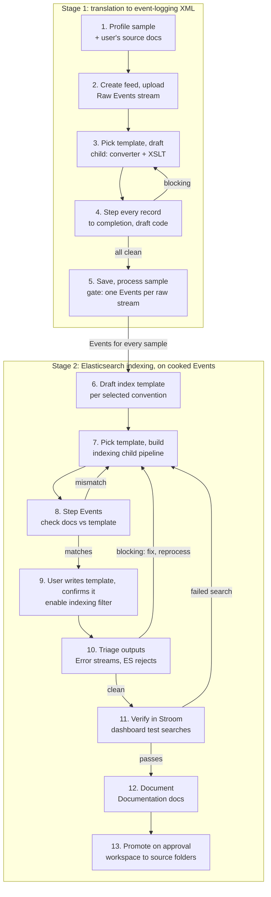
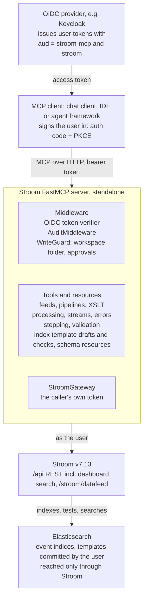

# Stroom FastMCP Server — Design

As of 2026-09-29. Kept in step with the shared design doc
(https://claude.ai/code/artifact/d0f92563-de5d-4c87-9d9b-8ba1c06f8c9a); diagrams are redrawn here in Mermaid.

## Overview

The Stroom MCP server lets an agent, whatever runs it, take a sample of raw data, or a feed that already holds data, and turn it into working Stroom content: a feed, a translation pipeline that emits [GCHQ event-logging](https://github.com/gchq/event-logging-schema) XML, and an indexing pipeline that sends those events to Elasticsearch. It is standalone: it talks only to Stroom, reaches Elasticsearch through Stroom, and needs no other MCP server. It borrows its structure from the Elasticsearch FastMCP server project but does not call it. It includes no agent or model: any MCP client that can sign the user in drives it (see Clients), and the rules that must hold are enforced by the server, not by a client.

**Goals**

- Accept a pasted or uploaded sample in XML, JSON, CSV or Syslog and land it in a Stroom feed.
- Build a translation pipeline (text converter + XSLT) iteratively on a suitable template pipeline, validated against the event-logging schema by stepping every sample record.
- Process the sample into Events, then build a lightweight indexing pipeline, on Stroom's Lucene index or Elasticsearch, and draft its index mapping that follows the environment's chosen field convention.
- Triage Error streams from pipelines that act on cooked Events, and fix what the agent's own content caused.
- Maintain existing content: update a translation with new samples or a field fix, and create a new versioned indexing pipeline beside the one in production; index raw structured data directly into a discovery index for exploration; and evaluate and document existing events pipelines against the event-logging schema.

**Non-goals (v1)**

- General-purpose search of indexed data; indexing is verified through Stroom searches, not direct queries.
- Managing Stroom users, permissions, nodes or volumes.
- Deleting existing content, or editing content the agent did not create, without an explicit flag.

**Target platform**: Stroom v7.13 REST API (`/api/...`), the event-logging schema version the environment uses (v3.5.2 in the reference environment; configurable), Elasticsearch 8/9.

## End-to-end workflow

In stage 1, stepping every sample record to completion is the correctness check: once every record steps clean, processing the sample only produces the Events stream stage 2 needs. The agent confirms every raw sample stream produced exactly one Events stream, since the indexing pipeline has nothing to step without one, but does not iterate on the stage 1 Error streams. From stage 2 on, pipelines act on cooked Events and write to Elasticsearch, so their Error streams are triaged and can send the agent back to fix and reprocess.



1. **Profile the sample.** Detect format (XML, JSON, CSV with or without header, RFC 3164/5424 Syslog), encoding, record delimiter and timestamp format. If the user supplies vendor documentation or annotated samples, the agent records them as a field dictionary and event catalogue (`record_source_notes`; see Source documentation) to guide steps 3 and 4.
2. **Create the feed and upload.** Create a `Feed` doc (stream type `Raw Events`, encoding) once the user confirms the proposed feed name and encoding, then POST the sample to `/stroom/datafeed` with a `Feed` header. The new stream's meta id is found with `/api/meta/v1/find`.
3. **Choose a template, draft the translation pipeline.** The XSLT is generated from a field mapping (`build_translation_xslt`) rather than written by hand, wherever a mapping can express it. Search for translation-stage template pipelines (`find_pipeline_templates`), see how existing children specialise them, and learn what shared elements such as user decoration expect. Create a child of the chosen template, supplying only the source-specific `TextConverter` (Data Splitter or XML Fragment) and `XSLT`. Stroom's standard Event Data (Text) or Event Data (XML) pipelines are the fallback. The user confirms the chosen template before the child is created. Field mappings and event types follow the field dictionary and event catalogue when there are source notes.
4. **Step every sample record to completion.** `/api/stepping/v1/step` accepts a `code` map that overrides element code for the session, so the agent tries XSLT revisions without saving them. It steps every record of the sample, not a subset; each step returns per-element input, output and error indicators, and any blocking error sends it back to step 3. Stepping errors are triaged with the same rules as Error streams, so benign decoration warnings do not hold it up.
5. **Save and process the sample.** When every record steps clean, save the docs and create a processor filter on the sample stream ids. This run only produces the `Events` stream that stage 2 needs; before stage 2 the agent checks that every raw sample stream has exactly one child Events stream, with records, and that the counts match the stepped records. More than one means the raw stream was processed twice (overlapping filters or a stray reprocess), which would give the indexing stage duplicate events, so the agent reports it and asks which to keep. A raw stream with no Events means processing failed despite clean stepping (a failed task, a fatal error, a filter that missed the stream), so the agent reads that stream's task status and Error stream, fixes the cause and reprocesses it (`reprocess_streams`), or asks the user. Beyond this gate, stage 1 Error streams are not iterated on.
6. **Draft the index template.** Apply the field convention the user or configuration selected (never an assumed one), check names and types against that convention's reference index docs (their fields read through Stroom), and draft a new template.
7. **Choose a template, build the indexing pipeline.** Search for indexing-stage templates the same way; a local one may already set the Elastic cluster, batch size and shared enrichment. Inherit from it (fallback: Indexing (Elasticsearch)). The indexing filter's `cluster` property must point at an existing Elastic Cluster doc: the agent takes the one that existing Elastic Index docs and indexing pipelines for similar data already use (`find_elastic_clusters`) and checks it with `elasticCluster/v1/testCluster`. It never creates a cluster doc, since that holds credentials; if none fits, it asks. The cluster, the indexing template, the field convention and the destination index or data stream name (with its version) are proposed together at the start of stage 2, and the user confirms or corrects them before anything is drafted or created. The child's XSLT emits the `xpath-functions` JSON-XML `array`/`map` form with `StreamId`, `EventId` and `@timestamp`.
8. **Step Events through it.** Step the cooked Events and compare each stepped document's fields and value shapes with the draft template. Fix the XSLT or the template on a mismatch.
9. **Agree the template, then hand over the filter.**
   - The agent suggests the index template once the indexing pipeline steps clean (`propose_index_template`). It is rendered from the field plan for the pipeline's own destination index, as a Kibana Dev Tools request, and already checked against the documents the pipeline writes.
   - If the user sends back a changed template, `check_index_template` steps the candidate indexing pipeline and checks every document field against it. It checks that `index_patterns` cover the pipeline's index and that values fit the mapped types, including date formats and IPs. It also checks the `dynamic` setting for unmapped fields, fields mapped as values that the pipeline writes as objects (or the reverse), `@timestamp` for data streams, and fields the template renamed or added.
   - When the template does not fit, the agent lists the pipeline changes it needs (e.g. rename `user.name` to `user.id` in the indexing XSLT) and asks whether to make them or change the template instead.
   - The user commits the template; the server has no Elasticsearch access of its own. Events reach Elasticsearch only through the Stroom indexing pipeline.
   - When the user confirms they have committed the template for the named index and cluster, `create_processor_filter` pre-creates the indexing filter **disabled**. The agent tells the user it is ready to enable and gives a direct link to the pipeline (`<stroom>/?action=open-doc&docType=Pipeline&docUuid=<uuid>`, the form Stroom's "Copy Link to Clipboard" uses) so they can review it and enable the filter on its Processors tab. It continues once they have, or enables it on request with approval.
10. **Triage indexing outputs.** Stepping does not write to Elasticsearch, so mapping conflicts and bulk rejections only appear now. The agent reads the indexing Error streams, classifies them as blocking, review or benign (see Error triage), fixes the XSLT or template and reprocesses on blocking errors, then runs Stroom's connection check (`elasticIndex/v1/testIndex`).
11. **Verify the Stroom way.** Create an Elastic Index doc for the target index or data stream on the same Elastic Cluster doc the indexing filter writes through, copying settings such as the time field and search scroll size from existing Elastic Index docs on that cluster (its fields load from the mapping) and a verification dashboard in the workspace: a query on that index and a table with a minimal field set (`StreamId`, `EventId`, the time field and a few key fields from the template). Then run test searches through Stroom's dashboard search API: all documents for the sample stream ids, whose count must match the Events records; an exact-match search on each key field using a value from a stepped document; and a time-range search around the sample timestamps. Each must return the expected records, which checks the mapping and the way people will actually search it. A failed search sends the agent back to step 7.
12. **Document.** Write Stroom Documentation docs for the events and indexing pipelines (`write_documentation`) from what stages 1 and 2 measured: the field mapping, event types from the processed sample, the index template and version, and the verification results. The same summary is returned in the chat.
13. **Promote on approval.** Everything so far lives in the workspace. `build_status` shows what the build still lacks (a clean step of each pipeline's current code, documentation). `promote_build` proposes destination folders from where sibling sources live; the user confirms them and approves, with any of those warnings in view, and the docs are moved into place. Each promoted pipeline gets a processor filter for new data on its feed, created disabled, with a link to the pipeline for the user to review and enable it.

## Further use cases

Six further jobs. The evaluation is read-only. The two updates start from existing production content rather than a new source: both work on draft code or copies until a person approves, and both compare new output with current output record by record, so the only differences are the intended ones.

**Update an events pipeline**

Triggered by new samples the current XSLT does not handle, or a reported issue such as a missed or wrongly translated field.

1. **Locate the baseline.** Find the pipeline by name or feed (`find_documents`, `describe_document`) and read its XSLT and text converter.
2. **Gather test records.** New samples go to a workspace test feed with the production feed's settings (`<FEED>-MCP-TEST`), never to the production feed, where live processor filters would pick them up. For a reported issue, the agent finds example records in the production feed's recent Raw Events (`find_streams`, `read_stream`), or uses stream and record ids the user gives.
3. **Revise with draft code.** Stepping accepts draft XSLT through the `code` map, so the existing pipeline is stepped over the test records and a regression set of recent production records without saving anything.
4. **Compare outputs.** `compare_outputs` steps the same records through the current and draft code and diffs each event. There must be no blocking errors, and differences must be limited to the fields the change targets; anything else goes to the user.
5. **Confirm how to save, then save.** The agent asks whether to create a new version or change the current pipeline in place, and proposes names from the baseline's versioning convention, e.g. `Keycloak-V1.2-Events` becomes pipeline and XSLT `Keycloak-V1.3-Events`. The user confirms the choice and the pipeline and translation names, or edits them. A new version is made in the workspace with `copy_pipeline` (pipeline, XSLT and text converter) plus the draft code; an in-place change is saved to a working copy of the XSLT in the workspace. Nothing in production changes until the user approves promotion: a new version is then moved into place and gets its processor filter, with the current version left running until the user retires it; an in-place change is written into the production XSLT after a backup. Reprocessing historical data with the production pipeline is the user's to do (see Design decisions); the agent lists the streams the change would affect. Test records in the build are reprocessed as part of development. The Documentation doc is created for a new version, noting what changed, or updated with a change-log entry for an in-place change.

**Update an indexing pipeline (as a new version)**

Triggered by a request to index more fields or change how fields are mapped. In-use production indices stay untouched: the agent builds a new versioned pipeline beside the current one.

1. **Locate the baseline.** Find the indexing pipeline, its Elastic Index doc, the index or data stream it writes to, and its index template.
2. **Work out the next version.** With the convention `stroom-windows-events-v1`, the candidate is `stroom-windows-events-v2`. The pattern is configurable (`index_versioning.pattern: '{base}-v{n}'`); if the current name does not match it, the agent asks. The v2 name and the cluster are confirmed like any stage 2 destination.
3. **Copy and bump.** `copy_pipeline` copies the pipeline and the XSLT it owns into the workspace under the new version and sets the `ElasticIndexingFilter` `indexName` to the v2 name; `create_index_doc` adds a v2 Elastic Index doc. Any inherited parent template is kept.
4. **Revise the XSLT and template.** The template draft starts from the v1 template, renamed and with `index_patterns` bumped to v2, then applies the requested field changes under the selected field convention.
5. **Step and compare.** `compare_outputs` steps the same Events records through v1 and v2 and diffs the documents. Only the added or changed fields may differ, and each must match the v2 template.
6. **Hand over.** The agent proposes the v2 template (`propose_index_template`) and checks any changes the user sends back (`check_index_template`). Once the user has committed it, the v2 indexing filter is pre-created disabled, on new Events from a create time, with the pipeline link for the user to review and enable it; backfilling older streams is the user's. Then triage its outputs and verify through a v2 Elastic Index doc and dashboard, as in steps 10 and 11. The v2 pipeline gets its own Documentation doc, noting what changed from v1. Moving readers from v1 to v2 and retiring v1 are the user's (see Design decisions).
**Create a discovery index**

A discovery index lets people explore raw structured data, such as JSON, before or instead of writing a translation. A simple indexing pipeline reads the Raw Events stream, parses it to JSON XML and indexes it as it is, with no event-logging step.

1. **Choose the source.** An existing Raw Events feed, or a sample uploaded to a new workspace feed as in steps 1 and 2.
2. **Choose a template.** Look for a discovery-stage template pipeline as in step 7 (`pipeline_templates.discovery`); in the reference environment that is `Raw to Elasticsearch`; the fallback is a minimal chain: `JSONParser`, `XSLTFilter`, `ElasticIndexingFilter`.
3. **Draft the XSLT.** `JSONParser` emits JSON XML in the `http://www.w3.org/2013/XSL/json` namespace, while the indexing filter reads the `xpath-functions` namespace, so the XSLT starts as a copy that moves elements into that namespace: it adds `StreamId`, `EventId` and `@timestamp` (from a timestamp field the user confirms) and keeps source field names. It may also do light processing the agent proposes from the sample profile: unpack JSON held as a string in a field such as `message` into a nested map with `json-to-xml()`; decorate each document from stream meta, e.g. `stroom:meta('MyHost')`, choosing from the attributes the raw streams actually carry (`describe_stream`); and drop or rename a few noisy or conflicting fields. XML or CSV sources need a small mapping XSLT instead. Anything beyond this, such as a full event-logging translation, belongs in `onboard_data_source`.
4. **Draft a permissive template.** Field names stay as in the source, so no field convention applies. The template uses dynamic mapping with guardrails from config (`discovery_template`): strings as `keyword`, a total-fields limit, `ignore_malformed`, and explicit types only for `@timestamp`, `StreamId` and `EventId`.
5. **Confirm, step and apply.** Cluster, destination name (e.g. `stroom-discovery-<source>-v1`), template pipeline, timestamp field and the proposed enrichments are confirmed in one prompt. The agent steps every sample record and proposes the template (checking any changes the user sends back); once the user has committed it, the processor filter on the Raw Events feed is pre-created disabled, with the pipeline link for the user to review and enable it.
6. **Verify the Stroom way.** Triage and verify as in steps 10 and 11. The discovered field list, read through the Elastic Index doc, can seed the sample profile when the source is later onboarded with a full translation. The discovery pipeline is documented like any other.
**Evaluate and document an events pipeline**

A read-only review that explains an existing translation and measures its output against the event-logging schema. Nothing is changed; suggested fixes go to `update_events_pipeline` if the user wants them.

1. **Describe the pipeline.** Element chain, inherited template, text converter, XSLT, reference data and decoration lookups, and the feeds its processor filters cover (`describe_document`, `processing_status`).
2. **Sample the data.** Recent Raw Events and their Events streams from each feed, up to `max_sample_records` (`find_streams`, `read_stream`). Stepping a handful of records shows input and output side by side.
3. **Map the translation.** `describe_document` reads the XSLT and lists which input fields feed which event-logging paths; comparing that with the sample profile shows input fields that are never used.
4. **Inventory the events.** `summarise_streams (kind=events)` counts events by `EventDetail` type, `TypeId` and `Action`, with examples, and reports how often each path is populated.
5. **Measure conformance.** Validate the sampled events against the schema version the pipeline targets and the latest version the instance holds (`check_events`, which also runs the quality rules), and triage recent Error streams (`summarise_streams (kind=errors)`). Results are rates, e.g. 97% valid, 12% missing `EventSource/Device/IPAddress`.
6. **Suggest improvements.** Prioritised changes, each with the rule or field it fixes, the share of events affected and a draft XSLT change.

The report is returned in the chat and saved as the pipeline's Documentation doc: written in the workspace and, on approval, moved beside the pipeline or written into its existing doc after a backup, with a change-log entry. It uses the shared documentation sections, with suggestions under Open items:

| Section | Content |
| --- | --- |
| Purpose and data | Feeds, source system, record format, volumes |
| Processing | Element chain, inherited template, reference lookups and decoration |
| Field mapping | Input field to event-logging path, unused input fields |
| Event types | `EventDetail` types, `TypeId`s and `Action`s, with counts and examples |
| Schema conformance | Validation and quality pass rates, schema version gap, recent error groups |
| Suggestions | Prioritised changes with rationale and draft XSLT |

**Build a pipeline for a feed that already holds data**

The user names an existing Raw Events feed instead of giving a sample. Not every kind of event shows up in every stream, so the agent samples stream after stream until more streams add nothing new. It only reads and steps: no feed is created, nothing is uploaded or processed, so there are no filters or streams to clean up.

1. **Survey.** `survey_feed` picks streams spread over the feed's lifetime (by create time, read newest, oldest, then the middle, then the quarters, so any prefix spans the whole range) and reads only the head of each: up to 250,000 characters of up to 3 parts, and 1,000 records, so a multi-GB stream costs the same as a small one. A cut-off last record is dropped, and JSON arrays and XML are parsed incrementally, so only complete records count. It groups the records into shapes, one per kind of event. For JSON, XML and key=value records a shape is the set of fields plus the values of fields that usually name the event (`action`, `event`, `type` and similar). For delimited data it is the values of those naming columns, or of low-variety columns when none is named that way. For syslog and other text it is the message with numbers, addresses and quoted strings masked, merged with messages that differ only in a few words, such as user names. A message-like field (body, message...) is unwrapped: JSON inside it, after any text prefix or byte order mark, is signed by its fields and naming values (logger names count), and naming `key=value` pairs keep their values (`type="LOGIN"`), so a wrapper such as syslog shipped as JSON does not hide the kinds of event. The survey stops when a few streams in a row add no new shape, and returns each shape's count, share and examples, with where each example is (stream, part, record), and says plainly whether the feed is covered yet.
2. **Translate every shape, stepping in place.** The mapping gets one rule per shape (`build_translation_xslt`), and `step_records` steps the translation on the survey's locations, the feed's own records, until clean. Records no rule matches are logged, not dropped, so a missed shape shows up. Kinds not worth translating (housekeeping, debug) are shown to the user with their share; only if the user agrees are they left untranslated: `set_shape_handling` records the choice and the user's reason in the survey doc (a confirmation), the mapping gets an explicit drop rule for them, and their locations are stepped expecting no Event.
3. **Read more streams.** The agent surveys again, skipping the streams already read and passing the signatures it already knows, so only new shapes come back. The mapping gains rules and every location found so far is stepped again. This repeats until a survey says the feed is covered, or every stream has been read; until then the agent says plainly that it is not covered yet.
4. **Broad check.** Two examples per shape cannot show every variant (a missing optional field, an odd value), so `step_sample` steps the first 200 records of three surveyed streams spread over time (`records_per_stream`). Anything blocking or for review goes back to the mapping. Then the agent reports which kinds of event the pipeline covers and their share of the data.
The survey is kept in the build as a Documentation doc, `<FEED> - Survey`: the kinds of event with counts, shares, streams and handling (translated, or left untranslated and why), example records with where each one is, the surveys run, and a machine-readable state block. A later survey with the same build carries on from it (skipping the streams read, knowing the shapes found), so an interrupted or later session need not start again, and it is promoted beside the pipeline as a record of what the feed holds. Example records are the feed's own data; who can read them is down to the permissions on the folder the doc lives in.

5. **Document, promote, hand over.** The translation is documented and promoted on approval. Processing the source feed with it is the user's to start; once its Events exist, `index_event_data` builds the indexing, since an indexing pipeline can only be stepped and filled from real Events streams.

**Fix a reported pipeline issue**

A user reports that something came out wrong, often one event type that is not translated properly, and gives a Stream ID and optionally an Event ID (as a dashboard shows them). The agent finds where it came from, confirms the problem, proves a fix and offers it. Nothing changes unless the user asks for the fix to be applied.

1. **Locate.** `locate_event` accepts an Events, Error or Raw Events stream id. An output stream leads to its parent raw stream and the pipeline that produced it; a raw stream leads to its Events child. With an Event ID, the agent steps the raw stream record by record, counting the events each record produces, until it reaches that event. It returns the raw part and record, the record's input, the stored event, the event stepping gives now, and the XSLTs and text converters the pipeline runs (marking any inherited from a template). This works on multi-part streams: Stroom numbers records within each raw part, while the Events stream's events run on across parts, and a record can produce no events or several.
2. **Plan the validation.** In a few lines the agent says what output the record should give (from the user's words, the schema and any source notes), which field paths are wrong now, and which other records it will check: recent raw streams on the same feed and the same event type (`find_streams`, `summarise_streams (kind=events)`).
3. **Confirm the issue.** `step_pipeline` on the located part and record, `check_events`. If the problem does not reproduce, the agent says what it found and asks the user rather than guessing a fix.
4. **Draft and prove the fix.** The fix goes in the pipeline's own XSLT or text converter, tried with draft code. `summarise_fix` steps every record of the reported stream and a few recent ones with the draft, and diffs the output against the saved code. The fix is ready when it changes the reported output, only the expected field paths change, and stepping has no blocking errors. It also returns the code diff and manual steps, and warns when the code belongs to a template shared by other pipelines.
5. **Offer it.** The agent shows the diff, the fields that change and on how many records, and asks whether to apply it. **Apply** follows `update_events_pipeline`: the user chooses a new version or an in-place change and confirms the names, then the agent copies, updates, compares against the original, documents and promotes on approval. **Manual** returns the steps to apply it in Stroom with the diff. In both cases reprocessing production data is the user's.

## Architecture

The server copies the ES MCP server's shape: FastMCP over streamable HTTP, OIDC auth, audit middleware, a lifespan-managed Stroom gateway, and tools that return compact, budgeted JSON with hints the model can act on. The one new idea is a **write guard**, because this server creates and changes content.



**Identity.** The server acts as the user who asked. Stroom 7.x trusts the same OpenID Connect provider (Keycloak, Entra ID, Okta, ...), and the clients' tokens carry both audiences (`aud` includes the MCP server's audience and `stroom`, e.g. through a Keycloak audience mapper; with a provider that issues one audience per token, Stroom accepts the server's audience instead), so the server forwards the caller's token unchanged on every Stroom call, including `/stroom/datafeed` uploads. Stroom applies that user's own document permissions and audits changes under their name. There is no shared API key and no token exchange. A token without Stroom's audience in `aud` is refused with a message saying so, and a token that expires during a long call (such as `wait_for_processing`) asks the client to refresh and call again. A Stroom API key is used only with `dev_no_auth`, which is refused unless the server listens on localhost. For uploads to work, Stroom's receiver must accept OIDC tokens (`receive` token authentication enabled).

**Clients.** Any MCP client can drive the server; what one needs is under Clients below. VS Code's chat (agent mode) is the first set up and tested: its model runs the workflows from the prompts (slash commands), guides attach as resources, and VS Code handles the sign-in with a pre-registered public client (PKCE, redirect URIs `http://127.0.0.1:33418` and `https://vscode.dev/redirect`). Setup: `docs/VSCODE.md`.

**Asking the user.** Confirmations and approvals are forms the user answers, so the model never holds the answer. On MCP 2026-07-28 connections, which have no server-initiated requests, the tool returns an input-required result with the form, and the client repeats the call with the answer (SEP-2322); the sealed request state names the exact request and user, and the gates already passed in the call. On earlier connections the server sends the elicitation during the call. A client that cannot answer forms gets a one-time id bound to the request and user instead.

**Elasticsearch.** The server never connects to Elasticsearch and holds no Elasticsearch credentials. Everything goes through Stroom, as the user: index doc fields (`dataSource/v1/findFields`), connection tests (`elasticIndex/v1/testIndex`, `elasticCluster/v1/testCluster`) and searches that verify indexed documents. Index templates are drafted and checked by the server and committed by the user. Documents reach Elasticsearch through Stroom's own `ElasticIndexingFilter` and Elastic Cluster doc; the server never bulk-writes events.

**Stroom API details.** Explorer calls (`fetchExplorerNodes`, `find`) must send `filter.requiredPermissions: ["VIEW"]`, as the Stroom UI does, and `find` needs a name filter (`*` or `type:Pipeline`); without them Stroom returns nothing below System. Docs are matched by UUID, because names held in inherited references go stale when a doc is renamed.

**Indexing backends.** Stage 2 is the same flow on Stroom's built-in Lucene index and on Elasticsearch: a field plan, an index doc, an indexing pipeline from a template, stepping, processing, then a verification dashboard and test searches. Only the pieces below differ, so tools take the backend from the build rather than assuming one. The backend is chosen per build from where sibling sources index and which indexing template is picked, and confirmed with the other stage 2 details. The local development stack uses Lucene; the live instance uses Elasticsearch.

| Aspect | Lucene (Stroom Index) | Elasticsearch |
| --- | --- | --- |
| Index doc | `Index`, in a volume group; `index/v2` | `ElasticIndex`, on an Elastic Cluster doc; `elasticIndex/v1` |
| Field definitions | On the index doc, via `index/v2/addField` | An index template in Elasticsearch; the doc reads fields from the mapping |
| Indexing template | `Indexing` (`IndexingFilter`, property `index`) | e.g. `Events to Elasticsearch` (`ElasticIndexingFilter`, `cluster`, `indexName`) |
| XSLT output | `records:2`: `<data name="..." value="..."/>` | `xpath-functions` JSON XML `map` |
| Keyword field | `TEXT` with the `KEYWORD` analyzer (`KEYWORD` itself indexes nothing) | `keyword` |
| IDs and time | `ID` for `StreamId`/`EventId`, `DATE` for the time field | `long`, `date` |
| Verification | Dashboard on the index doc, `dashboard/v1/search` | Same |

**Project layout**

```
stroom-fastmcp-server/
  main.py                 # FastMCP app: auth, TLS, /healthz, lifespan, tool registration
  main_tools.py           # the tool modules
  config.py               # Settings, STROOM_MCP_* env vars
  access_policy.yaml      # where template pipelines are looked for, per stage
  error_rules.yaml        # error triage rules: message regex, element, severity -> class
  conventions/            # field convention profiles (*.yaml)
  knowledge/guides/       # the stroom://guide/{name} resources
  security/
    auth.py               # OIDC token verification (key discovery, private CA, clear rejection reasons)
    audit.py              # audit middleware and events
    guard.py              # write guard: workspace folders, mcp-* tags, managed docs only
    policy.py             # access policy (template sources)
  utils/
    stroom.py             # StroomGateway: forwards the caller's token, error mapping
    consent.py            # confirmations and approvals: forms, elicitation or ids
    schemas.py  eventschema.py   # event-logging XSD from Stroom; element order, required parts, choices
    xsltgen.py            # translation XSLT from a field mapping
    survey.py  surveydoc.py      # kinds of event in a feed; the survey doc
    profile.py  fieldplan.py  templatecheck.py  triage.py  tls.py
  tools/                  # one module per tool group (see the tool catalogue)
  charts/stroom-mcp/      # Helm chart
  dev/                    # local Stroom and Keycloak stacks, e2e suites, evaluation set, live checks
  tests/                  # unit tests: respx-mocked Stroom, schema fixtures
```

**Config (`STROOM_MCP_*`)**: every setting, with its default and chart value, is in `docs/DEPLOYMENT.md`.

**Deployment.** One container image (uv multi-stage, non-root uid 10001, read-only root file system, no capabilities) and a Helm chart, `charts/stroom-mcp`, modelled on the Elasticsearch MCP server's. The server terminates TLS itself and refuses to start without a certificate, unless a proxy in front terminates TLS (`tls_terminated_upstream`, which the chart sets with `tls.enabled: false`) or it listens on localhost for development; with sign-in on, `public_base_url` must be https. The certificate comes from a Secret or cert-manager. Private CAs for Stroom and the identity provider are trusted in addition to the system CAs. Forms carry sealed state between rounds; several replicas must share the sealing keys (`request_state_keys`), and the chart refuses more than one replica without them. `/healthz` is unauthenticated and independent of Stroom and the identity provider, for probes. The access policy, error rules and field conventions can be replaced from chart values. CI runs the tests, lints and renders the chart (and checks it refuses to render without its required settings), and smoke-tests the image over TLS before publishing the image and chart to GHCR.

**Dependencies**: `fastmcp`, `httpx`, `pydantic`, `pydantic-settings`, `lxml` (XSD validation, XSLT well-formedness, incremental parsing), `pyyaml`; dev: `pytest`, `pytest-asyncio`, `respx`, `saxonche` (running generated XSLT in tests).

**Field conventions.** Index field names and structure are environment-specific: some environments use ECS, others a custom scheme. The server has no built-in naming scheme. A convention profile is a YAML file in `conventions/` (`STROOM_MCP_CONVENTIONS_DIR`), loaded like the ES server's source packs, and exposed as `stroom://conventions/{name}`.

```yaml
name: ecs
description: Elastic Common Schema 8.x, as used by ecs-* indices
reference_index_docs: [ECS-Base]   # existing Index or Elastic Index docs whose fields are authoritative
structure: nested                    # nested objects or flattened dotted keys
required_fields: {'@timestamp': date, StreamId: long, EventId: long}
field_map:                           # optional: event-logging path -> index field
  EventSource/Device/IPAddress: host.ip
  EventSource/User/Id: user.name
type_overrides: {'*.ip': ip}
```

Selection order: the profile the user names in the conversation, else `STROOM_MCP_DEFAULT_CONVENTION`, else none. With none, `get_field_conventions` returns `needs_guidance`, and the agent asks the user to pick a profile, point at reference index docs, or describe the convention. A described convention goes into the field plan as explicit fields (`draft_index_mapping`'s `extra_fields`); one worth keeping is added as a profile by whoever runs the server (the chart's `conventions`). The agent never falls back to ECS or any other scheme on its own.

**Pipeline templates.** Before drafting either pipeline, the agent looks for an existing pipeline to inherit from. A local template often carries shared elements a new source should reuse, not copy: user decoration XSLTs, reference data lookups, schema filter settings, indexing properties. Discovery uses three signals, in order:

1. Configured template sources per stage in `access_policy.yaml` (folders, explorer tags, name patterns).
2. Inheritance: pipelines that working pipelines inherit from (`parentPipeline`), ranked by number of children and how similar their feeds are to the new source.
3. Stroom's standard pipelines (Event Data (Text), Event Data (XML), Indexing (Elasticsearch)), as a last resort.

```yaml
pipeline_templates:
  translation:
    folders: [System/Template Pipelines]
    names: ['Event Data (*)']
  indexing:
    folders: [System/Template Pipelines/Elasticsearch]
    names: ['Events to Elasticsearch']
  discovery:
    folders: [System/Template Pipelines/Elasticsearch]
    names: ['Raw to Elasticsearch']
```

For each candidate the agent reviews the element chain, the elements a child is expected to supply (usually the text converter and source XSLT), and the input contract of shared downstream elements, e.g. a decoration XSLT that reads `EventSource/User/Id`. It shows the user the chosen template and why; when candidates are close or none fit, it asks instead of picking. The child overrides only what it must, so later fixes to the template reach every source. A new pipeline keeps the template's structure and defaults, e.g. its decoration step. A new version or an in-place change keeps the original pipeline's structure and settings instead: elements it removed or re-linked, its reference loaders and its property values. Stepping the child runs the whole inherited chain, so a translation that breaks a shared element shows up as an error on that element.

**Pipeline documentation.** Every pipeline the agent creates, changes or evaluates gets a Stroom Documentation doc (`documentation/v1`), written in Markdown from the guide in `knowledge/guides/documentation.md`. The Field mapping section is never typed: the mapping (or index plan) an XSLT was generated from is kept with the XSLT (`save_xslt mapping=`, in its description), and `write_documentation` regenerates the section from it by stepping the sample streams with each Event marked by its rule, so the tables show both halves (where each value comes from, and what the sample's events got) with exact per-rule counts. A digest marks the section; `build_status` reports documentation that predates the current mapping or XSLT, and an XSLT edited by hand since its mapping. The same content is returned in the chat. The doc takes the pipeline's name and sits in the same folder. On an update the agent revises the affected sections and appends to the change log instead of rewriting the doc.

| Section | Events pipeline | Indexing or discovery pipeline |
| --- | --- | --- |
| Purpose and data | Feeds, source system, record format, volumes | Source feed, destination index or data stream, Elastic Cluster |
| Processing | Element chain, inherited template, reference lookups and decoration | Element chain, inherited template, enrichments |
| Field mapping | Generated from the kept mapping: XPath, description, From, sample values; one row per rule with counts and each EventDetail element as path <- from = value | Generated from the kept plan: index field, type, event-logging path, how often populated |
| Output | Event types (`EventDetail`, `TypeId`, `Action`) with counts | Index template name and version; verification searches and results |
| Conformance | Schema validation and quality pass rates; recent error groups | Error stream triage summary |
| Open items | Suggestions and known limitations | Suggestions and known limitations |
| Change log | Date, user, build or change, summary | Same |

**Source documentation.** When onboarding or updating, the user can give the agent vendor documentation or annotated samples in the chat, e.g. a field reference, a list of event ids and their meanings, or a sample with notes such as "field 7 is the logon user". `record_source_notes` condenses them into two structures and saves them, with the originals' titles and links, as a Documentation doc beside the feed:

- a **field dictionary**: field, meaning, type, example, and a suggested event-logging path;
- an **event catalogue**: event id or action, description, and a suggested `EventDetail` type and `TypeId`.

The drafting steps use both: which fields are users, devices or addresses, and which event-logging type each event becomes. The Field mapping section of the pipeline's documentation cites the source note behind each choice. Where the sample and the documentation disagree, the sample decides the format and the documentation decides the meaning, and the conflict is shown to the user. Catalogue entries with no sample records are handled in the XSLT but reported as untested. Existing Documentation docs beside a feed or pipeline are read the same way, so notes gathered once are reused by later updates and evaluations.

## MCP tool catalogue

58 tools in 14 groups. Tools are task-shaped rather than one-per-endpoint: each hides DocRef plumbing, pipeline JSON, expression trees and paging, and returns only what the model needs next. Write tools are marked **W**; those needing user approval are marked **A**.

**Explorer and reference content** (`tools/explorer.py`)

| Tool | Purpose | Stroom API |
| --- | --- | --- |
| `find_documents` | Find docs by name pattern and type (Feed, Pipeline, XSLT, TextConverter, XmlSchema, ElasticIndex) | `explorer/v2/find` |
| `describe_document` | Fetch a doc's content by type and UUID or path; XSLT and TextConverter code returned verbatim | `xslt/v1`, `textConverter/v1`, `feed/v1`, `pipeline/v1`, ... |
| `find_pipeline_templates` | Candidate parent pipelines for a stage (translation, indexing, discovery or reference) from configured sources, inheritance and standard pipelines; each with element chain, shared elements, elements a child must supply, and child count | `explorer/v2/find`, `pipeline/v1/fetchPipelineJson`, `fetchPipelineLayers` |
| `describe_template` | Existing pipelines that inherit from a template, with the elements each overrides and the feeds they process | `explorer/v2/findInContent`, `pipeline/v1/fetchPipelineJson` |
| `describe_template` | What a child's output must contain for the template's shared elements to work, from the XPaths their XSLTs read | `pipeline/v1/fetchPipelineJson`, `xslt/v1` |
| `find_documents (content=...)` | Existing XSLTs for a vendor or format, as few-shot examples | `explorer/v2/findInContent` |

**Feeds and sample data** (`tools/feeds.py`)

| Tool | Purpose | Stroom API |
| --- | --- | --- |
| `profile_sample` | Local: detect format (XML document or fragments, JSON array or lines, delimited, syslog, key=value), delimiter, header, timestamp patterns inferred from the values, field inventory, and string fields that hold embedded JSON; says which parser, converter and parser settings to use. Given several files, profiles them together and reports the fields and timestamp shapes only some files have | none |
| `record_source_notes` **W** | Condense user-supplied vendor documentation or annotated samples into a field dictionary and event catalogue, and save them as a Documentation doc beside the feed; also reads existing notes | `explorer/v2/create`, `documentation/v1/{uuid}` |
| `create_feed` **W** | Create a feed in the workspace with stream type, encoding and description | `explorer/v2/create`, `feed/v1/{uuid}` |
| `upload_sample` **W** | POST sample text to a feed (Raw Events, or Raw Reference with an effective time); returns the new stream id. One call per sample file | `/stroom/datafeed`, `meta/v1/find` |

**Pipelines** (`tools/pipelines.py`)

| Tool | Purpose | Stroom API |
| --- | --- | --- |
| `create_pipeline` **W** | Create a child of the chosen template; sets only the elements the child supplies (text converter, XSLT) and any properties the template leaves open. `replace_parser` swaps the template's parser in the child (e.g. an `XMLFragmentParser` for XML fragments when no template has one), re-linked where the old one was; `references` attach reference feeds and their loader for `stroom:lookup()` | `explorer/v2/create`, `pipeline/v1/savePipelineJson` |
| `update_pipeline (references=...)` **W** | Attach reference data (feed and loader pipeline) to a pipeline this server created | `pipeline/v1` |
| `copy_pipeline` **W** | Copy an existing pipeline and the docs it owns into the workspace under new names, e.g. a version bump; keeps the original's structure, reference loaders and settings, rewires the copies and can set properties such as `indexName` | `explorer/v2/copy`, `pipeline/v1/savePipelineJson` |
| `describe_document` | Flattened element chain with effective properties, including inherited ones and removed elements | `pipeline/v1/fetchPipelineJson`, `fetchPipelineLayers` |
| `update_pipeline` **W** | Set one element property, e.g. `schemaFilter.schemaGroup`, `elasticIndexingFilter.indexName` | `pipeline/v1/savePipelineJson` |

**Builds** (`tools/builds.py`)

| Tool | Purpose | Stroom API |
| --- | --- | --- |
| `start_build` **W** | Create or find the build's workspace folder; returns the standing instructions that apply to the feeds or folders given | `explorer/v2/create`, `documentation/v1` |
| `build_status` | The build's documents, working copies marked, and what its pipelines still lack before promotion: a clean step of their current code, documentation | `explorer/v2/fetchExplorerNodes`, doc reads |
| `write_documentation` **W** | Create or update a pipeline's Documentation doc from the documentation template, in the workspace; updates revise sections and append a change-log entry | `explorer/v2/create`, `documentation/v1/{uuid}` |
| `promote_build` **W A** | Move a build's docs from the workspace to confirmed destination folders (creating any that don't exist, listed in the approval), or write working copies into the production docs they replace after a backup, then remove the build's folder if it is left empty; the approval carries what `build_status` says is missing. Pre-creates, disabled, a filter for new data on each promoted pipeline's feed (from its sample filters, or the surveyed feed) with the pipeline link | `explorer/v2/move`, doc `PUT`s, `processorFilter/v1` |

**Translation content** (`tools/translation.py`)

| Tool | Purpose | Stroom API |
| --- | --- | --- |
| `save_text_converter` **W** | Create a Data Splitter or XML Fragment converter with code; refuses a Data Splitter that is not a `dataSplitter` document, e.g. an attempt to parse JSON (the JSONParser does that, with no converter), and an XML Fragment wrapper without the `fragment` entity | `textConverter/v1` |
| `save_text_converter` **W** | Replace the code of a converter the server created (production docs change through a working copy); refused if the doc changed since the `version` given | `textConverter/v1/{uuid}` |
| `save_xslt` **W** | Create an XSLT doc with code | `xslt/v1` |
| `save_dictionary` **W** | A Dictionary doc of key=value lines or a list, read at run time by the generated XSLT (`dictionary`, `in_dictionary`) | `dictionary/v1` |
| `save_xslt` with `uuid` **W** | Replace the code of an XSLT the server created (production docs change through a working copy); refused if the doc changed since the `version` given | `xslt/v1/{uuid}` |

**Generation** (`tools/generation.py`, reads the schema from Stroom, writes nothing)

| Tool | Purpose | Stroom API |
| --- | --- | --- |
| `build_translation_xslt` | Write the event-logging translation from a field mapping: input kind, fields every event shares, and one rule per kind of event (conditions, then input field or constant to event-logging path, with time patterns, value maps, defaults and `Data` entries). Mistakes the schema catches come back as problems per mapping entry, with suggestions: unknown paths, disallowed constants, alternatives used together, missing required elements, unquoted pattern letters. Otherwise it returns XSLT in schema order that leaves out elements with empty inputs and logs unmatched records. Drop rules (conditions only) leave kinds the user chose not to translate out without the warning. Sources are a field, the first of several (`any_of`), a constant, an XPath, a reference-data `lookup` or a `dictionary`, with a `transform` (case, trim, domain stripping) and `extract` (regex groups of a text field become fields). `for_each` makes every item of a record an event (record-level inputs marked `scope: record`), `repeat` writes one element per value of an array, and `drop_when` leaves records out by condition, with a reason. Given the sample (and the splitter spec), the mapping is checked against its records first: fields no record has, with the nearest names, and time formats the values do not fit. The standing instructions for the feeds given come back with the result | `xmlSchema/v1` |
| `build_data_splitter` | Write a Data Splitter from a spec (delimited with or without a header, regex with named groups, key=value, syslog with a parsed body) and run the spec on the sample locally: records, unmatched lines, field names | none |
| `build_reference_xslt` | Write a reference-data pipeline's XSLT from a mapping of maps (name, key, value parts), in `reference-data:2` | `xmlSchema/v1` |
| `find_reference_data` | The reference maps the environment loads (from the XSLTs that write `reference-data:2`): key and value shape, loading pipeline and feeds, loader, and the pipelines that use them | `explorer/v2/findInContent`, `xslt/v1`, `processorFilter/v1/find` |

A model that is weak at XSLT only has to produce the mapping. The generator carries what the model would otherwise get wrong: the input namespace, element order, `stroom:format-date`, guards against empty elements, and `xsl:choose` per event kind. Hand-written XSLT remains for what a mapping cannot express, such as unpacking embedded JSON or reference lookups.

**Validation** (`tools/validation.py`: checks run locally; the XSD is read from Stroom once and cached)

| Tool | Purpose |
| --- | --- |
| `check_xslt` | Well-formed, XSLT 2.0/3.0 namespace, only real `stroom:` functions (an unknown one is refused with the nearest name), match/select expressions that would select nothing for want of the input namespace, event-logging elements the schema has no place for (checked against the XSD in Stroom), imports that resolve. Runs on every XSLT saved and on draft code before it is stepped |
| `check_events` | Validate event XML against the event-logging XSD held in the Stroom instance (the configured version, or the one the events declare); errors with line, path and a short fix hint |
| `check_events` | Beyond the XSD: `EventTime/TimeCreated` parses, `EventSource/System/Name` set, no empty elements, `EventDetail` type matches the action |
| `describe_document` | Read an XSLT and list, per output event-logging path, the input fields or expressions that feed it; flags constant values and paths never set |

**Processing** (`tools/processing.py`)

| Tool | Purpose | Stroom API |
| --- | --- | --- |
| `create_processor_filter` **W A** | Filter for a pipeline on sample stream ids, or on feed + stream type from a create time. Refuses streams the pipeline already processed (use `reprocess_streams`). An indexing pipeline reading Events must name its source events pipeline, and the filter adds `Pipeline IS_DOC_REF <source>`. For an Elasticsearch indexing pipeline, once the user confirms the index template for its destination index is committed, pre-creates the filter disabled and returns the pipeline link for the user to enable it | `processorFilter/v1`, `fetchPipelineLayers` |
| `set_processor_filter_enabled` **W A** | Enable or disable a filter the agent created | `processorFilter/v1/{id}/enabled` |
| `reprocess_streams` **W A** | Process up to 10 streams again through a workspace pipeline after a change, one task at a time; Stroom supersedes the earlier output. For Elasticsearch, the same hand-over: pre-created disabled for the user to enable | `processorFilter/v1` |
| `processing_status` | A pipeline's filters with tracker state and task counts by status, each filter's own tasks asked for by id (a page of every task in the system misses them on a busy instance) | `processorFilter/v1/find`, `processorTask/v1/find` |
| `wait_for_processing` | Poll `processing_status` with backoff until all tasks are complete or failed, or a timeout; then reports, per input stream, the child output stream (Events, or Reference for a reference-data pipeline) and errors, flagging inputs with none or more than one; can count only one filter's outputs | as above |

**Standing instructions** (`tools/instructions.py`, read-only)

| Tool | Purpose | Stroom API |
| --- | --- | --- |
| `get_instructions` | Standing instructions from `AGENTS` Documentation docs: those that apply to the given folders, feeds or documents (a doc applies to its folder and below; one directly under a root folder applies everywhere), most general first, with their text; other `AGENTS` docs listed by folder | `explorer/v2/find`, `documentation/v1` |

**Sampling** (`tools/sampling.py`, read-only apart from the build's survey doc)

| Tool | Purpose | Stroom API |
| --- | --- | --- |
| `survey_feed` | Sample an existing feed's streams spread over its lifetime (or exactly the sample streams an onboarding uploaded, given `stream_ids`), reading only the head of each (characters, parts and records capped), and group records into shapes (kinds of event) until more streams add nothing new; returns each shape's count, share and examples with their locations (stream, part, record) for `step_records`, and says plainly whether the feed is covered yet. A message-like field (body, message...) is unwrapped: JSON inside it (after any prefix or byte order mark) is signed by its fields and naming values, and naming `key=value` pairs keep their values, so a wrapper such as syslog shipped as JSON does not hide the kinds of event. Continues with `skip_stream_ids` and `known_signatures`, or, given a `build`, from the build's `<FEED> - Survey` doc, which it keeps up to date. Kinds the user chose to leave untranslated are marked, and their locations carry `expect: none` | `meta/v1/find`, `data/v1/fetch` |
| `set_shape_handling` **W** | Record in the survey doc, after the user confirms, that some kinds of event are left untranslated on purpose (with the user's reason), or undo that; returns their example locations to step. The doc shows each kind's handling | `documentation/v1` |

**Diagnosis** (`tools/diagnosis.py`, read-only)

| Tool | Purpose | Stroom API |
| --- | --- | --- |
| `locate_event` | From a reported Events, Error or Raw Events stream id and optional Event ID: the raw stream, part and record, the pipeline and its code docs, the record's input, the stored event and the event stepping gives now | `meta/v1/find`, `data/v1/fetch`, `stepping/v1/step` |
| `summarise_fix` | Prove a drafted XSLT or text converter fix on real records: output diff against the saved code (only expected paths may change), stepping verdict, code diff, readiness, and manual steps for applying it by hand | `stepping/v1/step`, doc reads |

**Streams and errors** (`tools/streams.py`)

| Tool | Purpose | Stroom API |
| --- | --- | --- |
| `find_streams` | Streams by feed, type, pipeline, parent id or create time | `meta/v1/find` |
| `describe_stream` | Child streams (Events, Error, Context, Meta) of a raw stream | `meta/v1/find` (`Parent Id`), `data/v1/{id}/parts/0/child-types` |
| `describe_stream` | Meta attributes a stream carries (e.g. `MyHost`, `ReceivedTime`, `RemoteAddress`), with values, for `stroom:meta()` decoration | `data/v1/{id}/metaAttributes`, `data/v1/{id}/info` |
| `read_stream` | Records from a stream in a range, trimmed to `max_stream_chars` | `data/v1/fetch` (TEXT) |
| `summarise_streams (kind=events)` | Profile Events streams: counts by `EventDetail` type, `TypeId` and `Action` with examples, and how often each event-logging path is populated | `data/v1/fetch` |
| `summarise_streams (kind=errors)` | Error markers grouped by message, element and severity with counts and first locations, each group classified blocking, review or benign with the rule that matched | `data/v1/fetch` (MARKER) |

**Stepping** (`tools/stepping.py`)

| Tool | Purpose | Stroom API |
| --- | --- | --- |
| `step_pipeline` | Step one record (first, last, or a record index) with optional draft code per element; returns the chosen elements' input and output and every element's errors, triaged | `stepping/v1/step` |
| `step_sample` | Step every record of the sample streams to completion (capped by `max_sample_records`, default 500, and optionally `records_per_stream` for the head of each stream); one compact verdict per record, errors triaged. A clean run of a build pipeline is recorded as an `mcp-stepped-*` tag on it, for promotion's checks | `stepping/v1/step` |
| `step_records` | Step chosen records of existing streams in place (e.g. `survey_feed`'s locations: stream, part, record) with optional draft code; one verdict like `step_sample`, plus which shapes did not step clean. A location with `expect: none` (a kind left untranslated) is clean when it writes no Event and flagged when it writes one. Nothing is copied or processed | `stepping/v1/step` |
| `compare_outputs` | Step the same records through two pipelines, or one pipeline with current and draft code, and diff each record's output (event XML or index document); reports fields added, removed and changed | `stepping/v1/step` |

Stepping holds no session between calls: each step is a fresh request from the last record's location, and a session id only polls a step that is still running (Stroom drops it when the step completes). So there is nothing to release afterwards.

**Indexing** (`tools/indexing.py`; Lucene or Elasticsearch per build)

| Tool | Purpose | Backend |
| --- | --- | --- |
| `get_field_conventions` | List convention profiles, or return the selected one with field-to-type maps from its reference index docs (Lucene or Elastic); returns `needs_guidance` when none is selected | `dataSource/v1/findFields` |
| `draft_index_mapping` | Local: turn stepped documents and the field convention into a field plan (name, logical type), rendered for the build's backend as an Elasticsearch index template or a Lucene field list; can start from a baseline with the version bumped; flags conflicts | none |
| `propose_index_template` | Elasticsearch: the template to suggest to the user for the candidate indexing pipeline's own index, as JSON and a Dev Tools request, self-checked against the pipeline's documents, with a link to the pipeline | `fetchPipelineLayers`, `stepping/v1/step` |
| `check_index_template` | Elasticsearch: check a user's changed template against the documents the candidate indexing pipeline writes; returns compatible or not, blocking issues, and each pipeline change needed | `stepping/v1/step`; fields from `composed_of` component templates are noted as unchecked |
| `create_index_doc` with `plan` **W** | Lucene: set a Lucene index doc's fields from the field plan (a keyword becomes `TEXT` with the `KEYWORD` analyzer) | `index/v2/addField`, `updateField`, `findFields` |
| `find_elastic_clusters` | Elasticsearch: cluster docs with their connection URLs (never credentials), the index docs and pipelines that use each, and their settings; optional connection test | `explorer/v2/find`, `elasticCluster/v1`, `elasticIndex/v1`, `elasticCluster/v1/testCluster` |
| `create_index_doc` **W** | The build's index doc: an Elastic Index doc on an existing Elastic Cluster, or a Lucene Index doc in a volume group, with settings copied from sibling index docs | `explorer/v2/create`, `elasticIndex/v1` or `index/v2`, `dataSource/v1/findFields` |
| `create_indexing_pipeline` **W** | Child of the chosen indexing template (e.g. `Events to Elasticsearch`, or `Indexing` for Lucene) with its XSLT and index property | as `create_pipeline` |
| `create_index_doc` | Elasticsearch: Stroom's own connection and index test | `elasticIndex/v1/testIndex` |
| `verify_index` **W** | Workspace dashboard with a query on the index doc and a table of a minimal field set (`StreamId`, `EventId`, time field, key fields); same on either backend | `explorer/v2/create`, `dashboard/v1/{uuid}` |
| `verify_index` | Run test searches through the dashboard (stream id count, exact match per key field, time range) and poll to completion; per search, pass or fail with expected and returned rows | `dashboard/v1/search` |

Tools return compact JSON with a `hint` for the next step where one helps, and gates as a `status` (`needs_confirmation`, `needs_approval`, `needs_guidance`) when the client cannot answer forms. Stroom errors are mapped to short reasons (not found, permission, validation, version conflict). Output is cut to `max_response_chars`, as in the ES server.

## MCP resources and prompts

Resources carry the reference knowledge the model needs but should not have to discover by tool calls; prompts package the workflows, so every client runs them the same way.

**Resources**

| URI | Content |
| --- | --- |
| `stroom://guides` | Index of the guides |
| `stroom://guide/{name}` | Short working guides: `event-logging` (required elements, `EventDetail` choices, common paths), `xslt` (`records:2` input, `stroom:` functions, identity templates, `json-to-xml()`, `stroom:meta()`), `data-splitter` (CSV, syslog and key=value recipes), `json-input` (`JSONParser` output and how the XSLT addresses it), `indexing` (Lucene fields; the JSON-XML form, `StreamId`, `EventId`, `@timestamp` for Elasticsearch), `agent-instructions` (writing AGENTS docs) |
| `stroom://conventions/{name}` | Configured field convention profiles |

**Prompts**

| Prompt | Arguments | Purpose |
| --- | --- | --- |
| `onboard_data_source` | `sample`, `source_name`, `vendor?`, `source_docs?` | Full stage 1 then stage 2 run, stopping at each confirmation and approval gate |
| `update_events_pipeline` | `pipeline`, `samples?`, `issue?`, `source_docs?` | Fix or extend an existing translation with draft code, output diffs and an approval-gated save |
| `update_indexing_pipeline` | `indexing_pipeline`, `changes` | Copy an indexing pipeline and template to the next version and apply field changes |
| `index_event_data` | `events_feed`, `index_pattern` | Stage 2 only, against an existing Events feed |
| `create_discovery_index` | `feed?`, `sample?`, `timestamp_field?` | Index raw structured data directly for exploration, without an event-logging translation |
| `evaluate_events_pipeline` | `pipeline`, `sample_size?`, `source_docs?` | Report on what a pipeline does, its data and event types, schema conformance and suggested fixes, returned in the chat and saved as its Documentation doc |
| `onboard_existing_feed` | `feed`, `source_docs?` | Build the events pipeline from the data a feed already holds by stepping only: survey its streams for kinds of event, step the translation on those records in place, look further back until nothing new turns up, then document, promote and hand over |
| `fix_pipeline_issue` | `stream_id`, `issue`, `event_id?` | Locate a reported event, confirm the problem, prove a fix, then apply it or give the manual steps, as the user chooses |

**Where the knowledge comes from.** The [event-logging](https://github.com/gchq/event-logging-schema) XSD is read from the Stroom instance's XML Schemas for the configured version, so generation and validation use exactly what the pipelines validate against. Guides are short, hand-written summaries of the [Stroom docs](https://gchq.github.io/stroom-docs/) in `knowledge/guides`, with links to the full page.

## Validation and safety

The agent may create freely inside its workspace, but anything that processes production data or changes Elasticsearch needs a human yes. Validation runs locally first, so most mistakes never reach Stroom.

**Write scope**

- Workspace (`STROOM_MCP_WORKSPACE_FOLDER`): everything the server creates or changes is built under `MCP Workspace/<build-name>/`, including new versions and working copies of production docs. Nothing reaches its destination until the user approves promotion (`promote_build`). Updates are allowed only to docs the server created and has not yet promoted, tracked by explorer tags: `mcp-managed`, `mcp-generated` and `mcp-build-<build>`. Stroom's own permissions still apply, since every call is made as the user.
- `access_policy.yaml`: where template pipelines are looked for, per stage.
- No delete tools in v1, and no Elastic Cluster docs are created or changed, since they hold credentials. Abandoned builds are left tagged for a person to clear.

**Workspace and promotion**

All work happens in the workspace; promotion is the approval-gated step that puts it in place. `promote_build` proposes a destination for each doc from where sibling content lives, e.g. `System/Feeds/Events/<Source>` for the feed, events pipeline, XSLT and text converter, and `System/Elastic Indices/<Source>` for the indexing pipeline, XSLT, Elastic Index doc, dashboard and Documentation docs. The user confirms the destinations, then approves the move.

- New docs and new versions are moved with `explorer/v2/move`. UUIDs do not change, so processor filters, pipeline references and dashboard queries keep working. Promoted docs lose `mcp-managed` and the build tag, so any later change goes through a working copy, but keep `mcp-generated`.
- A change to an existing production doc is made on a working copy in the workspace. On promotion the server backs up the production doc to `MCP Workspace/backups/`, writes the copy's content into it and removes the copy.
- Processor filters on workspace pipelines stay scoped to sample stream ids, one task at a time (`sample_max_tasks`). Promotion pre-creates each promoted pipeline's filter for its feed, from the promotion time (new data only), with the feed task limit, disabled: the user reviews the pipeline through the link and enables it, after disabling any earlier version that processes the same feed.
- A translation pipeline only processes streams from the build's own feeds: its Events land in the input's feed, so processing a production stream would put test Events into the production feed. Production records are stepped in place, or copied into a test feed. Indexing pipelines write to an index, so they are not limited this way.
- Before promotion, `build_status` shows what the build's pipelines still lack: a clean `step_sample` or `step_records` of their current code (stepping records a hash of the code that stepped clean, draft or saved, as an `mcp-stepped-<time>-<digest>` tag on the pipeline, the last five runs, so every replica sees it and it survives restarts; only pipelines the server manages are tagged, so stepping production stays read-only, and promotion removes the tags with `mcp-managed`), and, for new pipelines, a Documentation doc. `promote_build` puts these warnings in the approval, so the user decides with them in view.
- Standing instructions come back with `start_build` (given the feeds) and `build_translation_xslt`, not only from `get_instructions`, so a model that skips that step still sees them.
- Anything not promoted stays in the workspace, tagged for a person to clear.

**Approval gates (A tools)**

Before acting, the tool asks for the user's approval with a plain-language summary: as a form where the client supports one (see Asking the user), otherwise as `needs_approval` with an `approval_id` that the client passes back once the user agrees. Gated actions: enabling any processor filter (an Elasticsearch indexing filter is instead pre-created disabled once the user confirms the index template is committed, and the user enables it), putting an index template, changing a doc the agent did not create, and promoting a build out of the workspace.

**Confirmations**

Approvals guard actions; confirmations fix the key details those actions use. Both are asked through MCP elicitation when the client supports it, so the user answers the server directly rather than through the model; otherwise the tool returns an id with a summary for the client to show. The agent proposes each detail with where it came from and any alternatives, and the user confirms or corrects it. A confirmation is bound to the exact request and user: answered in a form, the call carries on; otherwise the tool returns a `confirmation_id` for the repeated call. `create_feed`, `create_pipeline`, `create_indexing_pipeline`, `copy_pipeline`, `create_index_doc` and `set_shape_handling` do not act without one covering the values they set.

| Detail | Confirmed at | Proposed from |
| --- | --- | --- |
| Feed name and encoding | Step 2 | Naming convention, sample profile |
| Translation template pipeline | Step 3 | `find_pipeline_templates`, existing children |
| Field convention | Start of stage 2, one prompt | Configured profile or user guidance |
| Indexing template pipeline | Start of stage 2, one prompt | `find_pipeline_templates` |
| Elastic Cluster doc | Start of stage 2, one prompt | Clusters used by Elastic Index docs and pipelines for similar data |
| Destination index or data stream name, with version | Start of stage 2, one prompt | Versioned naming convention, e.g. `stroom-windows-events-v1`, or the next version of a baseline |
| Events pipeline update: new version or in place, and the pipeline and translation names | `update_events_pipeline`, before saving | The baseline's versioning convention, e.g. V1.2 to V1.3 |
| Destination folders for promotion | Before promotion (step 13) | Where sibling sources' feeds, pipelines and indices live |
| Index template committed, for the destination index and cluster | Before the Elasticsearch indexing filter is pre-created, disabled (step 9) | The index name and cluster set on the indexing pipeline |
| Index backend (Lucene or Elasticsearch) and, for Lucene, the volume group | Start of stage 2, one prompt | Where sibling sources index and the chosen indexing template |

The stage 2 details come in one prompt because they depend on each other: the template's `index_patterns`, the Elastic Index doc and the indexing filter all use the same cluster and destination name.

**Blast radius on processing**

- Filters default to the sample stream ids only (`Meta Id IN (...)`), so the first runs never touch other data.
- A feed-wide filter needs approval and gets `maxProcessingTasks` from config (default 2) and a `minMetaCreateTimeMs`.
- A plain filter is refused for any stream the pipeline has already processed (it has an output from that pipeline, or one of the pipeline's filters already selects it); those go through `reprocess_streams`, which takes at most `max_reprocess_streams` (default 10) per call with `maxProcessingTasks` of `reprocess_max_tasks` (default 1). When a pipeline processes a stream again, Stroom marks that pipeline's earlier outputs for it deleted (superseded), so each raw stream keeps one Events stream.
- All processing tools act only on workspace pipelines this server built, so reprocessing never touches production pipelines.
- Every indexing filter over Events carries `Pipeline IS_DOC_REF <events pipeline>` for the events pipeline this server built for the source (`source_pipeline_uuid`), in addition to the stream ids or feed. Stream ids are checked first: each must be an Events stream that pipeline produced. Indexing never picks up Events streams from another pipeline, even on a shared feed. Stroom rejects `EQUALS` on the `Pipeline` field; `IS_DOC_REF` matches by UUID.

**Local validation before Stroom**

| Check | Where | Blocks save? |
| --- | --- | --- |
| XSLT well-formed and namespaces declared | `check_xslt`, before `save_xslt` | yes |
| Stepped output valid against event-logging XSD | `check_events` after each `step_pipeline` | no, returned as errors |
| Event quality rules | `check_events` | no, warnings |
| Indexing output has `StreamId`, `EventId`, `@timestamp` | `step_sample` on indexing pipelines | yes, before filter creation |
| Document fields match the draft template's types | `draft_index_mapping` conflict report | yes, before the template is proposed to the user |

**Error triage**

Triage applies to stepping indicators in every stage, and to Error streams from pipelines that run on cooked Events, such as indexing; the stage 1 processing run is not iterated on. Both often hold harmless INFO and WARN markers from shared template elements, so the agent judges each error group by who caused it, not by its presence. `summarise_streams (kind=errors)` classifies deterministically from severity, the element that raised it (and whether that element is the agent's own or inherited from the template) and message patterns; the model only explains and acts on the result.

| Class | Typical markers | Agent action |
| --- | --- | --- |
| Blocking | ERROR or FATAL from the text converter, parser or the agent's XSLT (`CODE`, `INPUT` errors); any `SchemaFilter` validation failure; Elasticsearch mapping conflicts or bulk rejections; indexing output missing `StreamId`, `EventId` or `@timestamp` | Fix and reprocess; the stage cannot pass |
| Review | Any ERROR from an inherited element; a WARN that hits every record; a decoration lookup that fails for all records when the key comes from a field the agent's XSLT sets | Check whether the translation causes it, e.g. a user id in the wrong format for the lookup; fix, or ask the user |
| Benign | INFO or WARN from inherited elements on some records, e.g. a failed user decoration lookup for an unknown account | Report counts and examples in the stage summary; no change |

Rules live in `error_rules.yaml` (message regex, element, severity, class) so an environment can mark known-harmless messages. Stage 1 passes when every sample record steps with no blocking or unresolved review groups and every raw sample stream has produced exactly one valid Events stream. The indexing stage passes when stepping and its Error streams both meet that bar and the verification searches pass.

**Idempotency and concurrency**

- Update tools take the `version` from the last read and refuse the save if the doc changed since, so the model re-reads and reapplies its change.
- Stepping holds no session between calls (see Stepping), so there is nothing to end on disconnect.
- Confirmations, approvals and clean-step records are held in Stroom or in sealed form state, not in the server's memory, so several replicas can serve one user (with shared sealing keys).

**Naming**

Names follow the environment's versioned conventions, learned from sibling content and confirmed with the user. In the reference environment, feeds and events pipelines carry a version (`Fortigate-FG60F-V1.2`, `Keycloak-V1.2-Events`, XSLT `Fortigate-FG60F-Events-V1.2`), indexing pipelines are `<Source> - Indexing`, and indices are `ecs-<source>-v<n>`. Test feeds add `-MCP-TEST`, the verification dashboard takes the index's name with a `-VERIFY` suffix, and Documentation docs take the name of the pipeline they document.

**Audit**: JSON lines with the user: `tool_call` (tool, arguments, outcome), `resource_read` (uri, outcome), `stroom_request` (method, path, status, ms), `es_request`, `access_denied` (rejected tokens with the check they failed, writes the guard refused, and Stroom's 401s and 403s), and each confirmation and approval (action, details, requested, granted or declined, and how: form, elicitation or id). Events and fields: `docs/AUDIT.md`.

## Clients

The server includes no agent. The agent is whatever the user runs: a chat client, an IDE's agent mode, or an agent framework, and building one is a separate initiative. Nothing a workflow depends on lives in the client: the server holds the rules (write guard, confirmations and approvals, processing limits, the Elasticsearch hand-over, checks before promotion), the prompts carry the workflows, and tool replies carry the next step.

| A client needs | Why | What the server provides |
| --- | --- | --- |
| Streamable HTTP | The transport | `<public url>/mcp` |
| OAuth sign-in as the user: authorization code with PKCE, or another flow that yields the user's own token | Every Stroom call acts as the user | Protected resource metadata (`/.well-known/oauth-protected-resource/mcp`) naming the OIDC issuer. Tokens must carry both audiences (the server's and `stroom`, or one both accept), `sub`, and the required scopes (`openid` by default); the client refreshes them |
| Forms, or a way to show a summary and send back an id | The user, not the model, answers confirmations and approvals | On MCP 2026-07-28, an input-required result the client answers by repeating the call (SEP-2322); on earlier versions, elicitation during the call; otherwise `needs_confirmation` / `needs_approval` with a summary and an id, which the client passes back only once the user agrees |
| Prompts (optional) | The workflows, e.g. as slash commands | Eight prompts; a client without prompt support can send the same text |
| Resources (optional) | Reference guides as context | `stroom://guides`, `stroom://guide/{name}`, `stroom://conventions/{name}` |
| Patience with long calls | Processing takes time | `wait_for_processing` returns at its timeout with a hint to call again |
| Room for 58 tools | Some clients cap tools per request | Tool groups a client can switch off (e.g. Elasticsearch on a Lucene-only instance) |

**For agent frameworks.** Replies are made to be routed on in code rather than by the model: gates come back as a `status` with an id, and verdicts are fields: stepping `verdict` (clean, review, blocking) and `shapes_not_clean`, the processing `gate` (pass or fail), survey `saturated` and `coverage`, and `before_promotion` from `build_status`. A framework can loop on those (e.g. draft, step, fix until clean) with the model only writing the mapping and explaining results, and keep its own state in the build: the survey doc and the build folder carry what a later session needs to carry on.

**Models.** A model weak at XSLT only writes a field mapping (`build_translation_xslt`); schema order, required parts, choices, namespaces and date formats come from the generator. Error triage, the survey and the template checks are deterministic, so the model explains and acts on results rather than judging them. Standing instructions come back from the tools that need them. The evaluation set (`dev/eval`) measures any agent against 10 samples: `--request` prints a case's request, and the reference mode shows what a passing run produces.

## Open questions, risks and delivery

The riskiest parts are driving stepping and pipeline JSON through REST APIs built for the Stroom UI, so a spike against a real 7.13 instance comes first.

**Design decisions** (can be revisited)

- **Identity**: the server acts as the user who asked, forwarding their token; the provider adds `stroom` to the token's `aud` (or Stroom accepts the server's audience). No token exchange, and no API key outside local development.
- **Uploads**: `/stroom/datafeed` is called with the user's token, not an API key.
- **Reprocessing** is part of developing a pipeline in the workspace: up to 10 streams per call, with a processor filter task limit of 1. Reprocessing with production pipelines is the user's; the write guard refuses it.
- **Superseded outputs** need no tool: Stroom marks a pipeline's earlier outputs for a stream deleted when it processes that stream again (verified locally). The server itself deletes no streams.
- **Moving from v1 to v2** of an index (aliases, data views, disabling or retiring v1) is the user's.
- **Elasticsearch indexing** runs only through the Stroom indexing pipeline. The agent suggests the index template and checks the user's changes against the pipeline; once the user confirms they have committed it, the indexing filter is pre-created disabled and the user enables it after reviewing the pipeline through a direct link.
- **Indexing input**: indexing filters select only Events produced by one named events pipeline (a `Pipeline` condition), never Events from elsewhere. A pipeline this server generated counts (through its `mcp-generated` tag, promoted or not); another pipeline needs the user's confirmation of that exact pipeline (`source_confirmation_id`).
- **Sample filters** run one task at a time.
- **Promotion hands over processing**: each promoted pipeline gets a filter for new data on its feed, created disabled, for the user to review and enable.
- **Translation pipelines process only the build's feeds**; production records are stepped in place or copied into a test feed.
- **Tags**: everything the server creates is tagged `mcp-generated`, for good, including promotion backups. `mcp-managed` (and the build tag) mark what the agent may still change and come off at promotion. A production doc that a working copy is written back over is not tagged: it was not generated.
- **Standing instructions**: people keep standing instructions for building pipelines in Documentation docs named `AGENTS` (configurable), the equivalent of an AGENTS.md. A doc applies to its folder and below; one directly under a root folder applies everywhere; where several apply they are read most general first. The prompts start with `get_instructions`, and `start_build` and `build_translation_xslt` return the ones that apply, so a client that skips the step still gets them. The user's request takes precedence, and no instruction lifts an approval or the write guard. Anyone who can edit a folder can edit its `AGENTS` doc, so its permissions matter.
- **Survey record**: survey results are kept in the build as a Documentation doc, `<FEED> - Survey`, with example records; access to them is governed by the folder's permissions.
- **The plan lives in the server, with state.** `start_onboarding` and `start_build` return the checklist; `build_status` derives each step's state from what the build holds; every write tool's result carries `next` (the first unfinished step and its tools) and `done: false` until promotion, so a model that treats each request as one call is told, in that call's result, that it is not finished. Three refusals keep the order: `create_pipeline` refuses an XSLT or converter from outside the build and a template whose parser cannot read the build's sample (both with an explicit override for when the user insists); `create_processor_filter` refuses a pipeline with no clean step recorded.
- **Several sample files**: an onboarding asks for every file the user has, profiles them together (`profile_sample` with `samples`), uploads each as its own stream, surveys those streams for the kinds of event they hold, checks the mapping against all of them, and steps them all; `any_of` maps fields the files name differently.
- **Reference data** is built and attached with the ordinary tools: a Raw Reference feed (uploaded with an effective time before the events), a child of the Reference Data template with an XSLT from `build_reference_xslt`, and the events pipeline naming the feed and the standard Reference Loader as a pipeline reference. Lookups in a mapping (`lookup`) read the map by key; `find_reference_data` shows what already exists. Small static tables go in Dictionary docs (`dictionary`, `in_dictionary`).
- **Filtering is part of every generated XSLT**: a translation's `drop_when` (records or items left untranslated, with reasons kept in the XSLT and the documentation), a reference mapping's `drop_when`, and an index plan's `drop_when` (XPath tests on Events). The user decides what is dropped; the generator only carries it out.
- **Stage markers** (what makes a pipeline a translation or reference stage) are configurable in `access_policy.yaml` (`stage_markers`), with Stroom's defaults built in.
- **Existing feeds are stepped, not copied**: `onboard_existing_feed` steps the feed's own records where they are and ends with the translation promoted; processing the source feed is the user's to start.

**Open questions**

- [x] Field naming for indexed events: decided, this is environment-specific. The agent uses a configured convention profile or the user's guidance, and asks when it has neither (see Field conventions under Architecture).
- [x] Template pipelines: decided. They live in `System/Template Pipelines`, with local templates in subfolders such as `Elasticsearch`; discovery is configured by folder and name.
- [x] Evaluation reports: decided. They are returned in the chat and saved as Stroom Documentation docs beside the pipeline, and every pipeline the agent creates or changes is documented the same way.
- [x] Schema version: decided. Stroom holds v3.0.0 to v4.0.2 and the pipelines target v3.5.2, so the version is configurable (the `SchemaFilter` schema group plus the version declared in the XSLT).
- [x] Pipeline structure (e.g. the template's empty `decorationFilter`): decided. A new pipeline keeps the template's structure and defaults; a modified pipeline keeps its original's structure and settings.
- [x] Live uploads with the user's token: checked read-only. The live instance uses an external IdP (a Keycloak realm), requires authentication on receipt with token and certificate authentication enabled, and validates the audience against its client id `stroom`. Tokens carrying `stroom` in `aud` will be accepted; the VS Code client in that realm needs the `stroom-mcp` and `stroom` audience mappers.
- [x] Clients: decided. The server is client-agnostic and includes no agent; building an agent is a separate initiative. VS Code is the first client set up and tested (`docs/VSCODE.md`).
- [x] Sample filters: decided, one task at a time.
- [x] Processing after promotion: decided, pre-created disabled for new data, with the pipeline link.
- [x] Translation pipelines: decided, the build's own feeds only.
- [x] Indexing Events from a pipeline the agent did not build: decided, allowed once the user confirms that exact source pipeline; the Pipeline condition still applies.

**Risks**

| Risk | Mitigation |
| --- | --- |
| Stepping API is session-based and UI-shaped; responses can be large | Wrap in `step_pipeline`, return only changed elements, trim output to budget, spike first |
| `savePipelineJson` format is undocumented | Round-trip existing pipelines in the spike; build JSON from a fetched template, never from scratch |
| Model writes plausible but wrong XSLT | Schema and quality validation on every step; attempt limits; few-shot examples from existing translations |
| Feed-wide filters process far more than the sample | Sample-id filters by default; approval, task limits and time bounds for anything wider |
| Template drift from the selected convention | `draft_index_mapping` conflict report, and `check_index_template` against the user's template |

**Delivery phases**

| Phase | Scope | Exit criterion |
| --- | --- | --- |
| 0. Spike | Auth path, datafeed upload, pipeline JSON round-trip, one stepping call, against a local Stroom 7.13 Docker stack | Script takes one CSV sample to a valid Events stream |
| 1. Read and validate | Explorer, template discovery, streams, errors, stepping (read-only), pipeline evaluation, validation tools, resources | Agent can explain errors in an existing broken pipeline and produce an evaluation report for a working one |
| 2. Stage 1 writes | Feeds, translation, pipelines, processing, write guard and approvals, translation updates with backups and output diffs, pipeline documentation, workspace promotion | CSV, JSON, XML and Syslog samples each reach valid Events; a reported field fix lands with a diff limited to that field |
| 3. Stage 2 | Indexing on both backends (Lucene locally, Elasticsearch live), ES template tools, convention profiles, indexing pipeline, stepping checks, versioned indexing copies, discovery indices | Sample events indexed and found by the verification searches, mapping matches the selected convention; a v2 copy indexes an added field beside v1 |
| 4. Clients | Sign-in as the user, forms for confirmations and approvals, VS Code setup, the evaluation set of 10 samples (`dev/eval`) | Sign-in as VS Code does it works end to end; every case's reference solution passes on the local stack. An agent reaching 8 of 10 with at most one hint each is measured with whichever agent is used |
| 5. Deployment | Container image, Helm chart, TLS, CI; the e2e suites against a live instance | Released as 0.1.0; the Phase 2, existing-feed and generator suites pass on the live instance and are cleaned up afterwards |

Sources: [Stroom 7.13 OpenAPI spec](https://gchq.github.io/stroom/v7.13/stroom.json), [Stroom API docs](https://gchq.github.io/stroom-docs/docs/user-guide/api/), [Elasticsearch indexing in Stroom](https://gchq.github.io/stroom-docs/docs/user-guide/indexing/elasticsearch/indexing/), [event-logging-schema](https://github.com/gchq/event-logging-schema).
