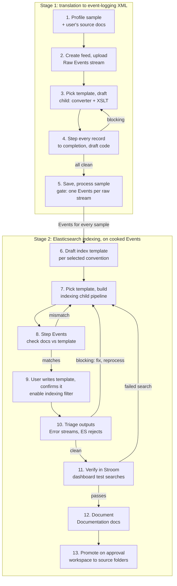
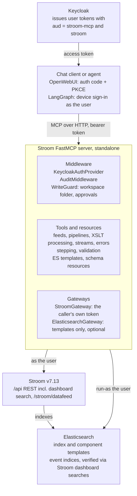

# Stroom FastMCP Server & LangGraph Agent — Design

As of 2026-09-28. Exported from the shared design doc
(https://claude.ai/code/artifact/d0f92563-de5d-4c87-9d9b-8ba1c06f8c9a); diagrams are redrawn here in Mermaid.

## Overview

The Stroom MCP server lets a chat agent (OpenWebUI, later a LangGraph agent) take a sample of raw data and turn it into working Stroom content: a feed, a translation pipeline that emits [GCHQ event-logging](https://github.com/gchq/event-logging-schema) XML, and an indexing pipeline that sends those events to Elasticsearch. It is standalone: it talks to Stroom and Elasticsearch directly and needs no other MCP server. It borrows its structure from the Elasticsearch FastMCP server project but does not call it.

**Goals**

- Accept a pasted or uploaded sample in XML, JSON, CSV or Syslog and land it in a Stroom feed.
- Build a translation pipeline (text converter + XSLT) iteratively on a suitable template pipeline, validated against the event-logging schema by stepping every sample record.
- Process the sample into Events, then build a lightweight indexing pipeline, on Stroom's Lucene index or Elasticsearch, and draft its index mapping that follows the environment's chosen field convention.
- Triage Error streams from pipelines that act on cooked Events, and fix what the agent's own content caused.
- Maintain existing content: update a translation with new samples or a field fix, and create a new versioned indexing pipeline beside the one in production; index raw structured data directly into a discovery index for exploration; and evaluate and document existing events pipelines against the event-logging schema.

**Non-goals (v1)**

- General-purpose search of indexed data; indexing is verified through Stroom searches, not direct queries.
- Managing Stroom users, permissions, nodes or volumes.
- Deleting existing content, or editing content the agent did not create, without an explicit flag.

**Target platform**: Stroom v7.13 REST API (`/api/...`), the event-logging schema version the environment uses (v3.5.2 in the reference environment; configurable), Elasticsearch 8/9.

## End-to-end workflow

In stage 1, stepping every sample record to completion is the correctness check: once every record steps clean, processing the sample only produces the Events stream stage 2 needs. The agent confirms every raw sample stream produced exactly one Events stream, since the indexing pipeline has nothing to step without one, but does not iterate on the stage 1 Error streams. From stage 2 on, pipelines act on cooked Events and write to Elasticsearch, so their Error streams are triaged and can send the agent back to fix and reprocess.



1. **Profile the sample.** Detect format (XML, JSON, CSV with or without header, RFC 3164/5424 Syslog), encoding, record delimiter and timestamp format. If the user supplies vendor documentation or annotated samples, the agent records them as a field dictionary and event catalogue (`record_source_notes`; see Source documentation) to guide steps 3 and 4.
2. **Create the feed and upload.** Create a `Feed` doc (stream type `Raw Events`, encoding) once the user confirms the proposed feed name and encoding, then POST the sample to `/stroom/datafeed` with a `Feed` header. The new stream's meta id is found with `/api/meta/v1/find`.
3. **Choose a template, draft the translation pipeline.** The XSLT is generated from a field mapping (`build_translation_xslt`) rather than written by hand, wherever a mapping can express it. Search for translation-stage template pipelines (`find_pipeline_templates`), see how existing children specialise them, and learn what shared elements such as user decoration expect. Create a child of the chosen template, supplying only the source-specific `TextConverter` (Data Splitter or XML Fragment) and `XSLT`. Stroom's standard Event Data (Text) or Event Data (XML) pipelines are the fallback. The user confirms the chosen template before the child is created. Field mappings and event types follow the field dictionary and event catalogue when there are source notes.
4. **Step every sample record to completion.** `/api/stepping/v1/step` accepts a `code` map that overrides element code for the session, so the agent tries XSLT revisions without saving them. It steps every record of the sample, not a subset; each step returns per-element input, output and error indicators, and any blocking error sends it back to step 3. Stepping errors are triaged with the same rules as Error streams, so benign decoration warnings do not hold it up.
5. **Save and process the sample.** When every record steps clean, save the docs and create a processor filter on the sample stream ids. This run only produces the `Events` stream that stage 2 needs; before stage 2 the agent checks that every raw sample stream has exactly one child Events stream, with records, and that the counts match the stepped records. More than one means the raw stream was processed twice (overlapping filters or a stray reprocess), which would give the indexing stage duplicate events, so the agent reports it and asks which to keep. A raw stream with no Events means processing failed despite clean stepping (a failed task, a fatal error, a filter that missed the stream), so the agent reads that stream's task status and Error stream, fixes the cause and reprocesses it (`reprocess_streams`), or asks the user. Beyond this gate, stage 1 Error streams are not iterated on.
6. **Draft the index template.** Read existing index and component templates from Elasticsearch, apply the field convention the user or configuration selected (never an assumed one), check names and types against that convention's reference templates, and draft a new template.
7. **Choose a template, build the indexing pipeline.** Search for indexing-stage templates the same way; a local one may already set the Elastic cluster, batch size and shared enrichment. Inherit from it (fallback: Indexing (Elasticsearch)). The indexing filter's `cluster` property must point at an existing Elastic Cluster doc: the agent takes the one that existing Elastic Index docs and indexing pipelines for similar data already use (`find_elastic_clusters`) and checks it with `elasticCluster/v1/testCluster`. It never creates a cluster doc, since that holds credentials; if none fits, it asks. The cluster, the indexing template, the field convention and the destination index or data stream name (with its version) are proposed together at the start of stage 2, and the user confirms or corrects them before anything is drafted or created. The child's XSLT emits the `xpath-functions` JSON-XML `array`/`map` form with `StreamId`, `EventId` and `@timestamp`.
8. **Step Events through it.** Step the cooked Events and compare each stepped document's fields and value shapes with the draft template. Fix the XSLT or the template on a mismatch.
9. **Agree the template, then hand over the filter.**
   - The agent suggests the index template once the indexing pipeline steps clean (`propose_index_template`). It is rendered from the field plan for the pipeline's own destination index, as a Kibana Dev Tools request, and already checked against the documents the pipeline writes.
   - If the user sends back a changed template, `check_index_template` steps the candidate indexing pipeline and checks every document field against it. It checks that `index_patterns` cover the pipeline's index and that values fit the mapped types, including date formats and IPs. It also checks the `dynamic` setting for unmapped fields, fields mapped as values that the pipeline writes as objects (or the reverse), `@timestamp` for data streams, and fields the template renamed or added.
   - When the template does not fit, the agent lists the pipeline changes it needs (e.g. rename `user.name` to `user.id` in the indexing XSLT) and asks whether to make them or change the template instead.
   - The user commits the template; `put_index_template` is used only if they ask and the server has Elasticsearch access. Events reach Elasticsearch only through the Stroom indexing pipeline.
   - When the user confirms they have committed the template for the named index and cluster, `create_processor_filter` pre-creates the indexing filter **disabled**. The agent tells the user it is ready to enable and gives a direct link to the pipeline (`<stroom>/?action=open-doc&docType=Pipeline&docUuid=<uuid>`, the form Stroom's "Copy Link to Clipboard" uses) so they can review it and enable the filter on its Processors tab. It continues once they have, or enables it on request with approval.
10. **Triage indexing outputs.** Stepping does not write to Elasticsearch, so mapping conflicts and bulk rejections only appear now. The agent reads the indexing Error streams, classifies them as blocking, review or benign (see Error triage), fixes the XSLT or template and reprocesses on blocking errors, then runs Stroom's connection check (`elasticIndex/v1/testIndex`).
11. **Verify the Stroom way.** Create an Elastic Index doc for the target index or data stream on the same Elastic Cluster doc the indexing filter writes through, copying settings such as the time field and search scroll size from existing Elastic Index docs on that cluster (its fields load from the mapping) and a verification dashboard in the workspace: a query on that index and a table with a minimal field set (`StreamId`, `EventId`, the time field and a few key fields from the template). Then run test searches through Stroom's dashboard search API: all documents for the sample stream ids, whose count must match the Events records; an exact-match search on each key field using a value from a stepped document; and a time-range search around the sample timestamps. Each must return the expected records, which checks the mapping and the way people will actually search it. A failed search sends the agent back to step 7.
12. **Document.** Write Stroom Documentation docs for the events and indexing pipelines (`write_documentation`) from what stages 1 and 2 measured: the field mapping, event types from the processed sample, the index template and version, and the verification results. The same summary is returned in the chat.
13. **Promote on approval.** Everything so far lives in the workspace. `promote_build` proposes destination folders from where sibling sources live; the user confirms them and approves, the docs are moved into place, and the processor filters are widened from the sample to the whole feed (new data only, from a create time) as part of the same approval.

## Further use cases

Six further jobs. The evaluation is read-only. The two updates start from existing production content rather than a new source: both work on draft code or copies until a person approves, and both compare new output with current output record by record, so the only differences are the intended ones.

**Update an events pipeline**

Triggered by new samples the current XSLT does not handle, or a reported issue such as a missed or wrongly translated field.

1. **Locate the baseline.** Find the pipeline by name or feed (`find_documents`, `describe_pipeline`) and read its XSLT and text converter.
2. **Gather test records.** New samples go to a workspace test feed with the production feed's settings (`<FEED>-MCP-TEST`), never to the production feed, where live processor filters would pick them up. For a reported issue, the agent finds example records in the production feed's recent Raw Events (`find_streams`, `read_stream`), or uses stream and record ids the user gives.
3. **Revise with draft code.** Stepping accepts draft XSLT through the `code` map, so the existing pipeline is stepped over the test records and a regression set of recent production records without saving anything.
4. **Compare outputs.** `compare_outputs` steps the same records through the current and draft code and diffs each event. There must be no blocking errors, and differences must be limited to the fields the change targets; anything else goes to the user.
5. **Confirm how to save, then save.** The agent asks whether to create a new version or change the current pipeline in place, and proposes names from the baseline's versioning convention, e.g. `Keycloak-V1.2-Events` becomes pipeline and XSLT `Keycloak-V1.3-Events`. The user confirms the choice and the pipeline and translation names, or edits them. A new version is made in the workspace with `copy_pipeline` (pipeline, XSLT and text converter) plus the draft code; an in-place change is saved to a working copy of the XSLT in the workspace. Nothing in production changes until the user approves promotion: a new version is then moved into place and gets its processor filter, with the current version left running until the user retires it; an in-place change is written into the production XSLT after a backup. Reprocessing historical data with the production pipeline is the user's to do (see Design decisions); the agent lists the streams the change would affect. Test records in the build are reprocessed as part of development. The Documentation doc is created for a new version, noting what changed, or updated with a change-log entry for an in-place change.

**Update an indexing pipeline (as a new version)**

Triggered by a request to index more fields or change how fields are mapped. In-use production indices stay untouched: the agent builds a new versioned pipeline beside the current one.

1. **Locate the baseline.** Find the indexing pipeline, its Elastic Index doc, the index or data stream it writes to, and its index template.
2. **Work out the next version.** With the convention `stroom-windows-events-v1`, the candidate is `stroom-windows-events-v2`. The pattern is configurable (`index_versioning.pattern: '{base}-v{n}'`); if the current name does not match it, the agent asks. The v2 name and the cluster are confirmed like any stage 2 destination.
3. **Copy and bump.** `copy_pipeline` copies the pipeline and the XSLT it owns into the workspace under the new version and sets the `ElasticIndexingFilter` `indexName` to the v2 name; `create_index_doc` adds a v2 Elastic Index doc. Any inherited parent template is kept.
4. **Revise the XSLT and template.** The template draft starts from the v1 template, renamed and with `index_patterns` bumped to v2, then applies the requested field changes under the selected field convention.
5. **Step and compare.** `compare_outputs` steps the same Events records through v1 and v2 and diffs the documents. Only the added or changed fields may differ, and each must match the v2 template.
6. **Hand over.** The agent proposes the v2 template (`propose_index_template`) and checks any changes the user sends back (`check_index_template`). Once the user has committed it, the v2 indexing filter is pre-created disabled, on new Events from a create time, with the pipeline link for the user to review and enable it; backfilling older streams is the user's. Then triage its outputs and verify through a v2 Elastic Index doc and dashboard, as in steps 10 and 11. The v2 pipeline gets its own Documentation doc, noting what changed from v1. Moving readers from v1 to v2 and retiring v1 are the user's (see Design decisions).
**Create a discovery index**

A discovery index lets people explore raw structured data, such as JSON, before or instead of writing a translation. A simple indexing pipeline reads the Raw Events stream, parses it to JSON XML and indexes it as it is, with no event-logging step.

1. **Choose the source.** An existing Raw Events feed, or a sample uploaded to a new workspace feed as in steps 1 and 2.
2. **Choose a template.** Look for a discovery-stage template pipeline as in step 7 (`pipeline_templates.discovery`); in the reference environment that is `Raw to Elasticsearch`; the fallback is a minimal chain: `JSONParser`, `XSLTFilter`, `ElasticIndexingFilter`.
3. **Draft the XSLT.** `JSONParser` emits JSON XML in the `http://www.w3.org/2013/XSL/json` namespace, while the indexing filter reads the `xpath-functions` namespace, so the XSLT starts as a copy that moves elements into that namespace: it adds `StreamId`, `EventId` and `@timestamp` (from a timestamp field the user confirms) and keeps source field names. It may also do light processing the agent proposes from the sample profile: unpack JSON held as a string in a field such as `message` into a nested map with `json-to-xml()`; decorate each document from stream meta, e.g. `stroom:meta('MyHost')`, choosing from the attributes the raw streams actually carry (`get_stream_attributes`); and drop or rename a few noisy or conflicting fields. XML or CSV sources need a small mapping XSLT instead. Anything beyond this, such as a full event-logging translation, belongs in `onboard_data_source`.
4. **Draft a permissive template.** Field names stay as in the source, so no field convention applies. The template uses dynamic mapping with guardrails from config (`discovery_template`): strings as `keyword`, a total-fields limit, `ignore_malformed`, and explicit types only for `@timestamp`, `StreamId` and `EventId`.
5. **Confirm, step and apply.** Cluster, destination name (e.g. `stroom-discovery-<source>-v1`), template pipeline, timestamp field and the proposed enrichments are confirmed in one prompt. The agent steps every sample record and proposes the template (checking any changes the user sends back); once the user has committed it, the processor filter on the Raw Events feed is pre-created disabled, with the pipeline link for the user to review and enable it.
6. **Verify the Stroom way.** Triage and verify as in steps 10 and 11. The discovered field list, read through the Elastic Index doc, can seed the sample profile when the source is later onboarded with a full translation. The discovery pipeline is documented like any other.
**Evaluate and document an events pipeline**

A read-only review that explains an existing translation and measures its output against the event-logging schema. Nothing is changed; suggested fixes go to `update_events_pipeline` if the user wants them.

1. **Describe the pipeline.** Element chain, inherited template, text converter, XSLT, reference data and decoration lookups, and the feeds its processor filters cover (`describe_pipeline`, `get_document`, `processing_status`).
2. **Sample the data.** Recent Raw Events and their Events streams from each feed, up to `max_sample_records` (`find_streams`, `read_stream`). Stepping a handful of records shows input and output side by side.
3. **Map the translation.** `describe_translation` reads the XSLT and lists which input fields feed which event-logging paths; comparing that with the sample profile shows input fields that are never used.
4. **Inventory the events.** `summarise_events` counts events by `EventDetail` type, `TypeId` and `Action`, with examples, and reports how often each path is populated.
5. **Measure conformance.** Validate the sampled events against the schema version the pipeline targets and the latest pinned version (`validate_events`), run the quality rules (`check_event_quality`), and triage recent Error streams (`summarise_errors`). Results are rates, e.g. 97% valid, 12% missing `EventSource/Device/IPAddress`.
6. **Suggest improvements.** Prioritised changes, each with the rule or field it fixes, the share of events affected and a draft XSLT change.

The report is returned in the chat and saved as the pipeline's Documentation doc: written in the workspace and, on approval, moved beside the pipeline or written into its existing doc after a backup, with a change-log entry. It uses the shared documentation sections, with suggestions under Open items:

| Section | Content |
| --- | --- |
| Purpose and data | Feeds, source system, record format, volumes |
| Processing | Element chain, inherited template, reference lookups and decoration |
| Field mapping | Input field to event-logging path, unused input fields |
| Event types | `EventDetail` types, `TypeId`s and `Action`s, with counts and examples |
| Schema conformance | Validation and quality pass rates, schema version gap, recent error groups |
| Suggestions | Prioritised changes with rationale and draft XSLT |

**Build a pipeline for a feed that already holds data**

The user names an existing Raw Events feed instead of giving a sample. Not every kind of event shows up in every stream, so the agent samples stream after stream until more streams add nothing new. It only reads and steps: no feed is created, nothing is uploaded or processed, so there are no filters or streams to clean up.

1. **Survey.** `survey_feed` picks streams spread over the feed's lifetime (by create time, read newest, oldest, then the middle, then the quarters, so any prefix spans the whole range) and reads only the head of each: up to 250,000 characters of up to 3 parts, and 1,000 records, so a multi-GB stream costs the same as a small one. A cut-off last record is dropped, and JSON arrays and XML are parsed incrementally, so only complete records count. It groups the records into shapes, one per kind of event. For JSON, XML and key=value records a shape is the set of fields plus the values of fields that usually name the event (`action`, `event`, `type` and similar). For delimited data it is the values of those naming columns, or of low-variety columns when none is named that way. For syslog and other text it is the message with numbers, addresses and quoted strings masked, merged with messages that differ only in a few words, such as user names. The survey stops when a few streams in a row add no new shape, and returns each shape's count, share and examples, with where each example is (stream, part, record).
2. **Translate every shape, stepping in place.** The mapping gets one rule per shape (`build_translation_xslt`), and `step_records` steps the translation on the survey's locations, the feed's own records, until clean. Records no rule matches are logged, not dropped, so a missed shape shows up.
3. **Read more streams.** The agent surveys again, skipping the streams already read and passing the signatures it already knows, so only new shapes come back. The mapping gains rules and every location found so far is stepped again. This repeats until a survey is saturated or every stream has been read.
4. **Broad check.** Two examples per shape cannot show every variant (a missing optional field, an odd value), so `step_sample` steps the first 200 records of three surveyed streams spread over time (`records_per_stream`). Anything blocking or for review goes back to the mapping. Then the agent reports which kinds of event the pipeline covers and their share of the data.
The survey is kept in the build as a Documentation doc, `<FEED> - Survey`: the kinds of event with counts, shares and streams, example records with where each one is, the surveys run, and a machine-readable state block. A later survey with the same build carries on from it (skipping the streams read, knowing the shapes found), so an interrupted or later session need not start again, and it is promoted beside the pipeline as a record of what the feed holds. Example records are the feed's own data; who can read them is down to the permissions on the folder the doc lives in.

5. **Document, promote, hand over.** The translation is documented and promoted on approval. Processing the source feed with it is the user's to start; once its Events exist, `index_event_data` builds the indexing, since an indexing pipeline can only be stepped and filled from real Events streams.

**Fix a reported pipeline issue**

A user reports that something came out wrong, often one event type that is not translated properly, and gives a Stream ID and optionally an Event ID (as a dashboard shows them). The agent finds where it came from, confirms the problem, proves a fix and offers it. Nothing changes unless the user asks for the fix to be applied.

1. **Locate.** `locate_event` accepts an Events, Error or Raw Events stream id. An output stream leads to its parent raw stream and the pipeline that produced it; a raw stream leads to its Events child. With an Event ID, the agent steps the raw stream record by record, counting the events each record produces, until it reaches that event. It returns the raw part and record, the record's input, the stored event, the event stepping gives now, and the XSLTs and text converters the pipeline runs (marking any inherited from a template). This works on multi-part streams: Stroom numbers records within each raw part, while the Events stream's events run on across parts, and a record can produce no events or several.
2. **Plan the validation.** In a few lines the agent says what output the record should give (from the user's words, the schema and any source notes), which field paths are wrong now, and which other records it will check: recent raw streams on the same feed and the same event type (`find_streams`, `summarise_events`).
3. **Confirm the issue.** `step_pipeline` on the located part and record, `validate_events` and `check_event_quality`. If the problem does not reproduce, the agent says what it found and asks the user rather than guessing a fix.
4. **Draft and prove the fix.** The fix goes in the pipeline's own XSLT or text converter, tried with draft code. `summarise_fix` steps every record of the reported stream and a few recent ones with the draft, and diffs the output against the saved code. The fix is ready when it changes the reported output, only the expected field paths change, and stepping has no blocking errors. It also returns the code diff and manual steps, and warns when the code belongs to a template shared by other pipelines.
5. **Offer it.** The agent shows the diff, the fields that change and on how many records, and asks whether to apply it. **Apply** follows `update_events_pipeline`: the user chooses a new version or an in-place change and confirms the names, then the agent copies, updates, compares against the original, documents and promotes on approval. **Manual** returns the steps to apply it in Stroom with the diff. In both cases reprocessing production data is the user's.

## Architecture

The server copies the ES MCP server's shape: FastMCP over streamable HTTP, Keycloak auth, audit middleware, a lifespan-managed gateway per backend, and tools that return compact, budgeted JSON with hints the model can act on. The one new idea is a **write guard**, because this server creates and changes content.



**Identity.** The server acts as the user who asked. Stroom 7.x trusts the same Keycloak realm, and the clients' tokens carry both audiences (`aud` includes the MCP server's audience and `stroom`, through a Keycloak audience mapper), so the server forwards the caller's token unchanged on every Stroom call, including `/stroom/datafeed` uploads. Stroom applies that user's own document permissions and audits changes under their name. There is no shared API key and no token exchange. A token without `stroom` in `aud` is refused with a message naming the missing mapper, and a token that expires during a long call (such as `wait_for_processing`) asks the client to refresh and call again. The LangGraph agent signs the person in with the device authorization grant and refreshes the token for the length of a run. A Stroom API key is used only with `dev_no_auth`, which is refused unless the server listens on localhost. For uploads to work, Stroom's receiver must accept OIDC tokens (`receive` token authentication enabled).

**Elasticsearch.** Only template reads and writes go direct to ES; indexed documents are verified through Stroom searches, through a copy of the ES server's `ElasticsearchGateway` (run-as). Documents reach ES through Stroom's own `ElasticIndexingFilter` and Elastic Cluster doc; the server never bulk-writes events.

**Stroom API details.** Explorer calls (`fetchExplorerNodes`, `find`) must send `filter.requiredPermissions: ["VIEW"]`, as the Stroom UI does, and `find` needs a name filter (`*` or `type:Pipeline`); without them Stroom returns nothing below System. Docs are matched by UUID, because names held in inherited references go stale when a doc is renamed.

**Indexing backends.** Stage 2 is the same flow on Stroom's built-in Lucene index and on Elasticsearch: a field plan, an index doc, an indexing pipeline from a template, stepping, processing, then a verification dashboard and test searches. Only the pieces below differ, so tools take the backend from the build rather than assuming one. The backend is chosen per build from where sibling sources index and which indexing template is picked, and confirmed with the other stage 2 details. The local development stack uses Lucene; the live instance uses Elasticsearch.

| Aspect | Lucene (Stroom Index) | Elasticsearch |
| --- | --- | --- |
| Index doc | `Index`, in a volume group; `index/v2` | `ElasticIndex`, on an Elastic Cluster doc; `elasticIndex/v1` |
| Field definitions | On the index doc, via `index/v2/addField` | An index template in Elasticsearch; the doc reads fields from the mapping |
| Indexing template | `Indexing` (`IndexingFilter`, property `index`) | e.g. `Events to Elasticsearch` (`ElasticIndexingFilter`, `cluster`, `indexName`) |
| XSLT output | `records:2`: `<data name="..." value="..."/>` | `xpath-functions` JSON XML `map` |
| Keyword field | `TEXT` with the `KEYWORD` analyzer (`KEYWORD` itself indexes nothing) | `keyword` |
| IDs and time | `ID` for `StreamId`/`EventId`, `DATE` for the time field | `long`, `date` |
| Verification | Dashboard on the index doc, `dashboard/v1/search` | Same |

**Project layout**

```
stroom-fastmcp-server/
  main.py                 # FastMCP app, lifespan, tool registration
  config.py               # Settings, STROOM_MCP_* env vars
  access_policy.yaml      # workspace folder, readable roots, ES template patterns, pipeline template sources
  error_rules.yaml        # error triage rules: message regex, element, severity -> class
  conventions/            # field convention profiles (*.yaml)
  security/
    audit.py              # copied from ES server; adds stroom_request events
    policy.py             # WritePolicy: where the agent may create/change docs
    guard.py              # WriteGuardMiddleware, approval tokens
  utils/
    stroom.py             # StroomGateway: httpx.AsyncClient, forwards the caller's token, error mapping
    elasticsearch.py      # ES gateway subset: templates and mappings
    expressions.py        # builders for Stroom ExpressionOperator trees
  tools/
    explorer.py  feeds.py  pipelines.py  translation.py
    processing.py  streams.py  stepping.py  indexing.py  validation.py
  knowledge/
    event-logging/        # fallback XSDs; normally read from Stroom's XML Schemas
    snippets/             # reference XSLT fragments per source format
    documentation.md      # Documentation doc template
  tests/                  # respx-mocked Stroom, recorded fixtures
```

**Config (`STROOM_MCP_*`)**: `stroom_url`, `stroom_ca_certs`, `stroom_request_timeout`, `keycloak_realm_url`, `keycloak_audience`, `stroom_token_audience`, `es_url` + impersonator credentials, `workspace_folder` (default `MCP Workspace`), `conventions_dir`, `default_convention`, `event_logging_version`, `max_response_chars`, `max_stream_chars`, `step_timeout_ms`, `audit_log_file`, `host`, `port`, TLS files.

**Dependencies**: `fastmcp`, `httpx`, `pydantic-settings`, `lxml` (local XSD validation and XSLT well-formedness), `elasticsearch`, `pyyaml`; dev: `pytest`, `pytest-asyncio`, `respx`.

**Field conventions.** Index field names and structure are environment-specific: some environments use ECS, others a custom scheme. The server has no built-in naming scheme. A convention profile is a YAML file in `conventions/` (`STROOM_MCP_CONVENTIONS_DIR`), loaded like the ES server's source packs, and exposed as `stroom://conventions/{name}`.

```yaml
name: ecs
description: Elastic Common Schema 8.x, as used by ecs-* indices
reference_templates: [ecs-*]        # existing templates whose mappings are authoritative
structure: nested                    # nested objects or flattened dotted keys
required_fields: {'@timestamp': date, StreamId: long, EventId: long}
field_map:                           # optional: event-logging path -> index field
  EventSource/Device/IPAddress: host.ip
  EventSource/User/Id: user.name
type_overrides: {'*.ip': ip}
```

Selection order: the profile the user names in the conversation, else `STROOM_MCP_DEFAULT_CONVENTION`, else none. With none, `get_field_conventions` returns `needs_guidance`, and the agent asks the user to pick a profile, point at reference templates, or describe the convention. A described convention is kept in the build state as an ad-hoc profile. The agent never falls back to ECS or any other scheme on its own.

**Pipeline templates.** Before drafting either pipeline, the agent looks for an existing pipeline to inherit from. A local template often carries shared elements a new source should reuse, not copy: user decoration XSLTs, reference data lookups, schema filter settings, indexing properties. Discovery uses three signals, in order:

1. Configured template sources per stage in `access_policy.yaml` (folders, explorer tags, name patterns).
2. Inheritance: pipelines that working pipelines inherit from (`parentPipeline`), ranked by number of children and how similar their feeds are to the new source.
3. Stroom's standard pipelines (Event Data (Text), Event Data (XML), Indexing (Elasticsearch)), as a last resort.

```yaml
pipeline_templates:
  translation:
    folders: [System/Template Pipelines]
    names: ['Event Data (*)']
  indexing:
    folders: [System/Template Pipelines/Elasticsearch]
    names: ['Events to Elasticsearch']
  discovery:
    folders: [System/Template Pipelines/Elasticsearch]
    names: ['Raw to Elasticsearch']
```

For each candidate the agent reviews the element chain, the elements a child is expected to supply (usually the text converter and source XSLT), and the input contract of shared downstream elements, e.g. a decoration XSLT that reads `EventSource/User/Id`. It shows the user the chosen template and why; when candidates are close or none fit, it asks instead of picking. The child overrides only what it must, so later fixes to the template reach every source. A new pipeline keeps the template's structure and defaults, e.g. its decoration step. A new version or an in-place change keeps the original pipeline's structure and settings instead: elements it removed or re-linked, its reference loaders and its property values. Stepping the child runs the whole inherited chain, so a translation that breaks a shared element shows up as an error on that element.

**Pipeline documentation.** Every pipeline the agent creates, changes or evaluates gets a Stroom Documentation doc (`documentation/v1`), written in Markdown from the template in `knowledge/documentation.md`; the same content is returned in the chat. The doc takes the pipeline's name and sits in the same folder. On an update the agent revises the affected sections and appends to the change log instead of rewriting the doc.

| Section | Events pipeline | Indexing or discovery pipeline |
| --- | --- | --- |
| Purpose and data | Feeds, source system, record format, volumes | Source feed, destination index or data stream, Elastic Cluster |
| Processing | Element chain, inherited template, reference lookups and decoration | Element chain, inherited template, enrichments |
| Field mapping | Input field to event-logging path; unused input fields | Event-logging path or source field to index field and mapped type |
| Output | Event types (`EventDetail`, `TypeId`, `Action`) with counts | Index template name and version; verification searches and results |
| Conformance | Schema validation and quality pass rates; recent error groups | Error stream triage summary |
| Open items | Suggestions and known limitations | Suggestions and known limitations |
| Change log | Date, user, build or change, summary | Same |

**Source documentation.** When onboarding or updating, the user can give the agent vendor documentation or annotated samples in the chat, e.g. a field reference, a list of event ids and their meanings, or a sample with notes such as "field 7 is the logon user". `record_source_notes` condenses them into two structures and saves them, with the originals' titles and links, as a Documentation doc beside the feed:

- a **field dictionary**: field, meaning, type, example, and a suggested event-logging path;
- an **event catalogue**: event id or action, description, and a suggested `EventDetail` type and `TypeId`.

The drafting steps use both: which fields are users, devices or addresses, and which event-logging type each event becomes. The Field mapping section of the pipeline's documentation cites the source note behind each choice. Where the sample and the documentation disagree, the sample decides the format and the documentation decides the meaning, and the conflict is shown to the user. Catalogue entries with no sample records are handled in the XSLT but reported as untested. Existing Documentation docs beside a feed or pipeline are read the same way, so notes gathered once are reused by later updates and evaluations.

## MCP tool catalogue

60 tools in 13 groups. Tools are task-shaped rather than one-per-endpoint: each hides DocRef plumbing, pipeline JSON, expression trees and paging, and returns only what the model needs next. Write tools are marked **W**; those needing user approval are marked **A**.

**Explorer and reference content** (`tools/explorer.py`)

| Tool | Purpose | Stroom API |
| --- | --- | --- |
| `find_documents` | Find docs by name pattern and type (Feed, Pipeline, XSLT, TextConverter, XmlSchema, ElasticIndex) | `explorer/v2/find` |
| `get_document` | Fetch a doc's content by type and UUID or path; XSLT and TextConverter code returned verbatim | `xslt/v1`, `textConverter/v1`, `feed/v1`, `pipeline/v1`, ... |
| `find_pipeline_templates` | Candidate parent pipelines for a stage (translation, indexing or discovery) from configured sources, inheritance and standard pipelines; each with element chain, shared elements, elements a child must supply, and child count | `explorer/v2/find`, `pipeline/v1/fetchPipelineJson`, `fetchPipelineLayers` |
| `list_template_children` | Existing pipelines that inherit from a template, with the elements each overrides and the feeds they process | `explorer/v2/findInContent`, `pipeline/v1/fetchPipelineJson` |
| `describe_template_contract` | What a child's output must contain for the template's shared elements to work, from the XPaths their XSLTs read | `pipeline/v1/fetchPipelineJson`, `xslt/v1` |
| `find_similar_translations` | Existing XSLTs for a vendor or format, as few-shot examples | `explorer/v2/findInContent` |

**Feeds and sample data** (`tools/feeds.py`)

| Tool | Purpose | Stroom API |
| --- | --- | --- |
| `profile_sample` | Local: detect format, delimiter, header, encoding, timestamp patterns, field inventory, and string fields that hold embedded JSON; applies the field dictionary's labels when there is one | none |
| `record_source_notes` **W** | Condense user-supplied vendor documentation or annotated samples into a field dictionary and event catalogue, and save them as a Documentation doc beside the feed; also reads existing notes | `explorer/v2/create`, `documentation/v1/{uuid}` |
| `create_feed` **W** | Create a feed in the workspace with stream type, encoding and description | `explorer/v2/create`, `feed/v1/{uuid}` |
| `upload_sample` **W** | POST sample text to a feed; returns the new stream id | `/stroom/datafeed`, `meta/v1/find` |

**Pipelines** (`tools/pipelines.py`)

| Tool | Purpose | Stroom API |
| --- | --- | --- |
| `create_pipeline` **W** | Create a child of the chosen template; sets only the elements the child supplies (text converter, XSLT) and any properties the template leaves open | `explorer/v2/create`, `pipeline/v1/savePipelineJson` |
| `copy_pipeline` **W** | Copy an existing pipeline and the docs it owns into the workspace under new names, e.g. a version bump; keeps the original's structure, reference loaders and settings, rewires the copies and can set properties such as `indexName` | `explorer/v2/copy`, `pipeline/v1/savePipelineJson` |
| `describe_pipeline` | Flattened element chain with effective properties, including inherited ones and removed elements | `pipeline/v1/fetchPipelineJson`, `fetchPipelineLayers` |
| `set_pipeline_property` **W** | Set one element property, e.g. `schemaFilter.schemaGroup`, `elasticIndexingFilter.indexName` | `pipeline/v1/savePipelineJson` |
| `write_documentation` **W** | Create or update a pipeline's Documentation doc from the documentation template, in the workspace; updates revise sections and append a change-log entry | `explorer/v2/create`, `documentation/v1/{uuid}` |
| `promote_build` **W A** | Move a build's docs from the workspace to confirmed destination folders, or write working copies into the production docs they replace after a backup; widens sample-scoped processor filters if approved | `explorer/v2/move`, doc `PUT`s, `processorFilter/v1/{id}` |

**Translation content** (`tools/translation.py`)

| Tool | Purpose | Stroom API |
| --- | --- | --- |
| `create_text_converter` **W** | Create a Data Splitter or XML Fragment converter with code | `textConverter/v1` |
| `update_text_converter` **W** | Replace converter code (approval and a backup first if the agent did not create the doc); optimistic on `version` | `textConverter/v1/{uuid}` |
| `create_xslt` **W** | Create an XSLT doc with code | `xslt/v1` |
| `update_xslt` **W** | Replace XSLT code (approval and a backup first if the agent did not create the doc); optimistic on `version` | `xslt/v1/{uuid}` |
| `suggest_data_splitter` | Local: generate a starting Data Splitter from the sample profile | none |

**Generation** (`tools/generation.py`, reads the schema from Stroom, writes nothing)

| Tool | Purpose | Stroom API |
| --- | --- | --- |
| `build_translation_xslt` | Write the event-logging translation from a field mapping: input kind, fields every event shares, and one rule per kind of event (conditions, then input field or constant to event-logging path, with time patterns, value maps, defaults and `Data` entries). Mistakes the schema catches come back as problems per mapping entry, with suggestions: unknown paths, disallowed constants, alternatives used together, missing required elements, unquoted pattern letters. Otherwise it returns XSLT in schema order that leaves out elements with empty inputs and logs unmatched records | `xmlSchema/v1` |

A model that is weak at XSLT only has to produce the mapping. The generator carries what the model would otherwise get wrong: the input namespace, element order, `stroom:format-date`, guards against empty elements, and `xsl:choose` per event kind. Hand-written XSLT remains for what a mapping cannot express, such as unpacking embedded JSON or reference lookups.

**Validation** (`tools/validation.py`, local, no Stroom calls)

| Tool | Purpose |
| --- | --- |
| `check_xslt` | Well-formed, XSLT 2.0/3.0 namespace, declared `stroom:` functions exist |
| `validate_events` | Validate event XML against the pinned event-logging XSD, or a named schema version; errors with line, path and a short fix hint |
| `check_event_quality` | Beyond the XSD: `EventTime/TimeCreated` parses, `EventSource/System/Name` set, no empty elements, `EventDetail` type matches the action |
| `describe_translation` | Read an XSLT and list, per output event-logging path, the input fields or expressions that feed it; flags constant values and paths never set |

**Processing** (`tools/processing.py`)

| Tool | Purpose | Stroom API |
| --- | --- | --- |
| `create_processor_filter` **W A** | Filter for a pipeline on sample stream ids, or on feed + stream type from a create time. Refuses streams the pipeline already processed (use `reprocess_streams`). An indexing pipeline reading Events must name its source events pipeline, and the filter adds `Pipeline IS_DOC_REF <source>`. For an Elasticsearch indexing pipeline, once the user confirms the index template for its destination index is committed, pre-creates the filter disabled and returns the pipeline link for the user to enable it | `processorFilter/v1`, `fetchPipelineLayers` |
| `set_processor_filter_enabled` **W A** | Enable or disable a filter the agent created | `processorFilter/v1/{id}/enabled` |
| `reprocess_streams` **W A** | Process up to 10 streams again through a workspace pipeline after a change, one task at a time; Stroom supersedes the earlier output. For Elasticsearch, the same hand-over: pre-created disabled for the user to enable | `processorFilter/v1` |
| `processing_status` | Tracker state, task counts by status, last error, for a filter or pipeline | `processorFilter/v1/find`, `processorTask/v1/find` |
| `wait_for_processing` | Poll `processing_status` with backoff until all tasks are complete or failed, or a timeout; then reports, per input stream, the child Events stream id and record count, flagging inputs with none or more than one; can count only one filter's outputs | as above |

**Standing instructions** (`tools/instructions.py`, read-only)

| Tool | Purpose | Stroom API |
| --- | --- | --- |
| `get_instructions` | Standing instructions from `AGENTS` Documentation docs: those that apply to the given folders, feeds or documents (a doc applies to its folder and below; one directly under a root folder applies everywhere), most general first, with their text; other `AGENTS` docs listed by folder | `explorer/v2/find`, `documentation/v1` |

**Sampling** (`tools/sampling.py`, read-only)

| Tool | Purpose | Stroom API |
| --- | --- | --- |
| `survey_feed` | Sample an existing feed's streams spread over its lifetime, reading only the head of each (characters, parts and records capped), and group records into shapes (kinds of event) until more streams add nothing new; returns each shape's count, share and examples with their locations (stream, part, record) for `step_records`. Continues with `skip_stream_ids` and `known_signatures`, or, given a `build`, from the build's `<FEED> - Survey` doc, which it keeps up to date | `meta/v1/find`, `data/v1/fetch` |

**Diagnosis** (`tools/diagnosis.py`, read-only)

| Tool | Purpose | Stroom API |
| --- | --- | --- |
| `locate_event` | From a reported Events, Error or Raw Events stream id and optional Event ID: the raw stream, part and record, the pipeline and its code docs, the record's input, the stored event and the event stepping gives now | `meta/v1/find`, `data/v1/fetch`, `stepping/v1/step` |
| `summarise_fix` | Prove a drafted XSLT or text converter fix on real records: output diff against the saved code (only expected paths may change), stepping verdict, code diff, readiness, and manual steps for applying it by hand | `stepping/v1/step`, doc reads |

**Streams and errors** (`tools/streams.py`)

| Tool | Purpose | Stroom API |
| --- | --- | --- |
| `find_streams` | Streams by feed, type, pipeline, parent id or create time | `meta/v1/find` |
| `get_stream_children` | Child streams (Events, Error, Context, Meta) of a raw stream | `meta/v1/find` (`Parent Id`), `data/v1/{id}/parts/0/child-types` |
| `get_stream_attributes` | Meta attributes a stream carries (e.g. `MyHost`, `ReceivedTime`, `RemoteAddress`), with values, for `stroom:meta()` decoration | `data/v1/{id}/metaAttributes`, `data/v1/{id}/info` |
| `read_stream` | Records from a stream in a range, trimmed to `max_stream_chars` | `data/v1/fetch` (TEXT) |
| `summarise_events` | Profile Events streams: counts by `EventDetail` type, `TypeId` and `Action` with examples, and how often each event-logging path is populated | `data/v1/fetch` |
| `summarise_errors` | Error markers grouped by message, element and severity with counts and first locations, each group classified blocking, review or benign with the rule that matched | `data/v1/fetch` (MARKER) |
| `error_context` | For one error: the raw input record and the XSLT lines it points at, side by side | `data/v1/fetch`, `xslt/v1` |

**Stepping** (`tools/stepping.py`)

| Tool | Purpose | Stroom API |
| --- | --- | --- |
| `step_pipeline` | Step one record (first, last, or a record index) with optional draft code per element; returns the chosen elements' input and output and every element's errors, triaged | `stepping/v1/step` |
| `step_sample` | Step every record of the sample streams to completion (capped by `max_sample_records`, default 500, and optionally `records_per_stream` for the head of each stream); one compact verdict per record, errors triaged | `stepping/v1/step` |
| `step_records` | Step chosen records of existing streams in place (e.g. `survey_feed`'s locations: stream, part, record) with optional draft code; one verdict like `step_sample`, plus which shapes did not step clean. Nothing is copied or processed | `stepping/v1/step` |
| `compare_outputs` | Step the same records through two pipelines, or one pipeline with current and draft code, and diff each record's output (event XML or index document); reports fields added, removed and changed | `stepping/v1/step` |

Stepping holds no session between calls: each step is a fresh request from the last record's location, and a session id only polls a step that is still running (Stroom drops it when the step completes). So there is nothing to release afterwards.

**Indexing** (`tools/indexing.py`; Lucene or Elasticsearch per build)

| Tool | Purpose | Backend |
| --- | --- | --- |
| `list_index_templates` | Elasticsearch: index and component templates matching a pattern, with index patterns and priorities | ES `_index_template`, `_component_template` |
| `get_field_conventions` | List convention profiles, or return the selected one with field-to-type maps from its reference templates or index docs; returns `needs_guidance` when none is selected | ES templates, `index/v2/findFields` |
| `draft_index_mapping` | Local: turn stepped documents and the field convention into a field plan (name, logical type), rendered for the build's backend as an Elasticsearch index template or a Lucene field list; can start from a baseline with the version bumped; flags conflicts | none |
| `simulate_index_template` | Elasticsearch: show the effective mapping for an index name | ES `_index_template/_simulate_index` |
| `propose_index_template` | Elasticsearch: the template to suggest to the user for the candidate indexing pipeline's own index, as JSON and a Dev Tools request, self-checked against the pipeline's documents, with a link to the pipeline | `fetchPipelineLayers`, `stepping/v1/step` |
| `check_index_template` | Elasticsearch: check a user's changed template against the documents the candidate indexing pipeline writes; returns compatible or not, blocking issues, and each pipeline change needed | `stepping/v1/step`, ES `_component_template` when configured |
| `put_index_template` **W A** | Elasticsearch: create or update a template in the allowed name pattern, only when the user asks (normally the user writes it) | ES `_index_template` |
| `set_index_fields` **W** | Lucene: set a Lucene index doc's fields from the field plan (a keyword becomes `TEXT` with the `KEYWORD` analyzer) | `index/v2/addField`, `updateField`, `findFields` |
| `find_elastic_clusters` | Elasticsearch: cluster docs with their connection URLs (never credentials), the index docs and pipelines that use each, and their settings; optional connection test | `explorer/v2/find`, `elasticCluster/v1`, `elasticIndex/v1`, `elasticCluster/v1/testCluster` |
| `create_index_doc` **W** | The build's index doc: an Elastic Index doc on an existing Elastic Cluster, or a Lucene Index doc in a volume group, with settings copied from sibling index docs | `explorer/v2/create`, `elasticIndex/v1` or `index/v2`, `dataSource/v1/findFields` |
| `create_indexing_pipeline` **W** | Child of the chosen indexing template (e.g. `Events to Elasticsearch`, or `Indexing` for Lucene) with its XSLT and index property | as `create_pipeline` |
| `test_elastic_index` | Elasticsearch: Stroom's own connection and index test | `elasticIndex/v1/testIndex` |
| `create_verification_dashboard` **W** | Workspace dashboard with a query on the index doc and a table of a minimal field set (`StreamId`, `EventId`, time field, key fields); same on either backend | `explorer/v2/create`, `dashboard/v1/{uuid}` |
| `run_test_searches` | Run test searches through the dashboard (stream id count, exact match per key field, time range) and poll to completion; per search, pass or fail with expected and returned rows | `dashboard/v1/search` |

Every tool returns `{ok, ..., hints[]}`. Stroom errors are mapped to short reasons (not found, permission, validation, version conflict) with a hint naming the tool that fixes it. Output is cut to `max_response_chars` with `truncated: true`, as in the ES server.

## MCP resources and prompts

Resources carry the reference knowledge the model needs but should not have to discover by tool calls; prompts package the workflow so OpenWebUI users get the same behaviour as the LangGraph agent.

**Resources**

| URI | Content |
| --- | --- |
| `stroom://schema/event-logging` | The event-logging XSD for the configured version, read from Stroom's XML Schemas (`xmlSchema/v1`), plus a condensed element guide: required elements, `EventDetail` choices, common paths |
| `stroom://schema/event-logging/examples/{type}` | Minimal valid events per `EventDetail` type: Authenticate, Process, Network, Send, Receive, Create, Delete, View, Alert |
| `stroom://guide/xslt` | Stroom XSLT conventions: `records:2` input, `stroom:` functions (`format-date`, `lookup`, `feed-name`, `stream-id`), identity templates, unpacking embedded JSON with `json-to-xml()`, stream meta with `stroom:meta()` |
| `stroom://guide/data-splitter` | Data Splitter elements (`split`, `regex`, `group`, `data`) with CSV, Syslog and key=value recipes |
| `stroom://guide/json-input` | JSON via `JSONParser` producing `xpath-functions` XML, and how the XSLT addresses it |
| `stroom://guide/elastic-indexing` | JSON-XML output form, mandatory `StreamId`, `EventId`, `@timestamp`, array and object encoding, `_`-prefixed element rule |
| `stroom://conventions/{name}` | Configured field convention profiles |
| `stroom://templates/{name}` | Existing index and component templates (live from ES), for field-name and type consistency |
| `stroom://workspace` | Docs the agent has created, grouped by build, with their last validation state |

**Prompts**

| Prompt | Arguments | Purpose |
| --- | --- | --- |
| `onboard_data_source` | `sample`, `source_name`, `vendor?`, `source_docs?` | Full stage 1 then stage 2 run, stopping at each confirmation and approval gate |
| `update_events_pipeline` | `pipeline`, `samples?`, `issue?`, `source_docs?` | Fix or extend an existing translation with draft code, output diffs and an approval-gated save |
| `update_indexing_pipeline` | `indexing_pipeline`, `changes` | Copy an indexing pipeline and template to the next version and apply field changes |
| `index_event_data` | `events_feed`, `index_pattern` | Stage 2 only, against an existing Events feed |
| `create_discovery_index` | `feed?`, `sample?`, `timestamp_field?` | Index raw structured data directly for exploration, without an event-logging translation |
| `evaluate_events_pipeline` | `pipeline`, `sample_size?`, `source_docs?` | Report on what a pipeline does, its data and event types, schema conformance and suggested fixes, returned in the chat and saved as its Documentation doc |
| `onboard_existing_feed` | `feed`, `source_docs?` | Build the events pipeline from the data a feed already holds by stepping only: survey its streams for kinds of event, step the translation on those records in place, look further back until nothing new turns up, then document, promote and hand over |
| `fix_pipeline_issue` | `stream_id`, `issue`, `event_id?` | Locate a reported event, confirm the problem, prove a fix, then apply it or give the manual steps, as the user chooses |

**Where the knowledge comes from.** The XSD and examples are vendored into `knowledge/` from the [event-logging-schema](https://github.com/gchq/event-logging-schema) repo at a pinned tag. Guides are short, hand-written summaries of the [Stroom docs](https://gchq.github.io/stroom-docs/), each under about 4,000 tokens, with links to the full page.

## Validation and safety

The agent may create freely inside its workspace, but anything that processes production data or changes Elasticsearch needs a human yes. Validation runs locally first, so most mistakes never reach Stroom.

**Write scope** (`access_policy.yaml`)

- `workspace_folder`: everything the agent creates or changes is built under `MCP Workspace/<build-name>/`, including new versions and working copies of production docs. Nothing reaches its destination until the user approves promotion (`promote_build`). Inside the workspace, updates are allowed only to docs the server created, tracked by an explorer tag `mcp-managed` plus the creating username.
- `readable_roots`: folders whose docs may be read as examples, e.g. `Standard Pipelines`, `Event Sources`.
- `template_patterns`: ES template names the server may write, e.g. `stroom-*`; reads may cover all templates.
- No delete tools in v1, and no Elastic Cluster docs are created or changed, since they hold credentials. Abandoned builds are left tagged for a person to clear.

**Workspace and promotion**

All work happens in the workspace; promotion is the approval-gated step that puts it in place. `promote_build` proposes a destination for each doc from where sibling content lives, e.g. `System/Feeds/Events/<Source>` for the feed, events pipeline, XSLT and text converter, and `System/Elastic Indices/<Source>` for the indexing pipeline, XSLT, Elastic Index doc, dashboard and Documentation docs. The user confirms the destinations, then approves the move.

- New docs and new versions are moved with `explorer/v2/move`. UUIDs do not change, so processor filters, pipeline references and dashboard queries keep working. Promoted docs lose `mcp-managed` and the build tag, so any later change goes through a working copy, but keep `mcp-generated`.
- A change to an existing production doc is made on a working copy in the workspace. On promotion the server backs up the production doc to `MCP Workspace/backups/`, writes the copy's content into it and removes the copy.
- Processor filters on workspace pipelines stay scoped to sample stream ids; widening them to the whole feed is part of the promotion approval.
- Anything not promoted stays in the workspace, tagged for a person to clear.

**Approval gates (A tools)**

The tool returns `needs_approval` with a plain-language summary and an `approval_id` instead of acting. The client shows the summary; the call is repeated with `approval_id` once the user agrees. OpenWebUI shows it as a chat turn; LangGraph uses `interrupt()`. Gated actions: enabling any processor filter (an Elasticsearch indexing filter is instead pre-created disabled once the user confirms the index template is committed, and the user enables it), putting an index template, changing a doc the agent did not create, and promoting a build out of the workspace.

**Confirmations**

Approvals guard actions; confirmations fix the key details those actions use. Both are asked through MCP elicitation when the client supports it, so the user answers the server directly rather than through the model; otherwise the tool returns an id with a summary for the client to show. The agent proposes each detail with where it came from and any alternatives, and the user confirms or corrects it. Confirmed values are stored in the build state and passed to tools as a `confirmation_id`: `create_feed`, `create_pipeline`, `create_indexing_pipeline`, `copy_pipeline`, `create_index_doc` and `put_index_template` refuse to run without one covering the values they set.

| Detail | Confirmed at | Proposed from |
| --- | --- | --- |
| Feed name and encoding | Step 2 | Naming convention, sample profile |
| Translation template pipeline | Step 3 | `find_pipeline_templates`, existing children |
| Field convention | Start of stage 2, one prompt | Configured profile or user guidance |
| Indexing template pipeline | Start of stage 2, one prompt | `find_pipeline_templates` |
| Elastic Cluster doc | Start of stage 2, one prompt | Clusters used by Elastic Index docs and pipelines for similar data |
| Destination index or data stream name, with version | Start of stage 2, one prompt | Versioned naming convention, e.g. `stroom-windows-events-v1`, or the next version of a baseline |
| Events pipeline update: new version or in place, and the pipeline and translation names | `update_events_pipeline`, before saving | The baseline's versioning convention, e.g. V1.2 to V1.3 |
| Destination folders for promotion | Before promotion (step 13) | Where sibling sources' feeds, pipelines and indices live |
| Index template committed, for the destination index and cluster | Before the Elasticsearch indexing filter is pre-created, disabled (step 9) | The index name and cluster set on the indexing pipeline |
| Index backend (Lucene or Elasticsearch) and, for Lucene, the volume group | Start of stage 2, one prompt | Where sibling sources index and the chosen indexing template |

The stage 2 details come in one prompt because they depend on each other: the template's `index_patterns`, the Elastic Index doc and the indexing filter all use the same cluster and destination name.

**Blast radius on processing**

- Filters default to the sample stream ids only (`Meta Id IN (...)`), so the first runs never touch other data.
- A feed-wide filter needs approval and gets `maxProcessingTasks` from config (default 2) and a `minMetaCreateTimeMs`.
- A plain filter is refused for any stream the pipeline has already processed (it has an output from that pipeline, or one of the pipeline's filters already selects it); those go through `reprocess_streams`, which takes at most `max_reprocess_streams` (default 10) per call with `maxProcessingTasks` of `reprocess_max_tasks` (default 1). When a pipeline processes a stream again, Stroom marks that pipeline's earlier outputs for it deleted (superseded), so each raw stream keeps one Events stream.
- All processing tools act only on workspace pipelines this server built, so reprocessing never touches production pipelines.
- Every indexing filter over Events carries `Pipeline IS_DOC_REF <events pipeline>` for the events pipeline this server built for the source (`source_pipeline_uuid`), in addition to the stream ids or feed. Stream ids are checked first: each must be an Events stream that pipeline produced. Indexing never picks up Events streams from another pipeline, even on a shared feed. Stroom rejects `EQUALS` on the `Pipeline` field; `IS_DOC_REF` matches by UUID.

**Local validation before Stroom**

| Check | Where | Blocks save? |
| --- | --- | --- |
| XSLT well-formed and namespaces declared | `check_xslt`, before `create_xslt` / `update_xslt` | yes |
| Stepped output valid against event-logging XSD | `validate_events` after each `step_pipeline` | no, returned as errors |
| Event quality rules | `check_event_quality` | no, warnings |
| Indexing output has `StreamId`, `EventId`, `@timestamp` | `step_sample` on indexing pipelines | yes, before filter creation |
| Document fields match the draft template's types | `draft_index_mapping` conflict report | yes, before `put_index_template` |

**Error triage**

Triage applies to stepping indicators in every stage, and to Error streams from pipelines that run on cooked Events, such as indexing; the stage 1 processing run is not iterated on. Both often hold harmless INFO and WARN markers from shared template elements, so the agent judges each error group by who caused it, not by its presence. `summarise_errors` classifies deterministically from severity, the element that raised it (and whether that element is the agent's own or inherited from the template) and message patterns; the model only explains and acts on the result.

| Class | Typical markers | Agent action |
| --- | --- | --- |
| Blocking | ERROR or FATAL from the text converter, parser or the agent's XSLT (`CODE`, `INPUT` errors); any `SchemaFilter` validation failure; Elasticsearch mapping conflicts or bulk rejections; indexing output missing `StreamId`, `EventId` or `@timestamp` | Fix and reprocess; the stage cannot pass |
| Review | Any ERROR from an inherited element; a WARN that hits every record; a decoration lookup that fails for all records when the key comes from a field the agent's XSLT sets | Check whether the translation causes it, e.g. a user id in the wrong format for the lookup; fix, or ask the user |
| Benign | INFO or WARN from inherited elements on some records, e.g. a failed user decoration lookup for an unknown account | Report counts and examples in the stage summary; no change |

Rules live in `error_rules.yaml` (message regex, element, severity, class) so an environment can mark known-harmless messages. Stage 1 passes when every sample record steps with no blocking or unresolved review groups and every raw sample stream has produced exactly one valid Events stream. The indexing stage passes when stepping and its Error streams both meet that bar and the verification searches pass.

**Idempotency and concurrency**

- Create tools take a `name`; if a doc of that type and name already exists in the build folder, it is returned instead of duplicated.
- Update tools require the `version` returned by the last read. A conflict returns the current content so the model can merge.
- Stepping sessions are tracked per MCP session and ended on disconnect.

**Naming**

Names follow the environment's versioned conventions, learned from sibling content and confirmed with the user. In the reference environment, feeds and events pipelines carry a version (`Fortigate-FG60F-V1.2`, `Keycloak-V1.2-Events`, XSLT `Fortigate-FG60F-Events-V1.2`), indexing pipelines are `<Source> - Indexing`, and indices are `ecs-<source>-v<n>`. Test feeds add `-MCP-TEST`, the verification dashboard takes the index's name with a `-VERIFY` suffix, and Documentation docs take the name of the pipeline they document.

**Audit**: the ES server's audit events, plus `stroom_request` (method, path, doc UUID, status, ms) and `approval` (id, summary, granted by, outcome).

## LangGraph agent design

The agent is a `StateGraph` whose nodes map one-to-one to the workflow steps and whose edges are the loops. It needs only this server, reached through `fastmcp.Client` (`langchain-mcp-adapters` pins `mcp<2`, so the agent wraps the tools itself). It runs as the person using it: a terminal run signs them in with Keycloak's device grant and refreshes the token, so every Stroom change is theirs.

```mermaid
flowchart TD
    intake[intake<br/>profile_sample, record_source_notes] --> onboard_feed[onboard_feed<br/>create_feed, upload_sample<br/>confirms feed name, encoding]
    onboard_feed --> select_translation_template[select_translation_template<br/>find_pipeline_templates, children<br/>confirms template]
    select_translation_template --> draft_translation[draft_translation<br/>create/update_xslt, text converter]
    draft_translation --> step_and_validate[step_and_validate<br/>step_sample every record, validate]
    step_and_validate -- blocking --> draft_translation
    step_and_validate --> approve_processing{{approve_processing<br/>interrupt: create_processor_filter}}
    approve_processing --> process_sample[process_sample<br/>wait_for_processing, Events gate]
    process_sample --> research_conventions[research_conventions<br/>list_index_templates, get_field_conventions<br/>asks if no convention set]
    research_conventions --> select_indexing_template[select_indexing_template<br/>find_pipeline_templates, children<br/>confirms cluster, index, template, convention]
    select_indexing_template --> draft_indexing[draft_indexing<br/>draft template, indexing pipeline]
    draft_indexing --> step_indexing[step_indexing<br/>step_sample on Events]
    step_indexing -- mismatch --> draft_indexing
    step_indexing --> propose_template[propose_template<br/>propose_index_template]
    propose_template --> review_template{{review_template<br/>interrupt: accept, or send a changed template}}
    review_template -- changed --> check_template[check_template<br/>check_index_template]
    check_template -- not compatible --> flag_changes{{flag_pipeline_changes<br/>interrupt: change the pipeline?}}
    flag_changes -- yes --> draft_indexing
    flag_changes -- no --> review_template
    check_template -- compatible --> index_sample
    review_template -- accepted --> index_sample[index_sample<br/>template committed? filter pre-created disabled]
    index_sample --> await_enable{{await_enable<br/>interrupt: ready to enable, pipeline link}}
    await_enable --> run_and_triage[run_and_triage<br/>summarise_errors, error_context]
    run_and_triage -- blocking errors --> draft_indexing
    run_and_triage --> verify_indexed[verify_indexed<br/>verification dashboard, test searches]
    verify_indexed --> document[document<br/>write_documentation]
    document --> promote{{promote<br/>interrupt: promote_build}}
```



**State** (checkpointed, so a build survives restarts and approvals that take days)

```python
class BuildState(TypedDict):
    build_name: str
    sample: SampleProfile            # format, delimiter, fields, timestamp format
    source_notes: SourceNotes | None  # field dictionary and event catalogue from user-supplied docs
    feed: DocRef | None
    raw_stream_ids: list[int]
    templates: dict[str, DocRef]     # chosen parent pipeline per stage
    translation: Translation         # pipeline, xslt, text_converter DocRefs + current code
    attempts: dict[str, int]         # per loop, e.g. {'translation': 2}
    last_findings: list[Finding]     # errors/warnings from stepping or Error streams
    events_stream_ids: list[int]
    conventions: FieldConventions | None  # selected profile or user-described; None until guided
    index_template: dict | None
    indexing: IndexingBuild | None
    approvals: list[Approval]
    mode: Literal['onboard', 'update_events_pipeline', 'update_indexing_pipeline', 'create_discovery_index',
                  'evaluate_events_pipeline']
    baseline: Baseline | None        # existing pipeline, docs, index name and template being changed
    test_feed: DocRef | None         # workspace feed for new samples in update_events_pipeline
    version: int | None              # target index version in update_indexing_pipeline
```

**Nodes**

- Each node is one LLM call with a small, node-specific tool subset plus deterministic Python checks. `draft_translation` only sees translation and reference tools, not processing ones.
- Router edges are code, not model choices: `step_and_validate` goes back to `draft_translation` while `validate_events` returns errors and `attempts['translation'] < 5`.
- `last_findings` is the only error context carried into the next draft, deduplicated and capped at 20 items, so the context stays small across iterations.
- After the attempt limit, the graph interrupts with the findings and asks the user to fix, hint or stop.

**Human in the loop**: `approve_processing` calls `interrupt()` with the server's approval summary; resuming passes the `approval_id` back. For Elasticsearch, `review_template`, `flag_pipeline_changes` and `await_enable` interrupt with the proposed template, the pipeline changes a user's template needs, and the ready-to-enable link. One tool call can raise more than one interrupt in turn, and the ids collected so far are passed on each repeat. OpenWebUI follows the same prompts manually, so both clients share the server's gates.

**Convention guidance**: `research_conventions` interrupts when no convention profile is selected, asking the user to choose a profile, name reference templates or describe the convention. It never picks one itself.

**Entry modes**: `intake` routes the request to one of five modes. `onboard` is the graph above. `update_events_pipeline` loads the baseline, uploads samples to a test feed or finds issue records, then enters at `draft_translation`; `step_and_validate` adds `compare_outputs` against the current code, and `approve_processing` becomes `approve_update`, which confirms new version or in place and the names, then copies to the new version or saves in place after a backup. `update_indexing_pipeline` loads the baseline, runs `copy_pipeline` with the version bump, then enters at `draft_indexing`; `step_indexing` adds `compare_outputs` against v1.

`create_discovery_index` runs `onboard_feed` or takes an existing feed, skips stage 1 and `research_conventions`, and enters at `select_indexing_template` with discovery-stage templates; `draft_indexing` drafts the near-identity XSLT and the permissive template, and the rest of stage 2 runs unchanged.

`onboard_existing_feed` starts at `survey` (survey the feed and start the build), then runs `draft_translation` and `step_and_validate`, which step the survey's locations with `step_records`. When stepping is clean and the survey is not saturated, `resurvey` reads more streams, skipping those read and passing the known signatures: new shapes go back to `draft_translation`, and a survey with nothing new moves on (once saturated, or after at most 6 surveys) to `broad_check`, which steps the head of three surveyed streams spread over time; a clean result goes on to `document` and `promote`, anything else back to `draft_translation`. The kinds of event and their locations travel in the state, so the drafting step sees every shape it has to translate. The `document` step also hands over: what the translation covers, and that processing the source feed, then `index_event_data`, are next.

`fix_pipeline_issue` runs `locate_issue` (locate the event, plan and confirm the problem), then `draft_fix`, which loops until `summarise_fix` says the fix is ready. A `draft_fix` attempt that proposes no fix means the issue did not reproduce, so the graph asks the user instead of looping. `offer_fix` interrupts with the diff and asks whether to apply it: yes runs `apply_fix` (copy, update, compare, document, promote, as in `update_events_pipeline`); no runs `explain_fix`, which returns the manual steps and the diff.

`evaluate_events_pipeline` is a read-only chain: load the baseline, sample, map the translation, inventory events, measure conformance, report. Its only write is the Documentation doc, promoted on approval like any other change; its suggestions can seed an `update_events_pipeline` run.

**Source notes and documentation**: `intake` collects any vendor documentation or annotated samples from the chat and calls `record_source_notes`; the drafting nodes get the condensed field dictionary and event catalogue, not the full documents, so context stays small. Every mode ends with a `document` node that calls `write_documentation` and returns the same summary in the chat, then a `promote` node that interrupts for the destination confirmation and approval before calling `promote_build`.

**Template choice**: `select_translation_template` and `select_indexing_template` run `find_pipeline_templates`, `list_template_children` and `describe_template_contract`, record the choice and rationale in `templates`, and interrupt to confirm the choice. The `select_indexing_template` interrupt also carries the field convention, Elastic Cluster and destination index name, so stage 2 needs one confirmation. The contract is passed into the drafting node so the XSLT produces what shared elements expect.

**Error routing**: in stage 1, `step_and_validate` steps every sample record and loops to `draft_translation` on blocking findings; `process_sample` then runs the processor to produce Events and checks every raw sample stream has exactly one Events child. A missing or duplicate one is investigated through that stream's task status and Error stream before stage 2 starts; that is the only time a stage 1 Error stream is read. In stage 2, `run_and_triage` routes on the triage of the indexing Error streams: blocking groups go back to `draft_indexing` as findings, review groups get one model check and, if still unclear, an interrupt, and benign groups go into the stage summary shown to the user. `verify_indexed` then builds the verification dashboard and runs the test searches; a failed search is a blocking finding for `draft_indexing`.

**Standing instructions**: a `load_instructions` step runs first in every mode, calling `get_instructions` in code, so no mode can skip it. Drafting and indexing steps may call it again with the folders, feeds or documents involved; the result replaces the instructions in the state. Every step's prompt carries them beside the request.

**Carry-over from the MCP design**: tool names, the `hints` field, approval ids and resource URIs are the agent's contract. Nodes should be written against those, not raw Stroom APIs, so the agent needs no changes when server internals change.

## Open questions, risks and delivery

The riskiest parts are driving stepping and pipeline JSON through REST APIs built for the Stroom UI, so a spike against a real 7.13 instance comes first.

**Design decisions** (can be revisited)

- **Identity**: the server acts as the user who asked, forwarding their token; Keycloak adds `stroom` to the token's `aud`. No token exchange, and no API key outside local development.
- **Uploads**: `/stroom/datafeed` is called with the user's token, not an API key.
- **Reprocessing** is part of developing a pipeline in the workspace: up to 10 streams per call, with a processor filter task limit of 1. Reprocessing with production pipelines is the user's; the write guard refuses it.
- **Superseded outputs** need no tool: Stroom marks a pipeline's earlier outputs for a stream deleted when it processes that stream again (verified locally). The server itself deletes no streams.
- **Moving from v1 to v2** of an index (aliases, data views, disabling or retiring v1) is the user's.
- **Elasticsearch indexing** runs only through the Stroom indexing pipeline. The agent suggests the index template and checks the user's changes against the pipeline; once the user confirms they have committed it, the indexing filter is pre-created disabled and the user enables it after reviewing the pipeline through a direct link.
- **Indexing input**: indexing filters select only Events produced by an events pipeline this server generated (a `Pipeline` condition), never Events from elsewhere. A promoted pipeline still counts, through its `mcp-generated` tag, so `index_event_data` works on the Events of a pipeline the agent built and promoted.
- **Tags**: everything the server creates is tagged `mcp-generated`, for good, including promotion backups. `mcp-managed` (and the build tag) mark what the agent may still change and come off at promotion. A production doc that a working copy is written back over is not tagged: it was not generated.
- **Standing instructions**: people keep standing instructions for building pipelines in Documentation docs named `AGENTS` (configurable), the equivalent of an AGENTS.md. A doc applies to its folder and below; one directly under a root folder applies everywhere; where several apply they are read most general first. The agent loads them in code at the start of every run and whenever a step calls `get_instructions` with the folders involved, and every step's prompt carries them. The user's request takes precedence, and no instruction lifts an approval or the write guard. Anyone who can edit a folder can edit its `AGENTS` doc, so its permissions matter.
- **Survey record**: survey results are kept in the build as a Documentation doc, `<FEED> - Survey`, with example records; access to them is governed by the folder's permissions.
- **Existing feeds are stepped, not copied**: `onboard_existing_feed` steps the feed's own records where they are and ends with the translation promoted; processing the source feed is the user's to start.

**Open questions**

- [x] Field naming for indexed events: decided, this is environment-specific. The agent uses a configured convention profile or the user's guidance, and asks when it has neither (see Field conventions under Architecture).
- [x] Template pipelines: decided. They live in `System/Template Pipelines`, with local templates in subfolders such as `Elasticsearch`; discovery is configured by folder and name.
- [x] Evaluation reports: decided. They are returned in the chat and saved as Stroom Documentation docs beside the pipeline, and every pipeline the agent creates or changes is documented the same way.
- [x] Schema version: decided. Stroom holds v3.0.0 to v4.0.2 and the pipelines target v3.5.2, so the version is configurable (the `SchemaFilter` schema group plus the version declared in the XSLT).
- [x] Pipeline structure (e.g. the template's empty `decorationFilter`): decided. A new pipeline keeps the template's structure and defaults; a modified pipeline keeps its original's structure and settings.
- [ ] Is token authentication enabled on the live `/stroom/datafeed` receiver? Uploads need it now that they use the user's token.
- [ ] OpenWebUI as the agent's front end (proposed): an OpenWebUI Pipe passes `__chat_id__` (the LangGraph thread id) and `__oauth_token__` (the user's token, refreshed by OpenWebUI) to an agent service that checkpoints with `AsyncPostgresSaver` on OpenWebUI's Postgres server (a separate database). Interrupts become assistant replies; the user's next message resumes the graph. SQLite for a single instance.
- [ ] Sample-scoped filters have no task limit (`maxProcessingTasks` 0); should they use 1, like reprocessing?
- [ ] `promote_build` does not yet widen sample filters to the whole feed, and a promoted pipeline is no longer the agent's to process. Should promotion create the feed-wide filter (from the promotion time) under the same approval?
- [ ] Should translation pipelines only process streams from feeds in the build (their Events output lands in the input's feed), with production records copied into a test feed first?
- [ ] Indexing an existing Events feed whose pipeline the agent did not generate (`index_event_data`): allow a confirmed exception, or bring that pipeline into a build first?

**Risks**

| Risk | Mitigation |
| --- | --- |
| Stepping API is session-based and UI-shaped; responses can be large | Wrap in `step_pipeline`, return only changed elements, trim output to budget, spike first |
| `savePipelineJson` format is undocumented | Round-trip existing pipelines in the spike; build JSON from a fetched template, never from scratch |
| Model writes plausible but wrong XSLT | Schema and quality validation on every step; attempt limits; few-shot examples from existing translations |
| Feed-wide filters process far more than the sample | Sample-id filters by default; approval, task limits and time bounds for anything wider |
| Template drift from the selected convention | `get_field_conventions` conflict report blocks `put_index_template` |

**Delivery phases**

| Phase | Scope | Exit criterion |
| --- | --- | --- |
| 0. Spike | Auth path, datafeed upload, pipeline JSON round-trip, one stepping call, against a local Stroom 7.13 Docker stack | Script takes one CSV sample to a valid Events stream |
| 1. Read and validate | Explorer, template discovery, streams, errors, stepping (read-only), pipeline evaluation, validation tools, resources | Agent can explain errors in an existing broken pipeline and produce an evaluation report for a working one |
| 2. Stage 1 writes | Feeds, translation, pipelines, processing, write guard and approvals, translation updates with backups and output diffs, pipeline documentation, workspace promotion | CSV, JSON, XML and Syslog samples each reach valid Events; a reported field fix lands with a diff limited to that field |
| 3. Stage 2 | Indexing on both backends (Lucene locally, Elasticsearch live), ES template tools, convention profiles, indexing pipeline, stepping checks, versioned indexing copies, discovery indices | Sample events indexed and found by the verification searches, mapping matches the selected convention; a v2 copy indexes an added field beside v1 |
| 4. LangGraph agent | State graph, checkpointer, interrupts, evaluation set of 10 samples (`dev/eval`) | 8 of 10 samples reach indexed events with at most one human hint. Every case's reference solution passes on the local stack; the agent run needs a model |

Sources: [Stroom 7.13 OpenAPI spec](https://gchq.github.io/stroom/v7.13/stroom.json), [Stroom API docs](https://gchq.github.io/stroom-docs/docs/user-guide/api/), [Elasticsearch indexing in Stroom](https://gchq.github.io/stroom-docs/docs/user-guide/indexing/elasticsearch/indexing/), [event-logging-schema](https://github.com/gchq/event-logging-schema).
